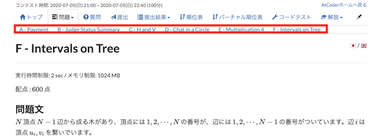
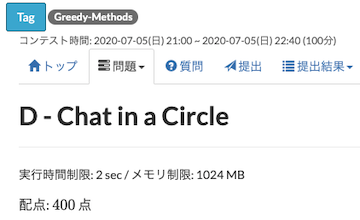

## 問題を探す

### 類題

- [ASPR](https://greasyfork.org/ja/scripts/431708-aspr) - AtCoder Beginners Contestの「問題」ページで、類似問題へのリンクを追加する。また、作者による[解説記事](https://qiita.com/dakkenkd425/items/366a81e5f34e1263627f)も公開されている。

    

      
    

### 外部サービスの利用

- [AtCoder Add link to Problems](https://greasyfork.org/ja/scripts/469312-atcoder-add-link-to-problems) - 「プロフィール」ページに、[AtCoder Problems](https://kenkoooo.com/atcoder/)へのリンクを追加する。

    

      
    

- [AtCoderUsers](https://greasyfork.org/ja/scripts/420811-atcoderusers) - 「プロフィール」ページに、[AtCoder Problems](https://kenkoooo.com/atcoder/)、[AtCoder Tags](https://atcoder-tags.herokuapp.com/)のリンクを追加する。

    !!! warning "注意"
        AtCoder PerformancesとAtCoder Scores: いずれも2022年11月26日にサービス終了。

    

      
    

## 問題を見る

### 一度に開く(特定のコンテスト)

- [atcoder_all_open](https://greasyfork.org/ja/scripts/387471-atcoder-all-open) - 「全ての問題をワンクリックで開く」タブを追加する。

    

      
    

### 一覧(特定のコンテスト)

- [AtCoder Dropdown Tasks](https://greasyfork.org/ja/scripts/529085-atcoder-dropdown-tasks) - 「問題」タブにマウスのカーソルを合わせると、各問題へ移動できるドロップダウンリストが表示されるようにする。

    

      
    

- [AtCoder Listing Tasks](https://greasyfork.org/ja/scripts/467289-atcoder-listing-tasks) - 「問題」ページに、各問題に移動できるドロップダウンリストを追加する。また、複数の問題をまとめて開くこともできる。

    

      
    

- [atcoder-problem-navigator](https://greasyfork.org/ja/scripts/383360-atcoder-problem-navigator) - 「問題」ページで、各問題のリンクに飛べるナビゲーションバーを追加する。

    

      
    

### 最初の問題(特定のコンテスト)

- [AtCoder Crouch Start](https://greasyfork.org/ja/scripts/463845-atcoder-crouch-start) - 開催前のコンテストの「トップ」ページに、最初の問題(A問題)に移動できるタブを追加する。

    !!! warning "注意"
        - コンテスト開始直前の過度なリロードは避ける。

        - リンク先のページが、必ずしも該当コンテストの最初の問題であるとは保証されない。

    

      
    

### 難易度順

- [atcoder-typical90-sort](https://greasyfork.org/ja/scripts/428698-atcoder-typical90-sort) - 「[競プロ典型90問](https://atcoder.jp/contests/typical90)」の問題を、難易度が低い順に並び替える。

    

      
    

- [tessoku_display_difficulty](https://greasyfork.org/ja/scripts/453352-tessoku-display-difficulty) - 「[競技プログラミングの鉄則](https://atcoder.jp/contests/tessoku-book)」の問題一覧に、難易度を表す星マークを追加する。また、難易度が低い順に並び替えることもできる。

    

      
    

### AtCoder Daily Training

- [ADT⇄ABC Converter Button](https://greasyfork.org/ja/scripts/531079-adt-abc-converter-button) - [AtCoder Daily Training](https://atcoder.jp/contests/adt_top)と該当コンテストの「問題」ページを往復できるボタンを追加する。

    

      
    

### 関連コンテストサイト

- [AtCoderLinkCompletionForJOI](https://greasyfork.org/ja/scripts/382313-atcoderlinkcompletionforjoi) - JOIの問題ページにPDFへのリンクを追加する。

    

      
    

### 多言語への対応

- [Atcoder Better!](https://greasyfork.org/ja/scripts/471106-atcoder-better) - 問題のタイトルや本文を中国語に翻訳できるボタンを追加する。翻訳サービスは、設定から変更できる(デフォルトは、[DeepL](https://www.deepl.com/en/translator))。

    

      
    

- [AtCoder 中文助手](https://greasyfork.org/ja/scripts/452449-atcoder-%E4%B8%AD%E6%96%87%E5%8A%A9%E6%89%8B) - コンテストの問題文を中国語で表示できるようにする。翻訳は、[AtCoder 中文站](https://atcoder-for-chinese-developers.github.io/atcoder-for-chinese/)に基づいている。

    

      
    

## 問題を解く

### テンプレートを利用

- [AtCoder Template](https://greasyfork.org/ja/scripts/438105-atcoder-template) - 「問題」ページや「提出」ページで、言語別のテンプレートの登録・読み込み(自動・手動)をすることで、貼り付けの手間を減らせる。類似したスクリプトに「[paste template](https://greasyfork.org/ja/scripts/441552-paste-template)」がある。

    

      
    

### コンテストIDをコピー

- [AtCoder Copy Contest ID](https://greasyfork.org/ja/scripts/463842-atcoder-copy-contest-id) - ナビゲーションバーに、コンテストIDをコピーするためのボタンを追加する。

    

      
    

- [AtCoderDevotionScript](https://greasyfork.org/en/scripts/415819-atcoderdevotionscript) - 「問題」ページで、Ctrl + Qを押すと、[atcoder-cli](https://github.com/Tatamo/atcoder-cli)の利用に必要なコンテストIDをクリップボードに書き込むことができる。使い方の詳細は、作者の[紹介記事](https://iiiimmmmo.hatenablog.com/entry/2020/11/15/170008)を参照されたい。

    !!! warning "注意"
        macOSユーザは、ショートカットの干渉があるため、設定の変更が必要。

    

      
    

### 問題文の文字列を扱いやすくする

- [AtCoder-quotation-adder](https://github.com/burioden/AtCoder-quotation-adder) - 「問題」ページの問題文に含まれる文字列に""を追加する。

    

      
    

- [AtCoder copy button adder](https://greasyfork.org/ja/scripts/485389-atcoder-copy-button-adder) - 「問題」ページの問題文に含まれる文字列をコピーできるボタンを追加する。[AtCoder-quotation-adder](https://github.com/burioden/AtCoder-quotation-adder)との併用もできる。

    

      
    

- [AtCoder NoCopy](https://greasyfork.org/ja/scripts/497349-atcoder-nocopy) - AtCoder Beginner Contestの問題文をコピーできないようにする(右クリックとCtrl + C)。

### 制約条件を確認・非表示に

- [制約をチェックする](https://greasyfork.org/ja/scripts/434715-check-constraints) - 「問題」ページの制約に、確認用のチェックボックスを追加する。

    

      
    

- [atcoder_constraints_eraser](https://greasyfork.org/ja/scripts/461798-atcoder-constraints-eraser) - 「問題」ページの制約を非表示にする。

- [AtCoderNotesForBeginners](https://greasyfork.org/ja/scripts/529251-atcodernotesforbeginners) - 「問題」ページの制約に、型の有効範囲や入力データ量に応じた時間計算量の一覧を表示する。

    

      
    

### 入出力例を集約

- [AtCoder Efficient Layout](https://greasyfork.org/ja/scripts/453117-atcoder-efficient-layout) - 「問題」ページで、入出力の形式とそれらの例を横並びで表示できる。

    

      
    

- [AtCoder for Large Display](https://greasyfork.org/ja/scripts/439100-atcoder-for-large-display) - 「問題」ページで、入出力例を2列で表示する。

    !!! warning "注意"
        古い問題では正しく表示されない可能性がある。

    

      
    

- [atcoder_collect_all_examples](https://greasyfork.org/ja/scripts/387240-atcoder-collect-all-examples) - 「問題」ページに入力例・出力例をそれぞれまとめる。

    

      
    

### ヒントを見る

- [AtCoderTags_Hint](https://greasyfork.org/ja/scripts/393337-atcodertags-hint) - 「問題」ページにカテゴリーを表すヒントボタンを設置する。

    

      
    

### 配点を確認しやすいように配置

- [AtCoder Scoreboard Pinner](https://greasyfork.org/ja/scripts/490663-atcoder-scoreboard-pinner) - 各コンテストの「トップ」ページから、問題の配点を確認しやすくする。

    

      
    

### 配点を隠す

- [AtCoderScoreHider](https://greasyfork.org/ja/scripts/371898-atcoderscorehider) - 「提出」ページなどの配点を隠す。日本語版のみ対応。

    

      
    

### カテゴリーを投票

- [AtCoderTags_Helper](https://greasyfork.org/ja/scripts/393121-atcodertags-helper) - 「問題」ページから[AtCoderTags](https://atcoder-tags.herokuapp.com/)に投票できる。

    

      
    

### タイトルをコピー

- [Atcoder Title Copy](https://greasyfork.org/ja/scripts/434033-atcoder-title-copy) - 「問題」ページのタイトルをクリップボードにコピーできるボタンを追加する。

    

      
    

### タイトルを一部書き換え

- [AtCoder D is for DP](https://greasyfork.org/ja/scripts/450727-atcoder-d-is-for-dp) - 「問題」ページのD問題のタイトルを「DP」に書き換える。

    

      
    

