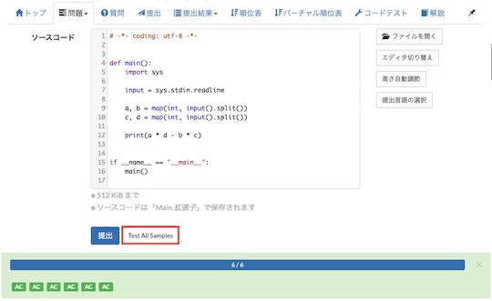
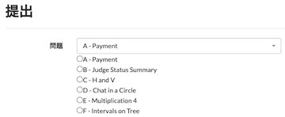
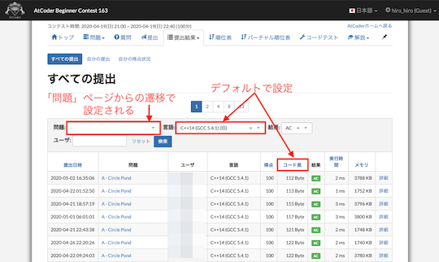

## 入出力例を活用する

### 入出力例を取得

- [atcoder-keyboard-shortcuts](https://greasyfork.org/ja/scripts/397575-atcoder-keyboard-shortcuts) - Shift+[1-5]で、「問題」ページにある入力例をクリップボードにコピーする。

- [AtCoder Print Task Copy](https://greasyfork.org/ja/scripts/394999-atcoder-print-task-copy) - 「問題」ページにある「印刷用問題文」にCopyボタンを追加する。

    

      
    

- [AtCoder Sample Downloader](https://greasyfork.org/ja/scripts/425977-atcoder-sample-downloader) - 「問題」ページに、入出力例をダウンロードできるボタンを設置する。

    

      
    

### バグがないか事前に確認

- [AtCoder_CustomTest_Run_Shortcut](https://greasyfork.org/ja/scripts/418633-atcoder-customtest-run-shortcut) - 「コードテスト」ページで、Ctrl+Enterを押すと、標準入力の値を使用してソースコードを実行する。

    !!! warning "注意"
        ショートカットを実行する前に、事前にソースコードと標準入力に入力を済ませておく必要がある。

- [AtCoder Easy Test v2](https://greasyfork.org/ja/scripts/433152-atcoder-easy-test-v2) - 「問題」ページで、入出力例を使って素早くテスト(自作を含む)を実行できる。また、[Codeforces](https://codeforces.com/)や[yukicoder](https://yukicoder.me/)にも対応している。
    - [作者による解説記事](https://qiita.com/magurofly/items/4b60dc02283e70230f71) - スクリプトの基本的な使用方法や使用技術が解説されている。

    

      
    

### ビジュアライザをより使いやすく

- [AHC Visualizer → AtCoder CustomTest Runner](https://greasyfork.org/ja/scripts/545397-ahc-visualizer-atcoder-customtest-runner-fixed-responsetext-guards) - [AtCoder Heuristic Contest](https://atcoder.jp/contests/archive?ratedType=4&category=0&keyword=AtCoder+Heuristic+Contest)のビジュアライザに専用フォームを追加し、ソースコードの実行から出力の結果まで画面を切り替えることなく確認できる。

    

      
    

## ソースコードを提出する

### 問題を選択

- [AtCoder Problem Buttons](https://greasyfork.org/ja/scripts/445191-atcoder-problem-buttons) - 「提出」ページに、提出する問題をワンクリックで切り替えられるボタンを追加する。

  

    
  

- [AtCoder-Submission-RadioButton](https://greasyfork.org/ja/scripts/390828-atcoder-submission-radiobutton) - 「提出」ページに、各問題を選択するラジオボタンを設置する。[Chrome拡張版](https://chrome.google.com/webstore/detail/atcoder-submission-radiob/hkehpabdllmdfmflgjofmgcdbmjafcdd?hl=ja&gl=UA)もある。

    

      
    

### 言語のフィルタリング・選択

- [AtCoderLanguageButtons](https://greasyfork.org/ja/scripts/421663-atcoderlanguagebuttons) - 「問題」「提出」「コードテスト」の各ページに、提出する言語を簡単に切り替えられるボタンを設置する。

    

      
    

- [AtCoder Language Filter](https://greasyfork.org/ja/scripts/398148-atcoder-language-filter) - 「提出」ページで、提出する言語のフィルタリングと並び替えを行う。

    

      
    

- [AtCoder Submission Language Detector](https://greasyfork.org/ja/scripts/448492-atcoder-submission-language-detector) - 「問題」「提出」「コードテスト」の各ページで、ソースコードのメタ情報に基づいて使用言語を検出・選択する。

### ケアレスミス対策

- [Atcoder Duplicate Checker](https://greasyfork.org/ja/scripts/454704-atcoder-duplicate-checker) - 「問題」「提出」の各ページで、既に提出したソースコードと重複していないか確認できる。

    !!! warning "注意"
        直近20回分の提出がチェック対象。

    

      
    

- [AtCoderPenaltyRateCheckEaser](https://greasyfork.org/ja/scripts/459897-atcoderpenaltyratecheckeaser) - 「問題」ページで、ペナルティ率(= ペナルティなしの正解者数 / 提出者数)を表示する。

    

      
    

- [AtCoderLeftShiftOverflowWarning](https://greasyfork.org/ja/scripts/536353-atcoderleftshiftoverflowwarning) - 「問題」「提出」ページで、数値リテラルを左シフトしているC++コード（例: 1 << i）を含む場合に、提出ボタンに警告メッセージを表示する。

    

      
    

- [mod noticer](https://greasyfork.org/ja/scripts/429808-mod-noticer) - 「問題」ページで、剰余(mod)を取る必要がある問題に対して、提出ボタンに確認メッセージを追加する。

    

      
    

### ショートカットキーで提出

- [AtCoder_submit_keyboard_shortcut](https://greasyfork.org/ja/scripts/378760-atcoder-submit-keyboard-shortcut) - 「問題」「提出」ページで、Ctrl + Enterを押すとソースコードが提出できる。

- [Atcoder Submission Shortcut](https://greasyfork.org/ja/scripts/509606-atcoder-submission-shortcut) - 「問題」「提出」「コードテスト」の各ページで、Ctrl + Shift + Enterを押すとソースコードを提出・実行できる。

### コードゴルフ用に改行コードを最適化

- [atcoder-lf-submit](https://greasyfork.org/ja/scripts/551938-atcoder-lf-submit) - 改行コードをCRLFからLFに変換して、ソースコードを提出・実行できるボタンを追加する。また、コード長も確認できる。
    - [作者による解説記事](https://dnek.net/ja/atcoder-lf-submit)

    

      
    

### Piet言語用にコード長を短くする

- [atcoder-piet-image-converter](https://greasyfork.org/ja/scripts/553186-atcoder-piet-image-converter) - 「問題」「提出」「コードテスト」の各ページで、画像ファイルをPietのソースコードとして提出できるようにする。また、「提出結果」ページで、ソースコードを画像として確認できる。
    - [作者による解説記事](https://dnek.net/ja/atcoder-piet-image-converter)

    

      
    

### 時間を指定して提出

- [AtCoder Submission Timer](https://greasyfork.org/ja/scripts/451696-atcoder-submission-timer) - 「問題」ページで、時間を指定してソースコードを提出できる。

    

      
    

### 提出に必要な待ち時間を確認

- [atcoder-wait-time-display](https://greasyfork.org/ja/scripts/430509-atcoder-wait-time-display) - 「問題」ページで、次の提出までに必要な待ち時間を表示する。また、直前の提出から経過した時間も見ることができる。

    

      
    

## 提出コードの正誤判定

### 自分

- [AtCoderJudgeProgressColorizer](https://greasyfork.org/ja/scripts/430903-atcoderjudgeprogresscolorizer) - 「提出結果」ページで、ジャッジの進行状況がプログレスバーで表示される。

    

      
    

- [atcoder-bell](https://greasyfork.org/ja/scripts/377923-atcoder-bell) - ジャッジシステムでの正誤判定が終了すると、ベルが鳴る。

- [AtCoderResultNotifier](https://greasyfork.org/ja/scripts/371225-atcoderresultnotifier) - 提出結果を通知する。

    

      
    

### お気に入りユーザ

- [AtCoder Standings Watcher](https://greasyfork.org/ja/scripts/428862-atcoder-standings-watcher) - コンテスト中に、お気に入りに登録したユーザの正誤情報を通知する。

## 提出コードを確認する

### 正誤判定の結果を集約

- [AtCoder Submission Status](https://greasyfork.org/ja/scripts/383817-atcoder-submission-status) - 提出した解答について、テストケースの結果(AC、WA、…)が一目でわかるように表示する。

    

      
    

### 実行時間・使用メモリの平均値

- [AtCoderAverageResult](https://greasyfork.org/ja/scripts/429155-atcoderaverageresult) - 「提出結果」ページで、テストケースの実行時間・使用メモリの平均値をそれぞれ表示する。

    

      
    

### ソースコードをまとめて表示

- [atcoder-submission-wo-ikki-ni-miiru](https://greasyfork.org/ja/scripts/403062-atcoder-submission-wo-ikki-ni-miiru) - 「提出結果」ページにソースコードを表示する。

    

      
    

## 提出コードを検索する

### 検索条件を指定

- [AtCoder Custom Default Submissions](https://greasyfork.org/ja/scripts/393705-atcoder-custom-default-submissions) - 「すべての提出」ページにおける絞り込み、並び替え設定のデフォルト値を設定できる。

    

      
    

- [AtCoder Default Search Fields](https://greasyfork.org/ja/scripts/445634-atcoder-default-search-fields) - 「すべての提出」ページで、結果がAC(正解)の提出を検索する。さらに、個別の問題ページから「すべての提出」ページに移動したときは、直前に見ていた問題に限定して絞り込むことができる。

- [AtCoderFavSubmissionFilter](https://greasyfork.org/ja/scripts/536911-atcoderfavsubmissionfilter) - 「提出結果」ページの「すべての提出」で、「お気に入り」に登録済みユーザの回答のみを表示する。

    !!! warning "注意"

        絞り込みの対象は、開いているページのみ。

- [AtCoder ResultsPage Tweaks](https://greasyfork.org/ja/scripts/424079-atcoder-resultspage-tweaks) - 「提出結果」ページの「すべての提出」で、検索条件を変更したときに自動で検索する。

- [AtCoder Search Query Holder](https://greasyfork.org/ja/scripts/460696-atcoder-search-query-holder) - 検索条件を保持したまま「自分の提出」ページから「すべての提出」ページへ移動できる。

- [AutoSubmissionsSettings.js](https://greasyfork.org/ja/scripts/390514-autosubmissionssettings-js) - 「すべての提出」ページで、指定した言語と結果で検索するボタンを追加する。

    

      
    

- [ac-search-old-languages](https://greasyfork.org/ja/scripts/405745-ac-search-old-languages) - 「提出結果」ページで、judge-update-202004以前の言語による提出コードを検索できるようにする。

    

      
    

- [AtCoderSubmitSearchSettings](https://greasyfork.org/ja/scripts/390424-atcodersubmitsearchsettings) - 「すべての提出」ページで、古いバージョンで提出されたコードを検索できる。検索のデフォルト設定も指定できる。

    

      
    

### 順位表から探す

- [AtCoder Jump to Submissions from Standings](https://greasyfork.org/ja/scripts/397528-atcoder-jump-to-submissions-from-standings) - 「順位表」ページの得点をダブルクリックすると、該当するコンテスタントの実装を見ることができる。[Codeforces](https://codeforces.com/)の仕様を参考にしている。

    

      
    

### 最速コード

- [AtCoder quickly check fastest codes](https://greasyfork.org/ja/scripts/499102-atcoder-quickly-check-fastest-codes) - 「提出結果 - 自分の提出」ページの実行時間に、正解コードの実行時間が短い順に表示できるボタンを追加する。2024年6月時点では、C++のみ対応。

    

      
    

### 最短コード

- [Add Shortest Tab](https://greasyfork.org/ja/scripts/391692-add-shortest-tab) - 開いている問題について、コード長に並べた提出ページのタブを追加する。

    !!! warning "注意"
        コンテスト中の利用は非推奨。

    

      
    

### 外部サービスの利用

- [AtCoder Companions Quick Jump](https://greasyfork.org/ja/scripts/463653-atcoder-companions-quick-jump) - 「提出結果」ページで指定した提出から、Webサービス[AtCoder Companions](https://atcoder-companions.kakira.dev/)の類似コードを探せる。

    

      
    

## 提出コードにメモを追加

- [AtCoder Submission Notes](https://greasyfork.org/ja/scripts/527638-atcoder-submission-notes) - 「提出結果 - 自分の提出」ページで、それぞれの提出にメモ欄を追加する。

    

      
    

