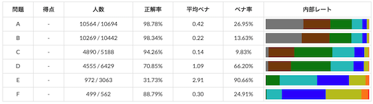
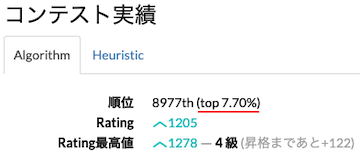

## リアルタイムの情報を見る

!!! danger "警告"
    コンテスト中にSNSでの言及や投稿は避ける。賠償が請求される可能性があるため。

### 問題の統計情報

- [AtCoderColorStandings](https://greasyfork.org/ja/scripts/423713-atcodercolorstandings) - 「順位表」ページと「バーチャル順位表」ページで、コンテスト参加者のレーティング別正解率を表示する。

    

      
    

- [AtCoderStandingsAnalysis](https://greasyfork.org/ja/scripts/398439-atcoderstandingsanalysis) - 「順位表」ページから、自分の得点・正解者数 / 提出者数・正解率・平均ペナルティ数・ペナルティ率・内部レートの分布を集計する。

    

      
    

- [atcoder-standings-difficulty-analyzer](https://greasyfork.org/ja/scripts/419541-atcoder-standings-difficulty-analyzer) - 「順位表」ページに、問題別の推定難易度の推移・ACした人数の推移などを表示する。

    

      
    

### コンテストの成績

- [ac-predictor](https://greasyfork.org/ja/scripts/369954-ac-predictor) - コンテスト開催中に推定パフォーマンスとレーティングの推移を表示する。[Webページ版](https://ac-predictor.com/)もある。使用されている技術に興味がある方は、作者による[解説記事(2020年12月時点)](https://qiita.com/keymoon/items/e83259f882f26c8f10a1)を参照されたい。
    - [ac-predictor-minimal](https://greasyfork.org/ja/scripts/386999-ac-predictor-minimal) - [ac-predictor](https://greasyfork.org/ja/scripts/369954-ac-predictor)の機能限定版。スクリプトの透明性を確保する観点から、パフォーマンスを表示するのは「順位表」ページに限定される。

    

      
    

- [AtCoder Center Your Standing](https://greasyfork.org/ja/scripts/496241-atcoder-center-your-standing) - 「順位表」ページで、ログインユーザを中心とした結果が最初に表示されるようにする。

    

      
    

- [AtCoderScoreHistogram](https://greasyfork.org/ja/scripts/462131-atcoderscorehistogram) - 「順位表」ページに、得点分布を追加する。ユーザ名を入力すると、該当ユーザの得点も表示される。

    

      
    

- [AtCoderHeuristicContestBarChart](https://greasyfork.org/ja/scripts/477377-atcoderheuristiccontestbarchart) - 「順位表」ページに、各順位の総得点を棒グラフで表示する。[AtCoder Heuristic Contest](https://atcoder.jp/contests/archive?ratedType=4&category=0&keyword=AtCoder+Heuristic+Contest)のみ有効。

    !!! info "参考"

        - 表示されるまでにやや時間を要する。

        - 横軸は順位、縦軸は総得点を表している。

    

      
    

## 問題に関する統計

### 難易度(推定)

- [AtCoder Difficulty Display](https://greasyfork.org/ja/scripts/397185-atcoder-difficulty-display) - AtCoderの「問題」のページに[AtCoder Problems](https://kenkoooo.com/atcoder/)の難易度を表示する。

    

      
    

## ユーザに関する統計

### コンテストの参加回数

- [AJL Join Count](https://greasyfork.org/ja/scripts/472659-ajl-join-count) - [AtCoder Junior League 2023](https://atcoder.jp/contests/ajl2023)の個人ランキング(学年別)ページに、コンテストの参加回数を表示する。

    

      
    

### コンテストの参加者数・チーム数

- [AtCoder Participants Display](https://greasyfork.org/ja/scripts/523852-atcoder-participants-display) - 「順位表」ページで、コンテストに参加しているユーザ数（Rated・UnRated）やチーム数を表示する。

    

      
    

### 正解するまでの所要時間

- [Atcoder AC Submission Duration](https://greasyfork.org/ja/scripts/500705-atcoder-ac-submission-duration) - 「順位表」ページで、ユーザが各問題を正解するまでの所要時間を表示する。

    

      
    

### パフォーマンス値の推移

- [Atcoder Perf Graph](https://greasyfork.org/ja/scripts/476103-atcoder-perf-graph) - ユーザの「プロフィール」ページにあるレーティンググラフに、各コンテストのパフォーマンス値を折れ線グラフで重ねて表示する。

    

      
    

- [AtCoder Performace Graph](https://greasyfork.org/ja/scripts/473409-atcoder-performace-graph) - ユーザの「プロフィール」ページに、各コンテストにおけるパフォーマンス値を棒グラフで表示する。

    !!! info "参考"

        直近の結果が画面左端に表示される。

    

      
    

### パフォーマンスの推定値

- [AtCoderUnratedPerfDisplayer](https://greasyfork.org/ja/scripts/457150-atcoderunratedperfdisplayer) - ユーザの「コンテスト成績表」ページに、Unrated参加したときのパフォーマンス値(推定)を表示する。

    !!! info "参考"

        アルゴリズム部門、かつ、レーティングの更新対象者が存在するコンテストで有効。

    

      
    

### レーティングの推移・分布

- [AtCoderAnotherGraph](https://greasyfork.org/ja/scripts/455542-atcoderanothergraph) - 「ユーザ」ページにあるレーティンググラフ︎を、ヒューリスティック/アルゴリズムの計算式で表示する。

    !!! info "参考"

        以下のサンプルでは、アルゴリズム部門のレーティングをヒューリスティックの計算式に基づいて表示している。

    

      
    

- [AtCoder Graph Time](https://greasyfork.org/ja/scripts/454517-atcoder-graph-time) - 「ユーザ」ページにあるレーティンググラフの横軸をコンテストの参加回数に変更する。

    

      
    

- [AtCoderRecentGraph](https://greasyfork.org/ja/scripts/418562-atcoderrecentgraph) - 「ユーザ」ページにあるレーティンググラフのうち、最近（注: 詳細は不明）の推移を表示する。

    

      
    

- [AtCoder Rating Cumlative Distribution](https://greasyfork.org/ja/scripts/419055-atcoder-rating-cumlative-distribution) - 「ユーザ」ページにあるRating分布の累積人数および累積パーセントを表示する。

    

      
    

### レーティングに基づいた順位のパーセンタイル値

- [AtCoder - You're top X%](https://greasyfork.org/ja/scripts/511580-atcoder-you-re-top-x-only-for-algorithm-ranking) - 「プロフィール」ページに、アクティブユーザの上位何%に相当するかを表示する。

    !!! info "参考"

        2024年10月上旬時点では、「アルゴリズム部門」に対応している。

    

      
    

### 正解した問題の総得点の推移

- [AtcoderDevotionGraph](https://greasyfork.org/ja/scripts/416588-atcoderdevotiongraph) - 「ユーザ」ページのレーティンググラフに、ACした問題の総得点の推移を上書き表示する。

    

      
    

### ユーザの成績で検索

- [AtCoder Auto Pager](https://greasyfork.org/ja/scripts/421991-atcoder-auto-pager) - 「順位表」ページに、順位・得点・解答時間・パフォーマンスによる検索機能を追加する。

    !!! warning "警告"
        パフォーマンスによる検索を行うためには、[ac-predictor](https://greasyfork.org/ja/scripts/369954-ac-predictor)を導入する必要がある。

    

      
    

### ユーザの成績を一部非表示に

- [AtCoder-HiderRatingAndPerformance](https://greasyfork.org/ja/scripts/492653-atcoder-hiderratingandperformance) - 「ユーザ」ページで、レーティングやパフォーマンスに関する内容を一部非表示にする。

    

      
    

### ユーザの使用言語を見る

- [atcoder-standings-lang](https://greasyfork.org/ja/scripts/415894-atcoder-standings-lang) - 「順位表」ページおよび「バーチャル順位表」ページで、ユーザ名の横にAC数の多い言語を表示する。

    

      
    

