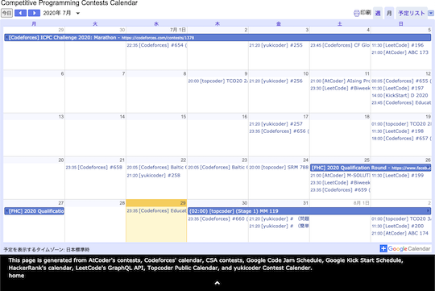

## コンテストの開催日時を確認する

### 複数のコンテストサイト

- [CLIST](https://clist.by/) - [60以上のコンテストサイト](https://clist.by/resources/)を対象として開始・終了時刻、コンテスト時間と閲覧時点での残り時間が一覧で表示される。また、順位表や問題の一覧なども確認できる。
    - [CLIST Contest Filter](https://greasyfork.org/ja/scripts/439442-clist-contest-filter) - 有志が作成したユーザスクリプト。Homeページで、指定したコンテストサイトのみ表示する。

    

      
    

- [Competitive Programming Contests Calendar](https://competitiveprogramming.info/calendar) - 開催予定のコンテスト情報をカレンダー形式で表示する。[Codeforces](https://codeforces.com/)、[CSAcademy](https://csacademy.com/)、[HackerRank](https://www.hackerrank.com/)、[LeetCode](https://leetcode.com/)、[Topcoder](https://www.topcoder.com/)、[yukicoder](https://yukicoder.me/)にも対応している。

    

      
    

- [Procon Notification](https://procon-notification.vercel.app/) - [15以上のコンテストサイト](https://procon-notification.vercel.app/about)を対象として、コンテストの開催状況を確認できる。
    - [X アカウント](https://x.com/procon_notify) - コンテスト開始30分前に通知してくれる。

    

      
    

### AtCoder

- [atcoder_calender](https://github.com/oirom/atcoder_calendar)  - コンテストの日程を自分のGoogleカレンダーに追加できる。

    

      
    

