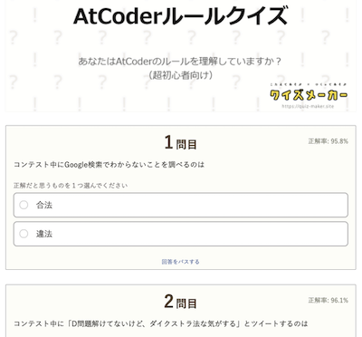
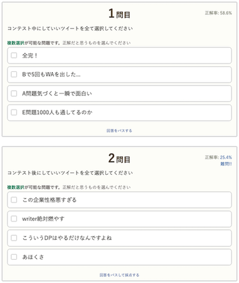
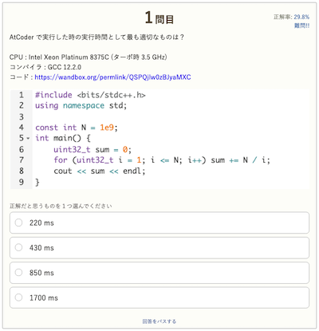
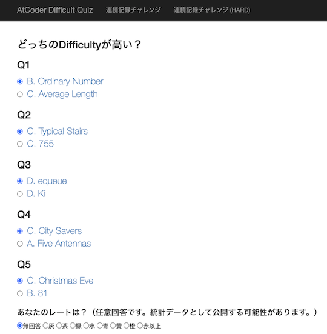
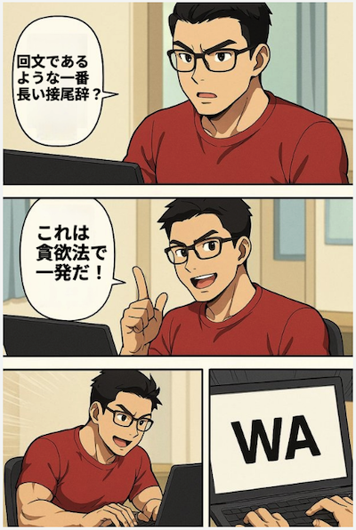
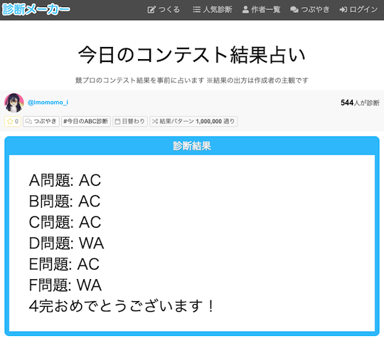

## クイズ

### コンテストのルールを確認

- [AtCoderルールクイズ](https://quiz-maker.site/quiz/play/IuEjiJ20220508114221) - AtCoderのルールの理解度をクイズ形式(全10問)で確認できる。

    !!! warning "注意"
        コンテスト参加前に確認されることを強く推奨。

    

      
    

- [AtCoder AIルールクイズ](https://quiz-maker.site/quiz/play/tKKCCl20250430221107) - AtCoder Beginner Contest、AtCoder Regular Contest Div.2 開催中の生成AIに関するルールをクイズ形式で確認できる。

    

      
    

- [AtCoder SNS Contest](https://quiz-maker.site/quiz/play/8i0Ogy20200315154852) - コンテストの開催中・終了後に、SNSに投稿可能な内容の理解度を確認できる。

    

      
    

### アルゴリズムの正式名称を回答

- [競技プログラミング用語の略さないやつ](https://quiz-maker.site/quiz/play/9ftelE20220328151757) - アルゴリズムに関する略語から正式名称を答えるクイズ(全10問)。

    

      
    

### ソースコードの実行時間を予測

- [AtCoder 実行時間クイズ](https://quiz-maker.site/quiz/play/d8Vt1O20250428222638) - C++で実装されたソースコードについて、AtCoderのジャッジシステムでの実行時間を回答するクイズ。

    

      
    

### 問題の難易度を予想

- [AtCoder Difficult Quiz](https://atcoder-difficulty-quiz.appspot.com/) - 2つの問題のうち、難易度が高いほう選ぶクイズ。

    

      
    

## ネタアプリ

### 問題を解く / ダイエットをサポート

- [AtCoder Diet](https://atcoder-diet.fly.dev/) - 前日に正解した問題の点数に基づいて、今日の摂取可能なカロリーを教えてくれる。

    

      
    

### 四コマ漫画を作成

- [嘘解法4コマジェネレーター](https://catupper.github.io/usokaiho-comic-generator/) - コンテストで確信を持って思いついた解法が不正解となってしまう状況を四コマ漫画にできる。

    

      
    

### コンテスト占い

- [今日のコンテスト結果占い](https://shindanmaker.com/1019867) - コンテストの結果を事前に占う。

    

      
    

