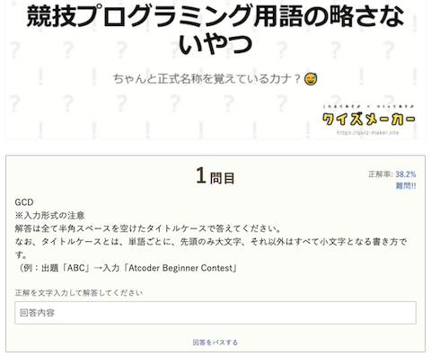

## クイズ

### コンテストのルールを確認

- [AtCoderルールクイズ](https://quiz-maker.site/quiz/play/IuEjiJ20220508114221) - AtCoderのルールの理解度をクイズ形式(全10問)で確認できる。

    !!! warning "注意"
        コンテスト参加前に確認されることを強く推奨。

    

      
    

### アルゴリズムの正式名称を回答

- [競技プログラミング用語の略さないやつ](https://quiz-maker.site/quiz/play/9ftelE20220328151757) - アルゴリズムに関する略語から正式名称を答えるクイズ(全10問)。

    

      
    

### 問題の難易度を予想

- [AtCoder Difficult Quiz](https://atcoder-difficulty-quiz.appspot.com/) - 2つの問題のうち、難易度が高いほう選ぶクイズ。

    

      
    

## ゲーム

### 過去問に登場したゲームで遊ぶ

- [AtCoder Games](https://atcoder-games.herokuapp.com/games/) - 過去問に登場したゲームで遊ぶことができる。

    

      
    

## ネタアプリ

### コンテスト占い

- [今日のコンテスト結果占い](https://shindanmaker.com/1019867) - コンテストの結果を事前に占う。

    

      
    

