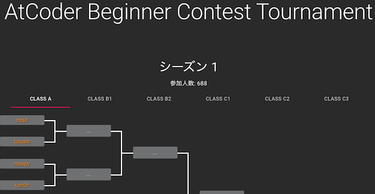
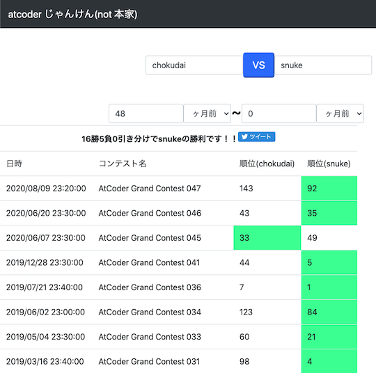

## 自己紹介する

- [競プロer自己紹介カード](https://nauclhlt.github.io/cardmaker/) - 競技プログラミングに関心のあるユーザ向けの自己紹介カードを簡単に作成できる。

    

      
    

## ライバルを探す・競う

### ライバルの練習状況を知る

- [AtCoder Rivals](https://atcoder-rivals.web.app/) - パフォーマンスやレーティングの遷移、日々の練習(通称、精進)状況などをライバルと比べることができる。
    <!-- markdown-link-check-disable -->
    - [作者による技術記事](https://note.com/sacckey/n/nf0b7ed1e9d1a)
    <!-- markdown-link-check-enable -->

    

      
    

- [Atcoder 精進チャート🐾](https://a-tilol.github.io/atcoder-shojin-chart-nextjs/) - 所定の期間における正解した問題の得点や問題数に加えて、レーティングの推移も比較できる。

    

      
    

### 成績で勝敗を競う

- [Atcoder Beginner Contest Tournament](https://abc.kenkoooo.com) - AtCoder Beginner Contestの順位を使ったトーナメント戦の結果を見ることができる。また、[X (旧 Twitter)](https://x.com/abc_tournament)で最新情報の告知が行われている。

    

      
    

- [atcoder じゃんけん(not 本家)](https://hotman78.github.io/atcoder-janken/) - 指定した2人のユーザが共通して出場したコンテストの順位を比較できる。[本家](../archived/no_longer_available.md)のリンク切れに伴い、有志が新たに作成・公開した。

    

      
    

