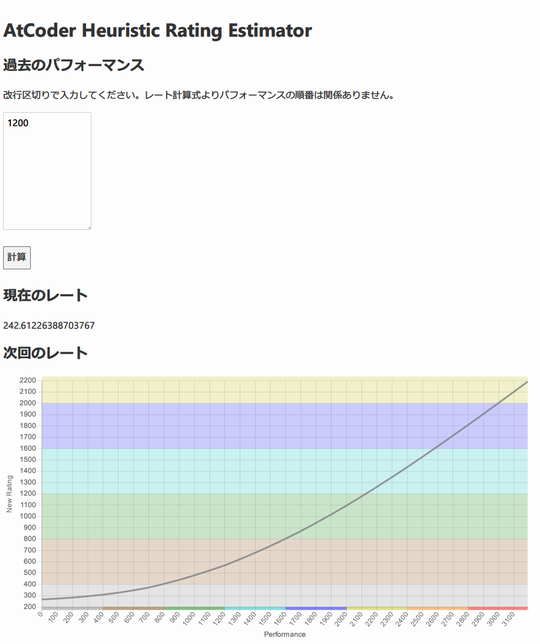
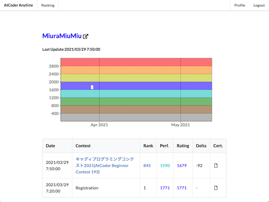

コンテストの成績(レーティング、パフォーマンス値、順位など)に関連するサービスを掲載しています。

!!! warning "注意"
    サブカテゴリで部門名(アルゴリズム・ヒューリスティック)が明記されていない場合は、アルゴリズム部門を対象としたサービスを表しています。

## 成績の計算・予測

### 目標レーティングに必要なパフォーマンス値を計算

#### アルゴリズム部門

- [AtCoder Rating Estimator](https://koba-e964.github.io/atcoder-rating-estimator/test-last.html) - 所定のレーティングに到達するために、次のコンテストで必要なパフォーマンス値を計算する。

    

      
    

#### ヒューリスティック部門

- [AtCoder Heuristic Rating Estimator](https://3w36zj6.github.io/atcoder-heuristic-rating-estimator/) - AtCoder Heuristic Contest(AHC)で目標とするレーティングに到達するために、次のコンテストで必要となるパフォーマンス値を計算する。利用にあたっては、過去に参加したコンテストのパフォーマンス値の入力が必要。また、作者による[技術解説記事](https://zenn.dev/3w36zj6/articles/5797217ce0f9ee)も公開されている。

    
 
    

### 将来のレーティングを予測

- [AtCoder Prophet](https://sotanishy.github.io/atcoder-prophet) - 機械学習モデルを使って、将来のレーティングを予測する。

    

      
    

### 仮想的なレーティングを計算

#### アルゴリズム部門

- [AtCoder Anytime](https://atcoder-anytime.sonoapp.page/) - 「バーチャル参加」の結果を利用して、レーティングの変動を表示する。同一の作者により[Codeforces版](https://codeforces-anytime.firebaseapp.com/)も公開されている。

    

      
    

- [一度も冷えなかった◯◯](https://tarareba.onrender.com/) - 参加したコンテストのうち、レーティングが単調増加となる結果だけを用いて、その推移を表示する。

    

      
    

- [Rating converter](https://silverfoxxxy.github.io/rating-converter) - [AtCoder](https://atcoder.jp/)のレーティングから、[Codeforces](https://codeforces.com/)のレーティング相当値を知ることができる。

    

      
    

- [まよコン🌽 レーティング](https://mayocon.shinnshinn.dev/) - [mayocorn](https://atcoder.jp/users/mayocorn)さん主催のバーチャルコンテストの結果に基づいて、レーティングのランキング(月別)が集計されている。

    

      
    

- [もすーんバチャ Rating Page](https://mosoon.net/mov_rating/top.html) - [MoSooN](https://atcoder.jp/users/MoSooN)さん主催のバーチャルコンテストの結果に基づいて、レーティングのランキングが集計されている。

    

      
    

#### ヒューリスティック部門

- [AtCoder Heuristic Season Ranking](https://ahc-season-ranking.terry-u16.net/) - 期間を指定すると、該当するコンテストに基づいてレーティングのランキングや個人成績が表示される。

    

      
    

