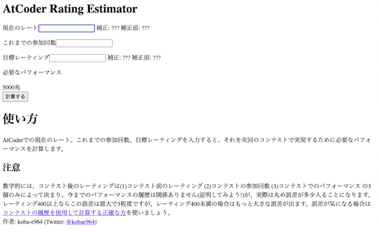
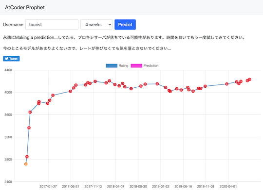
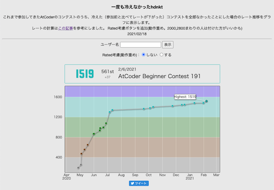
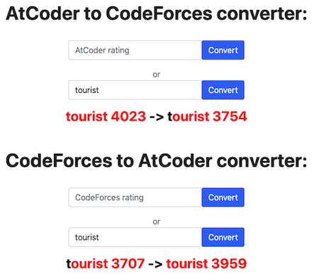
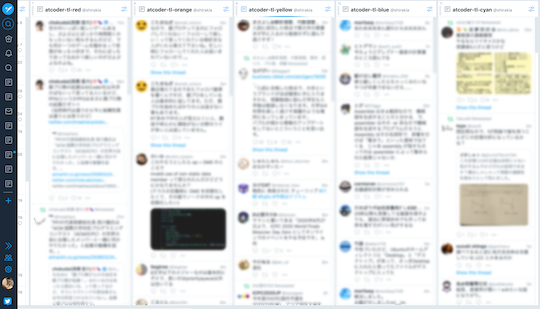

コンテストの成績(レーティング、パフォーマンス値、順位など)に関連するサービスを掲載しています。

!!! warning "注意"
    サブカテゴリで部門名(アルゴリズム・ヒューリスティック)が明記されていない場合は、アルゴリズム部門を対象としたサービスを表しています。

## 成績の計算・予測

### 目標レーティングに必要なパフォーマンス値を計算

#### アルゴリズム部門

- [AtCoder Rating Estimator](https://koba-e964.github.io/atcoder-rating-estimator/test-last.html) - 所定のレーティングに到達するために、次のコンテストで必要なパフォーマンス値を計算する。

    

      
    

- [AtCoder Rating Simulator](https://atcoderratingsimulator.herokuapp.com/) - 目標とするレーティングに到達するまでに必要なパフォーマンスを表示する。任意の回数だけ同じパフォーマンスを取ったと仮定した場合についても計算できる。

    

      
    

#### ヒューリスティック部門

- [AtCoder Heuristic Rating Estimator](https://3w36zj6.github.io/atcoder-heuristic-rating-estimator/) - AtCoder Heuristic Contest(AHC)で目標とするレーティングに到達するために、次のコンテストで必要となるパフォーマンス値を計算する。利用にあたっては、過去に参加したコンテストのパフォーマンス値の入力が必要。また、作者による[技術解説記事](https://zenn.dev/3w36zj6/articles/5797217ce0f9ee)も公開されている。

    
 
    

### 将来のレーティングを予測

- [AtCoder Prophet](https://sotanishy.github.io/atcoder-prophet) - 機械学習モデルを使って、将来のレーティングを予測する。

    

      
    

### 仮想的なレーティングを計算

- [一度も冷えなかった◯◯](https://tarareba.herokuapp.com/vote/) - 参加したコンテストのうち、レーティングが単調増加となる結果だけを用いて、その推移を表示する。

    

      
    

- [Rating converter](https://silverfoxxxy.github.io/rating-converter) - [AtCoder](https://atcoder.jp/)のレーティングから、[Codeforces](https://codeforces.com/)のレーティング相当値を知ることができる。

    

      
    

## ライバルを探す・競う

### レーティングが近いユーザを探す

- [AtCoder Find Rivals](https://atcoder-find-rivals.herokuapp.com/) - 指定したユーザに近いレーティングのユーザを探すことができる。

    

      
    

### ライバルの練習状況を知る

- [AtCoder Rivals](https://atcoder-rivals.web.app/) - パフォーマンスやレーティングの遷移、日々の練習(通称、精進)状況などをライバルと比べることができる。また、作者による[技術記事](https://note.com/sacckey/n/nf0b7ed1e9d1a)も公開されている。

    

      
    

### コンテスト後の情報収集・発信

- [AtCoder TL](https://github.com/shirakia/atcoder_tl) - レーティング帯ごとのTwitterタイムラインを生成する。全てのタイムラインをまとめた[Web版](https://atcoder-tl.com/)も公開されている。

    

      
    

    

      
    

### 成績で勝敗を競う

- [Atcoder Beginner Contest Tournament](https://abc.kenkoooo.com/#/tournament/1) - AtCoder Beginner Contestの順位を使ったトーナメント戦の結果を見ることができる。また、[Twitter](https://twitter.com/abc_tournament)で最新情報の告知が行われている。

    

      
    

