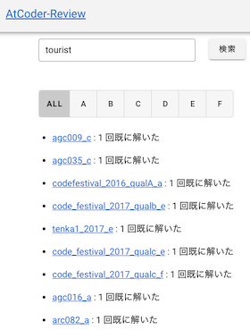

## 定番サービスを利用する

- [AtCoder Problems](https://kenkoooo.com/atcoder/) - 開催されたコンテストの問題を一覧できる。問題の正誤状況や各種集計結果を確認できるだけでなく、バーチャルコンテストなどの機能もある。詳しくは、有志による[AtCoder Problemsの使い方](https://ntk-ta01.hatenablog.com/entry/2020/04/15/001405)を参照されたい。

    !!! warning "注意"
        記事に掲載されている図やバーチャルコンテストの名称・内容は、最新情報と異なる場合もある。

    

      
    

- [AtCoder Scores](http://atcoder-scores.herokuapp.com/) - AtCoder Grand Contest 001(AGC 001)以降の問題が点数順に並んでいる。

    !!! warning "注意"
        2021年4月以降の問題が反映されていないと思われる。

    

      
    

- [Virtual Judge](https://vjudge.net/) - 30以上のコンテストサイトの問題を利用して、バーチャルコンテストが開催できる。

    

      
    

## 特定の分野を重点的に学ぶ

- [AtCoder Tags](https://atcoder-tags.herokuapp.com/) - 問題のカテゴリーを分類する。ユーザ登録を行えば、問題にふさわしいと思うカテゴリーを投票できる。[AtCoderTags_Helper](https://greasyfork.org/ja/scripts/393121-atcodertags-helper)を導入すると、[AtCoder](https://atcoder.jp/)の「問題」ページからも投票できる。

    

      
    

## 復習の効果をより高める

- [AtCoder-Ebbing](https://atcoder-ebbing.web.app/) - 任意のユーザのレーティング・回答状況に応じて、復習すると効果が高い問題が出題される。作者による[解説記事](https://qiita.com/numeric_tuba/items/9898e31e2566e7296c5d)もある。

    

      
    

- [AtCoder List](http://atcoder-list.herokuapp.com) - 過去問から自分専用の問題リストを作ることができる。コンテストで出題された問題の情報は、前述の[AtCoder Problems](https://kenkoooo.com/atcoder/)や[AtCoder Scores](http://atcoder-scores.herokuapp.com/)などを参照されたい。

    

      
    

- [AtCoder-Review](https://at-coder-review.vercel.app/) - 任意のユーザが正解(AC)した問題とその回数を表示する。

    !!! warning "注意"
        検索ボタンの連打などは控える。過剰なAPIリクエストを回避するため。

  

    
  

