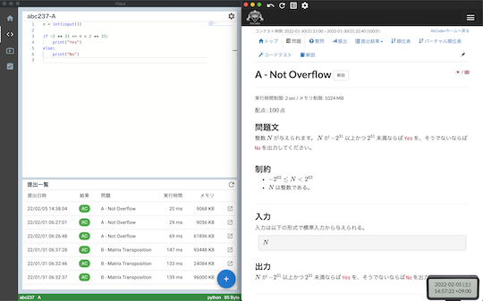
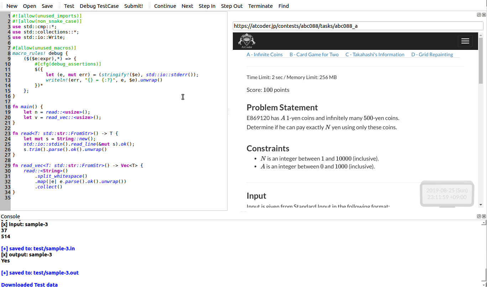
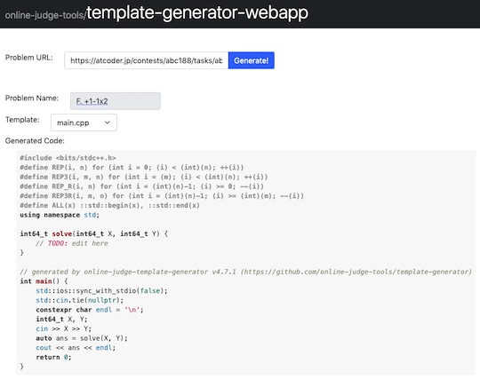

## 定番サービスを利用する

- [AtCoder Problems](https://kenkoooo.com/atcoder/) - 開催されたコンテストの問題を一覧できる。問題の正誤状況や各種集計結果を確認できるだけでなく、バーチャルコンテストなどの機能もある。詳しくは、有志による[AtCoder Problemsの使い方](https://ntk-ta01.hatenablog.com/entry/2020/04/15/001405)を参照されたい。

    !!! warning "注意"
        記事に掲載されている図やバーチャルコンテストの名称・内容は、最新情報と異なる場合もある。

    

      
    

- [AtCoder Scores](http://atcoder-scores.herokuapp.com/) - AtCoder Grand Contest 001(AGC 001)以降の問題が点数順に並んでいる。

    !!! warning "注意"
        2021年4月以降の問題が反映されていないと思われる。

    

      
    

- [Virtual Judge](https://vjudge.net/) - 30以上のコンテストサイトの問題を利用して、バーチャルコンテストが開催できる。

    

      
    

## 特定の分野を重点的に学ぶ

- [AtCoder Tags](https://atcoder-tags.herokuapp.com/) - 問題のカテゴリーを分類する。ユーザ登録を行えば、問題にふさわしいと思うカテゴリーを投票できる。[AtCoderTags_Helper](https://greasyfork.org/ja/scripts/393121-atcodertags-helper)を導入すると、[AtCoder](https://atcoder.jp/)の「問題」ページからも投票できる。

    

      
    

## 復習の効果をより高める

- [AtCoder-Ebbing](https://atcoder-ebbing.web.app/) - 任意のユーザのレーティング・回答状況に応じて、復習すると効果が高い問題が出題される。作者による[解説記事](https://qiita.com/numeric_tuba/items/9898e31e2566e7296c5d)もある。

    

      
    

- [AtCoder List](http://atcoder-list.herokuapp.com) - 過去問から自分専用の問題リストを作ることができる。コンテストで出題された問題の情報は、前述の[AtCoder Problems](https://kenkoooo.com/atcoder/)や[AtCoder Scores](http://atcoder-scores.herokuapp.com/)などを参照されたい。

    

      
    

## 便利な補助ツール

### コードエディタ・統合開発環境

- [Simple C++ Editor](https://tumoiyorozu.github.io/SimpleCppEditor/) - ブラウザでC++が実行できるコードエディタ。特徴的な機能として、ソースコードの自動保存・標準出力の順次出力・エラーメッセージの日本語化・実行時エラーの捕捉などがある。詳しくは、作者の[紹介記事](https://qiita.com/TumoiYorozu/items/7a9b862071edd5427200)を参照されたい。

    

      
    

- [Hisui](https://github.com/adenohitu/hisui)  - 競技プログラミング専用のサポートツール(Alpha版)。コードエディタ(C++とPythonに対応)、ダッシュボード、解答コードのテスト・提出などの機能が用意されている。

    !!! warning "注意"
        2022年6月時点で、コンテスト中の利用は非推奨。

    

      
    

- [Rujaion](https://github.com/fukatani/rujaion)  - 競技プログラミングのためのRust IDE。C++とPythonも試験的にサポートされている。サンプルのテスト、解答コードの提出、コードの補完・移動・自動整形、テンプレートの生成、グラフの構造の可視化などの機能がある。

    

      
    

### 問題文から提出用コードのテンプレートを作成

- [online-judge-tools/template-generator-webapp](https://online-judge-tools.github.io/template-generator-webapp/) - コンテストの問題を解析して、提出用コードのテンプレートを出力する[Online Judge Template Generator](https://github.com/online-judge-tools/template-generator)のWebアプリ版。C++とPython3に対応している。

    !!! warning "注意"
        コンテスト中はコマンドライン版のみ利用できる。

    

      
    

### グラフを可視化

- [GRAPH × GRAPH](https://hello-world-494ec.firebaseapp.com/) - グラフ理論に関する問題の入力例を可視化する。ターミナル上で同サイトを起動するためのCLIツール[ggg(go GRAPH × GRAPH)](https://github.com/monkukui/ggg)と[作者による紹介記事](https://monkukui.hatenablog.com/entry/2020/10/01/173918)もある。

    

      
    

