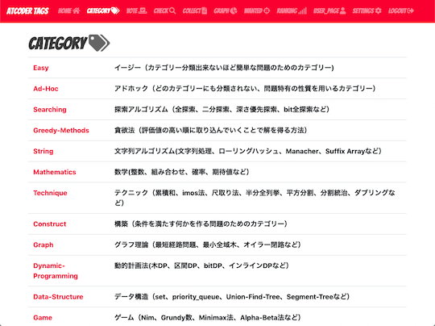

## 定番サービスを利用する

- [AtCoder Problems](https://kenkoooo.com/atcoder/) - 開催されたコンテストの問題を一覧できる。問題の正誤状況や各種集計結果を確認できるだけでなく、バーチャルコンテストなどの機能もある。詳しくは、以下のドキュメント・記事を参照されたい。
    - [User Guide](https://kenkoooo.com/atcoder/book/ja/index.html) - 同サービスで提供されているドキュメント(日本語)。
    - [AtCoder Problemsの使い方（AtCoder Problemsを知らない人向け）](https://ntk-ta01.hatenablog.com/entry/2020/04/15/001405) - 有志が使い方を解説した記事。
    - [AtCoder Problems Contest Builder](https://github.com/KowerKoint/ac-problems-contest-builder)  - 有志によるバーチャルコンテスト作成のための補助ツール。問題の難易度の範囲を指定すると、出題される問題セットが自動的に作成・追加される。
        - [茶コーダーが競プロ知識だけでやってみた！シリーズ〜バチャを半自動で立てられるPythonを改変し、Twitter投稿用テキストも生成してみた話〜](https://d-burioden.hateblo.jp/entry/2023/05/27/033554) - 同ツールを活用して、バーチャルコンテストとTwitter投稿用の文面を同時に作成する方法を紹介した記事。
        - [GitHub ActionsでAtCoder Problemsのバーチャルコンテストを自動で作成したい](https://zenn.dev/powell/scraps/224688ca6ce2b5) - 同ツールとGitHub Actionsを利用して、バーチャルコンテストの作成を自動化する方法が紹介されている。

    !!! info "参考"
        定期的に開催されているバーチャルコンテストの[一例](../../bot)

    !!! warning "注意"
        記事に掲載されている図やバーチャルコンテストの名称・内容は、最新情報と異なる場合もある。

    

      
    

- [Virtual Judge](https://vjudge.net/) - 30以上のコンテストサイトの問題を利用して、バーチャルコンテストが開催できる。

    

      
    

## 特定の分野・難易度を重点的に学ぶ

### アルゴリズム部門

- [AtCoder Tags](https://atcoder-tags.herokuapp.com/) - 問題のカテゴリーを分類する。ユーザ登録を行えば、問題にふさわしいと思うカテゴリーを投票できる。[AtCoderTags_Helper](https://greasyfork.org/ja/scripts/393121-atcodertags-helper)を導入すると、[AtCoder](https://atcoder.jp/)の「問題」ページからも投票できる。

    

      
    

- [AtCoder Gacha](https://atcoder-gacha.onrender.com/) - 難易度や正誤状況を指定して、問題を絞り込むことができる。

    

      
    

- [AtCoder NoviSteps](https://atcoder-novisteps.vercel.app/) - 問題の取組み状況(AC、解説AC、挑戦中、未挑戦)を自分で記録していくことができる。また、細かく難易度付けされており、必要な知識を段階的に習得可能。

    

      
    

- [searchapp](https://andoryoto.github.io/WebApplication/searchapp/) - 指定した語句が問題文や公式解説に含まれる問題を検索できる。

    

      
    

- [AtCoder Editorial Problems](https://ajinoko33.github.io/AtCoderEditorialProblems/) - 解説を書いたユーザを指定して問題を検索できる。

    

      
    

- [Atcoder Daily Contests](https://github.com/ika9810/Atcoder-Daily-Contests)  - 日替わりで問題を解くことができる。[AtCoder](https://atcoder.jp/)の過去問から、仮想的なAtCoder Xxx Contest (Xxx: Beginner, Regular, Grand)クラスの問題セットが出題される。

    

      
    

- [Rosetta Problems](https://rosetta-problems-dev.vercel.app/) - 国内外30以上のオンラインジャッジシステムから有名な問題を一括検索できる。

### ヒューリスティック部門

- [mm-tester](https://github.com/kosakkun/mm-tester)  - ヒューリスティック型コンテストの問題とサンプルコードがまとめられている。

## 復習の効果をより高める

- [AtCoder Companions](https://atcoder-companions.kakira.dev/) - 指定された提出(WA・RE・TLE・MLE)に基づいて、類似した誤答と最終的に正解した提出との差分を見やすく表示する。
    - [AtCoder Companions Quick Jump](https://greasyfork.org/ja/scripts/463653-atcoder-companions-quick-jump) - [AtCoder](https://atcoder.jp/)の「提出結果」ページから、指定した提出に類似したコードを探せるユーザスクリプト。

    

      
    

- [AtCoder-Review](https://at-coder-review.vercel.app/) - 任意のユーザが正解(AC)した問題とその回数を表示する。

    !!! warning "注意"
        検索ボタンの連打などは控える。過剰なAPIリクエストを回避するため。

    

      
    

## おすすめの問題を共有

- [kyopro share](https://kyopro-share.onrender.com/#/about) - 競技プログラミングのおすすめの問題を共有できる。

    

      
    

## ライブラリ・スニペットを共有

- [CompSnips](https://compsnips.zeronosu77108.com/) - 競技プログラミングのライブラリ・スニペットを登録・閲覧できる。検索やVisual Studio Codeのスニペット用のJSONを出力する機能もある。

    

      
    

## 問題を投稿・解答する

- [MojaCoder](https://mojacoder.app/) - 競技プログラミングに関する問題を投稿・解答できるオンラインジャッジシステム。解答で利用できる言語は、Brainfuck、C、C++、C#、Go、Java、Python3、Ruby、Rust、Textなど。
    - [初めてのコンテストの開き方(MojaCoder)](https://ajinoko33.hatenablog.com/entry/2023/02/18/141240) - 有志によりコンテストの開催方法がまとめられている記事。「[問題を作成・出題する](../../articles/for_writers)」ページや「[問題作成に関する便利ツール](../../cli/tools_for_writers)」ページも併せて参照されたい。

    !!! danger "警告"
        - [告知専用のTwitterアカウント](https://twitter.com/MojaCoder)もあるが、2021年8月以降は更新を確認できず。

    !!! warning "注意"
        - 同サービスを引き続き利用するには、[MOFE](https://mofecoder.com/)への移行作業が必要([出典](https://twitter.com/CafeCoder_/status/1689280921835335680))。

    

      
    

## 多言語への対応

- [AtCoder 中文站](https://atcoder-for-chinese-developers.github.io/atcoder-for-chinese/) - 中国語ユーザ向けに、コンテストの問題文の翻訳と解説・ソースコードの一例がまとめられている。[ユーザスクリプト版](https://greasyfork.org/ja/scripts/452449-atcoder-%E4%B8%AD%E6%96%87%E5%8A%A9%E6%89%8B)もある。

    

      
    

