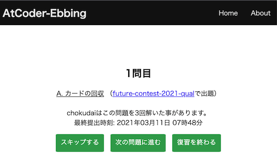
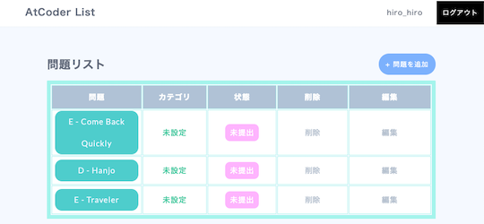
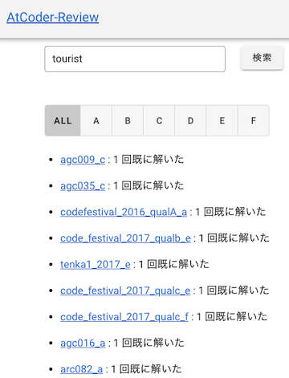

## 定番サービスを利用する

- [AtCoder Problems](https://kenkoooo.com/atcoder/) - 開催されたコンテストの問題を一覧できる。問題の正誤状況や各種集計結果を確認できるだけでなく、バーチャルコンテストなどの機能もある。詳しくは、以下のドキュメント・記事を参照されたい。
    - [User Guide](https://kenkoooo.com/atcoder/book/ja/index.html) - 同サービスで提供されているドキュメント(日本語)。
    - [AtCoder Problemsの使い方（AtCoder Problemsを知らない人向け）](https://ntk-ta01.hatenablog.com/entry/2020/04/15/001405) - 有志が使い方を解説した記事。

    !!! warning "注意"
        記事に掲載されている図やバーチャルコンテストの名称・内容は、最新情報と異なる場合もある。

    

      
    

- [Virtual Judge](https://vjudge.net/) - 30以上のコンテストサイトの問題を利用して、バーチャルコンテストが開催できる。

    

      
    

## 特定の分野・難易度を重点的に学ぶ

### アルゴリズム部門

- [AtCoder Gacha](https://atcoder-gacha.onrender.com/) - 難易度や正誤状況を指定して、問題を絞り込むことができる。

    

      
    

### ヒューリスティック部門

- [mm-tester](https://github.com/kosakkun/mm-tester)  - ヒューリスティック型コンテストの問題とサンプルコードがまとめられている。

## 復習の効果をより高める

- [AtCoder-Ebbing](https://atcoder-ebbing.web.app/) - 任意のユーザのレーティング・回答状況に応じて、復習すると効果が高い問題が出題される。作者による[解説記事](https://qiita.com/numeric_tuba/items/9898e31e2566e7296c5d)もある。

    

      
    

- [AtCoder List](http://atcoder-list.herokuapp.com) - 過去問から自分専用の問題リストを作ることができる。コンテストで出題された問題の情報は、前述の[AtCoder Problems](https://kenkoooo.com/atcoder/)などを参照されたい。

    

      
    

- [AtCoder-Review](https://at-coder-review.vercel.app/) - 任意のユーザが正解(AC)した問題とその回数を表示する。

    !!! warning "注意"
        検索ボタンの連打などは控える。過剰なAPIリクエストを回避するため。

    

      
    

## 問題を投稿・解答する

- [MojaCoder](https://mojacoder.app/) - 競技プログラミングに関する問題を投稿・解答できるオンラインジャッジシステム。解答で利用できる言語は、Brainfuck、C、C++、C#、Go、Java、Python3、Ruby、Rust、Textなど。

    !!! danger "警告"
        - サービス運営者の連絡先が削除されており、今後の不具合対応や機能追加などの可能性は低いと思われる。

        - [告知専用のTwitterアカウント](https://twitter.com/MojaCoder)もあるが、2021年8月以降は更新を確認できず。

    

      
    

