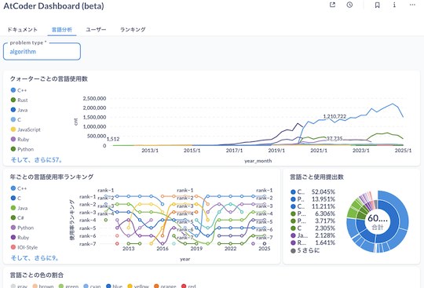
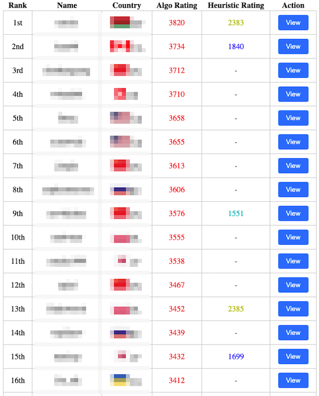
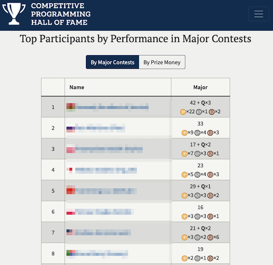

コンテストに関する統計情報を、問題とユーザの観点から分類しています。

## 分析・可視化プラットフォーム

- [AtCoder Dashboard (beta)](https://atcoder-db.sirogami.com/) - AtCoder の関連データの分析・可視化が誰でも実行できる環境が提供されている。言語の利用状況・ユーザの提出状況・ランキングを閲覧できる。

    !!! info "参考"

        - Google アカウントでログイン、もしくは、任意のメールアドレスでサインインが必要。

    

      
    

## ユーザに関する統計

### 複数の指標

- [AtCoder Users Viewer](https://beta.kyo-pro.club/apps/users) - アルゴリズム部門・ヒューリスティック部門のレーティングに基づいた順位表、各ユーザのソースコードの提出履歴・成績などを検索・閲覧できる。

    

      
    

### 正解数

- [AC Counter](https://ac-counter.onrender.com) - 任意のユーザが正解した問題数を表示する。以下のコンテストサイトに対応。
    - [AtCoder](https://atcoder.jp/)
    - [AOJ (AIZU ONLINE JUDGE)](https://onlinejudge.u-aizu.ac.jp/home)
    - [Codeforces](https://codeforces.com/)
    - [LeetCode](https://leetcode.com/)
    - [Library Checker Problems](https://judge.yosupo.jp/)
    - [Topcoder](https://www.topcoder.com/)
    - [yukicoder](https://yukicoder.me/)

    

      
    

### 偏差値

- [deviation](https://atcoder-notify.com/deviation/) - 任意のユーザもしくは特定のレーティングに基づいた偏差値（アルゴリズム部門・ヒューリスティック部門）を表示する。

    

      
    

### 成績の推移

- [AtCoder Heuristic Contest Statistics (AHC-stats)](https://ahc-stats.vercel.app) - [AtCoder Heuristic Contest (AHC)](https://atcoder.jp/contests/archive?ratedType=4&category=0&keyword=)のパフォーマンス値・レーティングの推移、アルゴリズム部門とヒューリスティック部門のレーティングの相関などを見ることができる。

    

      
    

### 成績および条件別の得点・順位

- [Competitive Programming Hall Of Fame](https://cphof.org/) - 国際大会（オンサイト）の成績上位者一覧を確認できる。

    

      
    

- [ahc_standings](https://img.atcoder.jp/ahc_standings/index.html?contest=ahc025) - [AtCoder Heuristic Contest (AHC)](https://atcoder.jp/contests/archive?ratedType=4&category=0&keyword=)を対象とした高機能な順位表(公式)。

    

      
    

- [AHC statistics](https://siman-man.github.io/ahc_statistics/) - 長期コンテストのシステムテストの結果に基づいて、パラメータ別の得点・順位が集計されている。

    

      
    

- [scorerun](https://siman-man.github.io/scorerun/index.html) - 各コンテストで1位となったユーザの得点と提出コードの一覧を表示する。延長戦の有無別に集計されている。

    

      
    

- [wladimirleite.github.io](https://github.com/wladimirleite/wladimirleite.github.io)  - [AtCoder Heuristic Contest (AHC)](https://atcoder.jp/contests/archive?ratedType=4&category=0&keyword=)の最終成績や制約条件別の得点・順位を見ることができる。[Topcoder](https://www.topcoder.com/)のMarathon Matches(MM)についても、同様の集計がされている。
    - [AHC 045](https://wladimirleite.github.io/ahc045.html)

    ??? info "過去のAHCの集計結果"

        - [AHC 038](https://wladimirleite.github.io/ahc038.html)
        - [AHC 031](https://wladimirleite.github.io/ahc031.html)
        - [AHC 017](https://wladimirleite.github.io/ahc017.html)
        - [AHC 016](https://wladimirleite.github.io/ahc016.html)
        - [AHC 014](https://wladimirleite.github.io/ahc014.html)
        - [AHC 013](https://wladimirleite.github.io/ahc013.html)
        - [AHC 011](https://wladimirleite.github.io/ahc011.html)
        - [AHC 008](https://wladimirleite.github.io/ahc008.html)

    

      
    

### コンテスタントとしての特性を知る

- [AtCoder Type Checker](https://atcoder-type-checker.herokuapp.com/) - コンテストの成績から、同じ(内部)レーティング帯で「多く解くタイプ」か「早く解くタイプ」かを判定してくれる。また、有志によりレーティング2800〜3000の日本人ユーザのスコアが集計されている([出典](https://twitter.com/gojira_kyopro/status/1377204092410327040))。

    

      
    

### 統計情報からトロフィーを作成

- [AtCoder Trophies](https://atcoder-trophies.vercel.app/) - AtCoderに関連する統計情報を利用してトロフィーアイコンを動的に生成し、GitHubのREADMEに貼ることができる。

    

      
    

