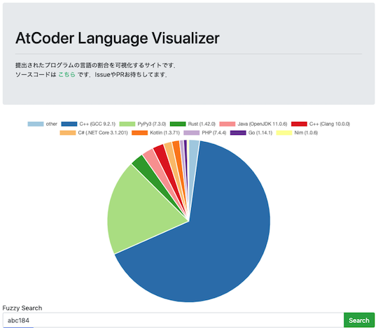
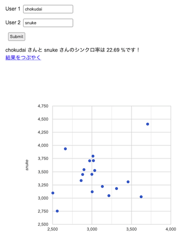
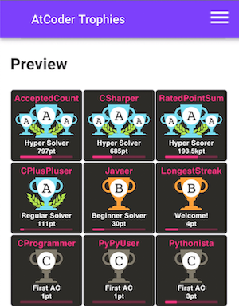

コンテストに関する統計情報を、問題とユーザの観点から分類しています。

## 問題に関する統計・予測

### 提出数

- [AtCoder Language Visualizer](https://inazuma110.github.io/atcoder_language_visualizer/) - 各問題の言語別提出数・割合を表示する。また、作者による使い方・技術解説に関する[記事](https://qiita.com/Inazuma110/items/e02b8b1c71e101b41635)もある。

    

      
    

## ユーザに関する統計

### 正解数

- [AC Counter](https://ac-counter.onrender.com) - 任意のユーザが正解した問題数を表示する。以下のコンテストサイトに対応。
    - [AtCoder](https://atcoder.jp/)
    - [AOJ (AIZU ONLINE JUDGE)](https://onlinejudge.u-aizu.ac.jp/home)
    - [Codeforces](https://codeforces.com/)
    - [LeetCode](https://leetcode.com/)
    - [Library Checker Problems](https://judge.yosupo.jp/)
    - [Topcoder](https://www.topcoder.com/)
    - [yukicoder](https://yukicoder.me/)

    

      
    

### 偏差値

- [deviation](https://atcoder-notify.com/deviation/) -　任意のユーザもしくは特定のレーティングに基づいた偏差値（アルゴリズム部門・ヒューリスティック部門）を表示する。

    

      
    

### 成績の推移

- [AtCoder Heuristic Contest Statistics (AHC-stats)](https://ahc-stats.vercel.app) - [AtCoder Heuristic Contest (AHC)](https://atcoder.jp/contests/archive?ratedType=4&category=0&keyword=)のパフォーマンス値・レーティングの推移、アルゴリズム部門とヒューリスティック部門のレーティングの相関などを見ることができる。

    

      
    

### 成績および条件別の得点・順位

- [ahc_standings](https://img.atcoder.jp/ahc_standings/index.html?contest=ahc025) - [AtCoder Heuristic Contest (AHC)](https://atcoder.jp/contests/archive?ratedType=4&category=0&keyword=)を対象とした高機能な順位表(公式)。

    

      
    

- [AHC statistics](https://siman-man.github.io/ahc_statistics/) - 長期コンテストのシステムテストの結果に基づいて、パラメータ別の得点・順位が集計されている。

    

      
    

- [scorerun](https://siman-man.github.io/scorerun/index.html) - 各コンテストで1位となったユーザの得点と提出コードの一覧を表示する。延長戦の有無別に集計されている。

    

      
    

- [wladimirleite.github.io](https://github.com/wladimirleite/wladimirleite.github.io)  - [AtCoder Heuristic Contest (AHC)](https://atcoder.jp/contests/archive?ratedType=4&category=0&keyword=)の最終成績や制約条件別の得点・順位を見ることができる。[Topcoder](https://www.topcoder.com/)のMarathon Matches(MM)についても、同様の集計がされている。
    - [AHC 038](https://wladimirleite.github.io/ahc038.html)

    ??? info "過去のAHCの集計結果"

        - [AHC 031](https://wladimirleite.github.io/ahc031.html)
        - [AHC 017](https://wladimirleite.github.io/ahc017.html)
        - [AHC 016](https://wladimirleite.github.io/ahc016.html)
        - [AHC 014](https://wladimirleite.github.io/ahc014.html)
        - [AHC 013](https://wladimirleite.github.io/ahc013.html)
        - [AHC 011](https://wladimirleite.github.io/ahc011.html)
        - [AHC 008](https://wladimirleite.github.io/ahc008.html)

    

      
    

### 成績の平均値・最高値

- [AtCoder QQ](https://atcoder-qq.vercel.app/) - コンテストの順位を、最高順位が含まれる形で表形式 (縦軸: 10の位、横軸: 1の位) で示す。また、セルをクリックすると、該当するコンテスト情報が表示される。

    

      
    

### 成績に関する相関係数

- [atcoder-synchronicity](https://phocom.github.io/atcoder-synchronicity/) - 指定した2人のユーザのシンクロ率(両者のパフォーマンス値の相関係数)を表示する。

    

      
    

- [AtCoder Training-Performance Visualizer](http://atcoder-training-performance-visualizer.azurewebsites.net/App) - 日々の練習（通称、精進）が、コンテストのパフォーマンスにどの程度影響しているかを確認できる。

    

      
    

### コンテスタントとしての特性を知る

- [AtCoder Type Checker](https://atcoder-type-checker.herokuapp.com/) - コンテストの成績から、同じ(内部)レーティング帯で「多く解くタイプ」か「早く解くタイプ」かを判定してくれる。また、有志によりレーティング2800〜3000の日本人ユーザのスコアが集計されている([出典](https://twitter.com/gojira_kyopro/status/1377204092410327040))。

    

      
    

### 統計情報からトロフィーを作成

- [AtCoder Trophies](https://atcoder-trophies.vercel.app/) - AtCoderに関連する統計情報を利用してトロフィーアイコンを動的に生成し、GitHubのREADMEに貼ることができる。

    

      
    

### ランキング

#### 順位によるポイントランキング

- [AtCoder Heuristic Race Ranking *Unofficial*](https://tomerun.github.io/ahc_point_race/publish/2023.html) - [AtCoder Heuristic Contest (AHC)](https://atcoder.jp/contests/archive?ratedType=4&category=0&keyword=)の順位に基づいた年別のポイントランキングを見ることができる。集計は、[AtCoder レースランキング](https://atcoder.jp/posts/170)の方法に基づいている。

    

      
    

