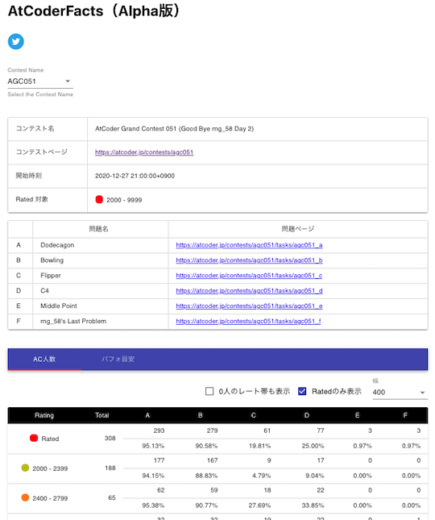
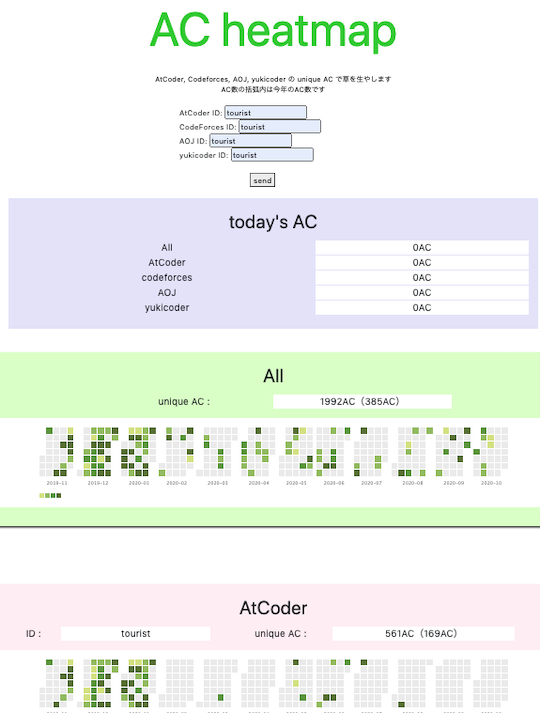
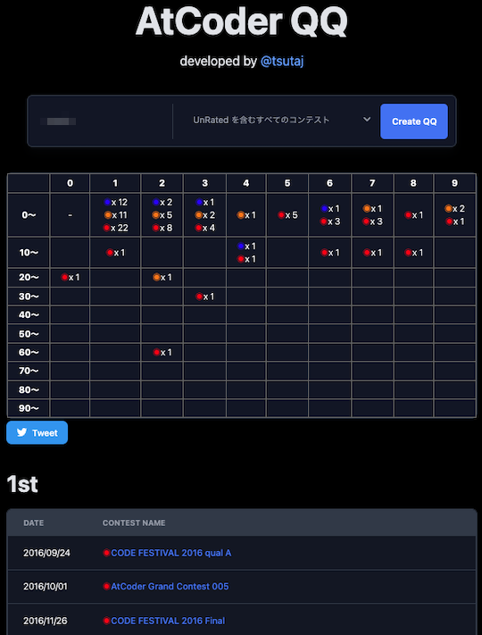
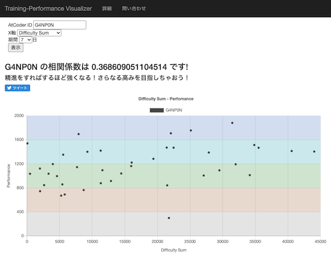

コンテストに関する統計情報を、問題とユーザの観点から分類しています。

## 問題に関する統計・予測

### 正解者数・正解率

- [AtCoderFacts](https://app.atcoder-facts.com/) - Ratedコンテストを対象として、レーティング別・問題別の正解者数・正解率を表示する。また、所定のパフォーマンスを得るための得点と所要時間の目安を知ることもできる。

    !!! warning "注意"
        2022年2月以降のコンテストは、反映されていない可能性が高い。

    

      
    

### 提出数

- [AtCoder Language Visualizer](https://inazuma110.github.io/atcoder_language_visualizer/) - 各問題の言語別提出数・割合を表示する。また、作者による使い方・技術解説に関する[記事](https://qiita.com/Inazuma110/items/e02b8b1c71e101b41635)もある。

    

      
    

## ユーザに関する統計

### 解答状況をヒートマップで見る

- [AC heatmap](https://rika0384.github.io/ac-heatmap/?handle_atcoder=&handle_codeforces=&handle_aoj=&handle_yukicoder=) - 任意のユーザが[AtCoder](https://atcoder.jp/)、[Codeforces](https://codeforces.com/)、[AOJ (AIZU ONLINE JUDGE)](https://onlinejudge.u-aizu.ac.jp/home)、[yukicoder](https://yukicoder.me/)で解いた問題のうち、unique ACをヒートマップで表示する。

    

      
    

### 正解数

- [AC Counter](https://accepted-counter.web.app/) - 任意のユーザが正解した問題数を表示する。以下のコンテストサイトに対応。
    - [AtCoder](https://atcoder.jp/)
    - [AOJ (AIZU ONLINE JUDGE)](https://onlinejudge.u-aizu.ac.jp/home)
    - [Codeforces](https://codeforces.com/)
    - [Library Checker Problems](https://judge.yosupo.jp/)
    - [LeetCode](https://leetcode.com/)
    - [Topcoder](https://www.topcoder.com/)
    - [yukicoder](https://yukicoder.me/)

    

      
    

### 成績および制約条件別の得点・順位

- [tc-wleite/tc-wleite.github.io](https://github.com/tc-wleite/tc-wleite.github.io)  - [AtCoder Heuristic Contest (AHC)](https://atcoder.jp/contests/archive?ratedType=4&category=0&keyword=)の最終成績や制約条件別の得点・順位を見ることができる。[Topcoder](https://www.topcoder.com/)のMarathon Matches(MM)についても、同様の集計がされている。
    - [AHC 016](https://tc-wleite.github.io/ahc016.html)
    - [AHC 014](https://tc-wleite.github.io/ahc014.html)
    - [AHC 013](https://tc-wleite.github.io/ahc013.html)
    - [AHC 011](https://tc-wleite.github.io/ahc011.html)
    - [AHC 008](https://tc-wleite.github.io/ahc008.html)

    

      
    

### 成績の平均値・最高値

- [AtCoder QQ](https://app.tsutaj.com/atcoder-qq/) - コンテストの順位を、最高順位が含まれる形で表形式 (縦軸: 10の位、横軸: 1の位) で示す。

    

      

### 成績に関する相関係数

- [atcoder-synchronicity](https://phocom.github.io/atcoder-synchronicity/) - 指定した2人のユーザのシンクロ率(両者のパフォーマンス値の相関係数)を表示する。

    

      
    

- [AtCoder Training-Performance Visualizer](http://atcoder-training-performance-visualizer.azurewebsites.net/App) - 日々の練習（通称、精進）が、コンテストのパフォーマンスにどの程度影響しているかを確認できる。

    

      
    

### コンテスタントとしての特性を知る

- [AtCoder Type Checker](https://atcoder-type-checker.herokuapp.com/) - コンテストの成績から、同じ(内部)レーティング帯で「多く解くタイプ」か「早く解くタイプ」かを判定してくれる。また、有志によりレーティング2800〜3000の日本人ユーザのスコアが集計されている([出典](https://twitter.com/gojira_kyopro/status/1377204092410327040))。

    

      
    

### 統計情報からトロフィーを作成

- [AtCoder Trophies](https://atcoder-trophies.vercel.app/) - AtCoderに関連する統計情報を利用してトロフィーアイコンを動的に生成し、GitHubのREADMEに貼ることができる。

    

      
    

### ランキング

#### 順位によるポイントランキング

- [AtCoder Heuristic Race Ranking *Unofficial*](https://docs.google.com/spreadsheets/d/1gFmqVYr44QlQBkHKLcd1YyFM_-Ne7Hzf7SODbADx8HI/edit#gid=340005926) - [AtCoder Heuristic Contest (AHC)](https://atcoder.jp/contests/archive?ratedType=4&category=0&keyword=)の順位に基づいたポイントランキングを見ることができる。

    

      
    

#### 賞金ランキング

- [AtCoder賞金ランキング](https://docs.google.com/spreadsheets/d/1E7Ho85znRw7ebB7ZATWBQckM2P_7qZYc35XZExlL_a4/edit#gid=1741891477) - 賞金付きコンテストの獲得額(目安)を集計している。[元ツイート](https://twitter.com/gojira_kyopro/status/1281199066408292353)を参照。

    !!! warning "注意"
        2021年5月以降のコンテストは、反映されていない可能性が高い。

    

      
    

