## コードエディタ・統合開発環境

- [Simple C++ Editor](https://tumoiyorozu.github.io/SimpleCppEditor/) - ブラウザでC++が実行できるコードエディタ。特徴的な機能として、ソースコードの自動保存・標準出力の順次出力・エラーメッセージの日本語化・実行時エラーの捕捉などがある。詳しくは、作者の[紹介記事](https://qiita.com/TumoiYorozu/items/7a9b862071edd5427200)を参照されたい。

    

      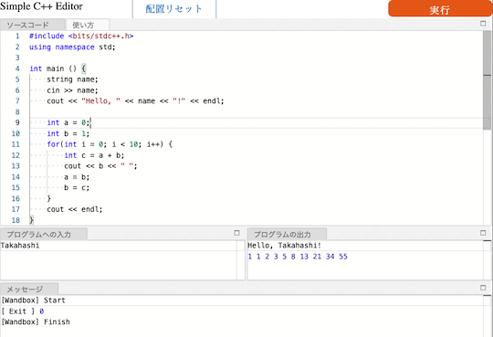
    

## 配列の消費メモリ量を知る

- [配列のサイズと型を入力すると何MBか教えてくれるうし](https://ei1333.github.io/beet/memory.html) - 配列のサイズと型を入力すると消費メモリ量が表示される。

    

      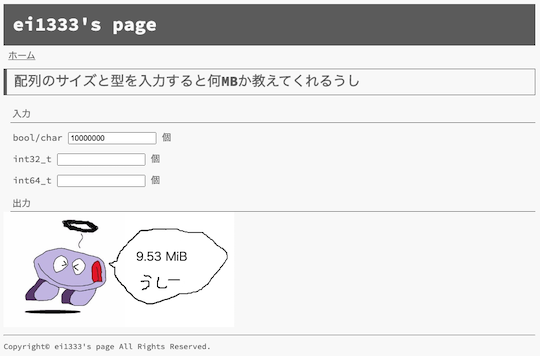
    

## グラフを可視化

- [Graph Editor](https://kentakom1213.github.io/graph-editor/) - グラフを直感的に作成しながら、標準入力用の数値データも同時に用意できる。

    

      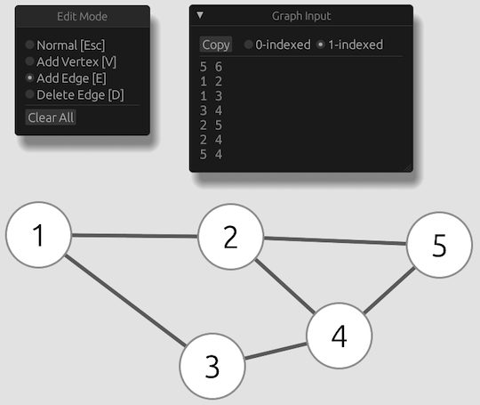
    

- [Graph Editor](https://graph-editor.daikusutora3.workers.dev/) - 問題の入力例やサンプルから、さまざまなグラフを作成・図示できる。配置のオプションが豊富に用意されている。

    

      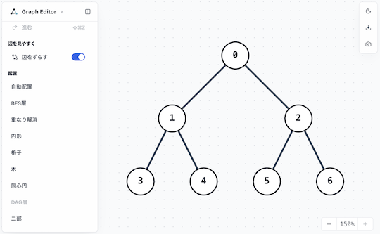
    

- [GRAPH × GRAPH](https://hello-world-494ec.firebaseapp.com/) - グラフ理論に関する問題の入力例をリアルタイムで可視化できる。
    - [ggg(go GRAPH × GRAPH)](https://github.com/monkukui/ggg) - ターミナル上で同サイトを起動するためのCLIツール
    - [作者による紹介記事](https://monkukui.hatenablog.com/entry/2020/10/01/173918)

    

      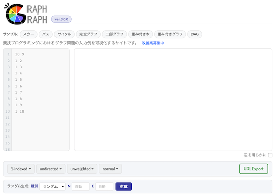
    

- [Kyopro Visualizer](https://yukitonegawa.github.io/visualizer.html) - 有向グラフ・無向グラフの生成・図示だけでなく、数列の生成・統計諸量の要約や幾何の図示にも対応している。

    

      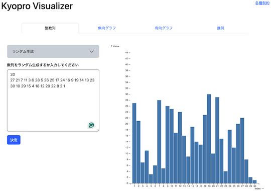
    

- [MINI GENERATOR](https://mini-generator.netlify.app/graph) - さまざまなグラフが生成できることに加えて、その内容をSNSで共有できる。

    

      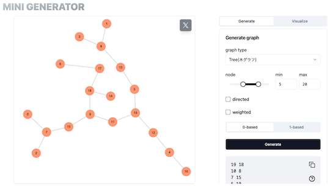
    

## グリッド状の図を作成・出力

- [グリッドエディタ](https://paruma.github.io/grid-editor/) - グリッド形式のテストケースを手動で簡単に作成・編集できる。

    

      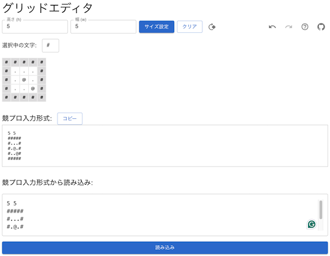
    

- [Generic Grid Editor](https://snuke.main.jp/gge/) - グリッド状の図を作成・出力できる。

    

      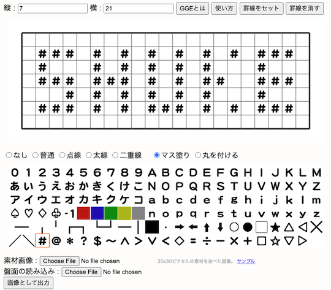
    

## 二次元平面上の図形を可視化

- [Geometry Visualizer](https://tatesoto.github.io/cp-geo-visualizer/) - 競技プログラミングにおける計算幾何の入力例の図示やデバッグができる。
    - [競プロの入力をそのまま描画できる幾何ビジュアライザを作った](https://zenn.dev/tatesoto/articles/a656925e126353) - 作者によるサービスの紹介および技術解説。

    

      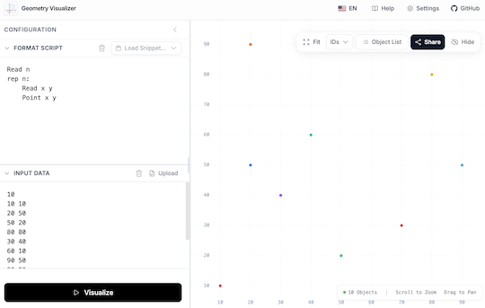
    

- [2DPlot Visualizer](https://hibit-at.github.io/2D_plot_visualizer/) - 二次元平面上の点群を図示できる。

    

      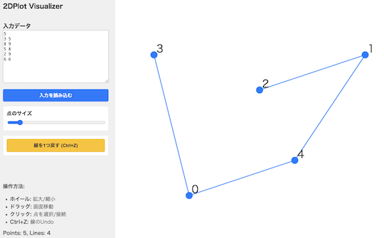
    

## 有理数 mod から復元

- [Reverse Mod](https://e6nlaq.vercel.app/mod) - 剰余演算で変換された有理数を元の分数形式に戻せる。

    

      
    

## 数列から母関数や数式を求める

- [Sequence Recurrence Finder](https://maruoka842.github.io/functionFinder/) - 任意の数列から、その規則性を表す母関数や数式を導出できる。

    

      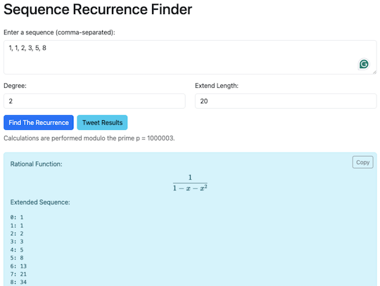
    

## 関連記事を検索

- [検索エンジン集](https://magurofly.github.io/tools/search) - 競技プログラミングに関する記事を検索できる。

    

      
    

## ヒューリスティック問題の入出力を可視化

!!! warning "注意"
    コンテスト期間中に関連ツールなどを公開する場合は、事前に運営チームへの問い合わせと了承を得ておくことを強く推奨いたします([参考](https://twitter.com/maspy_stars/status/1368224269671395331))。

### ビジュアライザ

- [AHC Vis Archiver](https://github.com/koyumeishi/ahc_vis_archiver)  - [AtCoder Heuristic Contest](https://atcoder.jp/contests/archive?ratedType=4&category=0&keyword=AtCoder+Heuristic+Contest)のビジュアライザに関連するファイルをローカル環境に保存して実行できる。Pythonの実行環境と関連ライブラリのインストールが必要。

    

      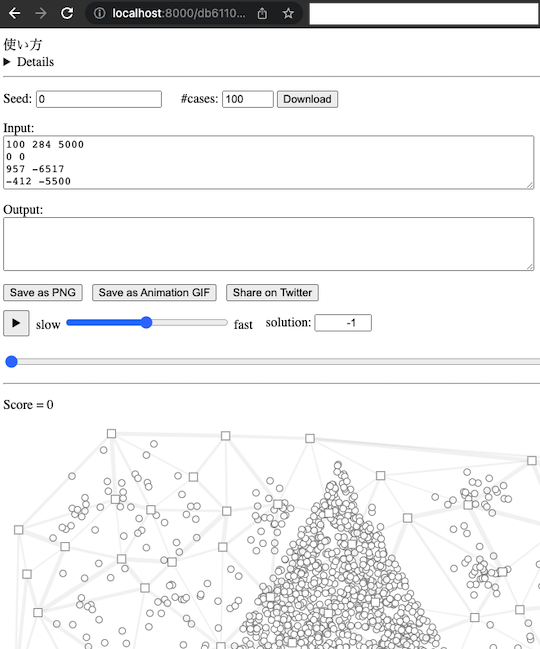
    

- [p5visualizer](https://github.com/shindannin/p5visualizer)  - C++で書かれたソースコードに描画コマンドを埋め込み、出力結果をブラウザに表示させることができる。

    

      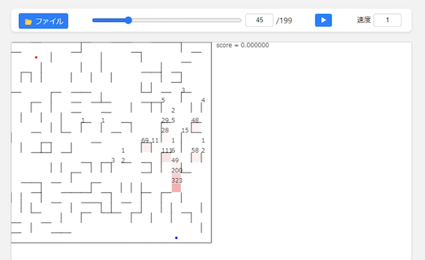
    

