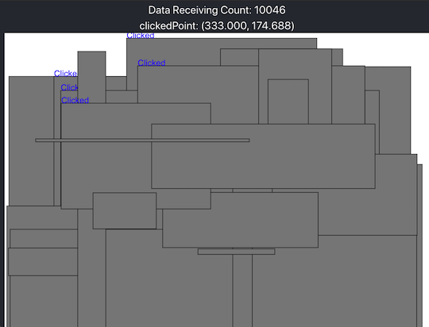

## コードエディタ・統合開発環境

- [Simple C++ Editor](https://tumoiyorozu.github.io/SimpleCppEditor/) - ブラウザでC++が実行できるコードエディタ。特徴的な機能として、ソースコードの自動保存・標準出力の順次出力・エラーメッセージの日本語化・実行時エラーの捕捉などがある。詳しくは、作者の[紹介記事](https://qiita.com/TumoiYorozu/items/7a9b862071edd5427200)を参照されたい。

    

      
    

- [Hisui](https://github.com/adenohitu/hisui)  - 競技プログラミング専用のサポートツール(Alpha版)。コードエディタ(C++とPythonに対応)、ダッシュボード、解答コードのテスト・提出などの機能が用意されている。

    !!! warning "注意"
        2022年6月時点で、コンテスト中の利用は非推奨。

    

      
    

- [Rujaion](https://github.com/fukatani/rujaion)  - 競技プログラミングのためのRust IDE。C++とPythonも試験的にサポートされている。サンプルのテスト、解答コードの提出、コードの補完・移動・自動整形、テンプレートの生成、グラフの構造の可視化などの機能がある。

    

      
    

## 問題文から提出用コードのテンプレートを作成

- [online-judge-tools/template-generator-webapp](https://online-judge-tools.github.io/template-generator-webapp/) - コンテストの問題を解析して、提出用コードのテンプレートを出力する[Online Judge Template Generator](https://github.com/online-judge-tools/template-generator)のWebアプリ版。C++とPython3に対応している。

    !!! warning "注意"
        コンテスト中はコマンドライン版のみ利用できる。

    

      
    

## 配列の消費メモリ量を知る

- [配列のサイズと型を入力すると何MBか教えてくれるうし](https://ei1333.github.io/beet/memory.html) - 配列のサイズと型を入力すると消費メモリ量が表示される。

    

      
    

## グラフを可視化

- [GRAPH × GRAPH](https://hello-world-494ec.firebaseapp.com/) - グラフ理論に関する問題の入力例を可視化する。ターミナル上で同サイトを起動するためのCLIツール[ggg(go GRAPH × GRAPH)](https://github.com/monkukui/ggg)と[作者による紹介記事](https://monkukui.hatenablog.com/entry/2020/10/01/173918)もある。

    

      
    

## ヒューリスティック問題の入出力を可視化

!!! warning "注意"
    コンテスト期間中に関連ツールなどを公開する場合は、事前に運営チームへの問い合わせと了承を得ておくことを強く推奨いたします([参考](https://twitter.com/maspy_stars/status/1368224269671395331))。

### ビジュアライザフレームワーク

- [Marathon General Visualizer](https://github.com/kyuridenamida/marathon-general-visualizer)  - ヒューリスティック型コンテストにおける入出力の結果をリアルタイムで表示させるためのビジュアライザフレームワーク。問題に応じて、表示する内容をカスタマイズできる。

    

      
    

### ビジュアライザ

- [ahc001-gen-vis-wasm](https://kenkoooo.github.io/ahc001-gen-vis-wasm/) - [AtCoder Heuristic Contest 001](https://atcoder.jp/contests/ahc001)で提供されている入力ジェネレータとビジュアライザをWebブラウザから利用することできる。ソースコードは、[GitHub](https://github.com/kenkoooo/ahc001-gen-vis-wasm) で公開されている。

    

      
    

