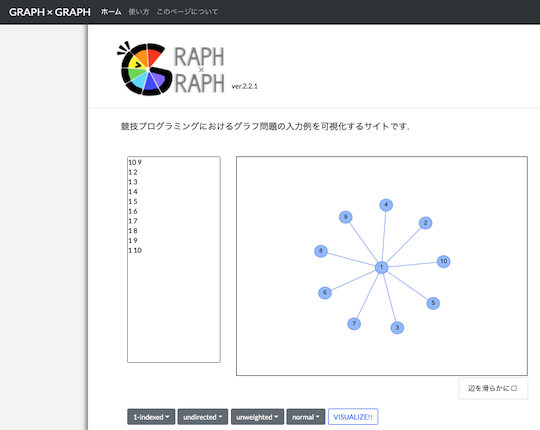

## コードエディタ・統合開発環境

- [Simple C++ Editor](https://tumoiyorozu.github.io/SimpleCppEditor/) - ブラウザでC++が実行できるコードエディタ。特徴的な機能として、ソースコードの自動保存・標準出力の順次出力・エラーメッセージの日本語化・実行時エラーの捕捉などがある。詳しくは、作者の[紹介記事](https://qiita.com/TumoiYorozu/items/7a9b862071edd5427200)を参照されたい。

    

      
    

## 問題文から提出用コードのテンプレートを作成

- [online-judge-tools/template-generator-webapp](https://online-judge-tools.github.io/template-generator-webapp/) - コンテストの問題を解析して、提出用コードのテンプレートを出力する[Online Judge Template Generator](https://github.com/online-judge-tools/template-generator)のWebアプリ版。C++とPython3に対応している。

    !!! warning "注意"
        コンテスト中はコマンドライン版のみ利用できる。

    

      
    

## 配列の消費メモリ量を知る

- [配列のサイズと型を入力すると何MBか教えてくれるうし](https://ei1333.github.io/beet/memory.html) - 配列のサイズと型を入力すると消費メモリ量が表示される。

    

      
    

## グラフを可視化

- [Graph Editor](https://kentakom1213.github.io/graph-editor/) - グラフを直感的に作成しながら、標準入力用の数値データも同時に用意できる。

    

      
    

- [GRAPH × GRAPH](https://hello-world-494ec.firebaseapp.com/) - グラフ理論に関する問題の入力例を可視化する。ターミナル上で同サイトを起動するためのCLIツール[ggg(go GRAPH × GRAPH)](https://github.com/monkukui/ggg)と[作者による紹介記事](https://monkukui.hatenablog.com/entry/2020/10/01/173918)もある。

    

      
    

- [Kyopro Visualizer](https://yukitonegawa.github.io/visualizer.html) - 有向グラフ・無向グラフの生成・図示だけでなく、数列の生成・統計諸量の要約や幾何の図示にも対応している。

    

      
    

- [MINI GENERATOR](https://mini-generator.netlify.app/graph) - さまざまなグラフが生成できることに加えて、その内容をSNSで共有できる。

    

      
    

- [Sheep Visualize Graph Beta](https://binomialsheep.github.io/sheep-visualize-graph-beta/) - (ベータ版) グラフ理論に関する問題の入力例を可視化する。頂点を左クリック、もしくは、右クリックすると色を変えられる。

    

      
    

- [グラフ可視化ツール](https://zeronosu77108.github.io/show-graph/) - 有向グラフ・無向グラフの入力例を可視化する。頂点だけでなく、辺の色も変えられる。

    

      
    

## 関連記事を検索

- [検索エンジン集](https://magurofly.github.io/tools/search) - 競技プログラミングに関する記事を検索できる。

    

      
    

## ヒューリスティック問題の入出力を可視化

!!! warning "注意"
    コンテスト期間中に関連ツールなどを公開する場合は、事前に運営チームへの問い合わせと了承を得ておくことを強く推奨いたします([参考](https://twitter.com/maspy_stars/status/1368224269671395331))。

### ビジュアライザフレームワーク

- [Marathon General Visualizer](https://github.com/kyuridenamida/marathon-general-visualizer)  - ヒューリスティック型コンテストにおける入出力の結果をリアルタイムで表示させるためのビジュアライザフレームワーク。問題に応じて、表示する内容をカスタマイズできる。

    

      
    

### ビジュアライザ

- [AHC Vis Archiver](https://github.com/koyumeishi/ahc_vis_archiver)  - [AtCoder Heuristic Contest](https://atcoder.jp/contests/archive?ratedType=4&category=0&keyword=AtCoder+Heuristic+Contest)のビジュアライザに関連するファイルをローカル環境に保存して実行できる。Pythonの実行環境と関連ライブラリのインストールが必要。

    

      
    

- [p5visualizer](https://github.com/shindannin/p5visualizer)  - C++で書かれたソースコードに描画コマンドを埋め込み、出力結果をブラウザに表示させることができる。

    

      
    

