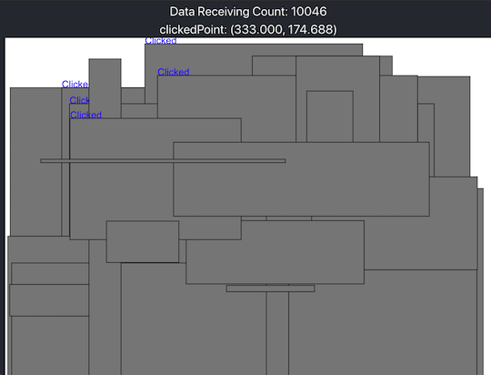
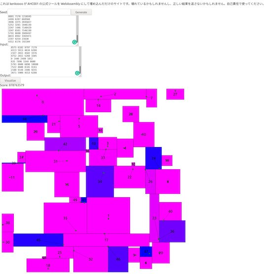

!!! warning "注意"
    コンテスト期間中に関連ツールなどを公開する場合は、事前に運営チームへの問い合わせと了承を得ておくことを強く推奨いたします([参考](https://twitter.com/maspy_stars/status/1368224269671395331))。

## ビジュアライザフレームワーク

- [Marathon General Visualizer](https://github.com/kyuridenamida/marathon-general-visualizer)  - ヒューリスティック型コンテストにおける入出力の結果をリアルタイムで表示させるためのビジュアライザフレームワーク。問題に応じて、表示する内容をカスタマイズできる。

    

      
    

## ビジュアライザ

- [ahc001-gen-vis-wasm](https://kenkoooo.github.io/ahc001-gen-vis-wasm/) - [AtCoder Heuristic Contest 001](https://atcoder.jp/contests/ahc001)で提供されている入力ジェネレータとビジュアライザをWebブラウザから利用することできる。ソースコードは、[GitHub](https://github.com/kenkoooo/ahc001-gen-vis-wasm) で公開されている。

    

      
    

