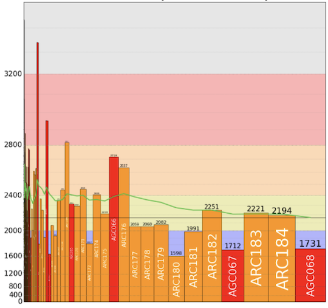
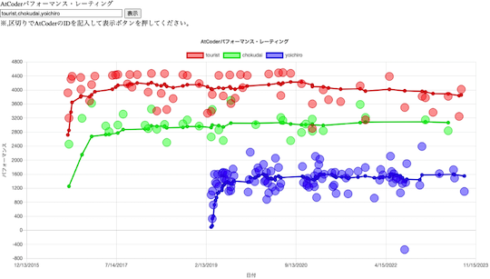
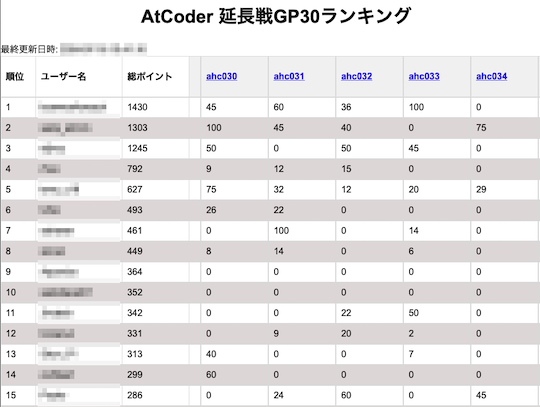

コンテストの成績(レーティング、パフォーマンス値、順位など)を見たり、比較できたりするサービスを掲載しています。

!!! warning "注意"
    サブカテゴリで部門名(アルゴリズム・ヒューリスティック)が明記されていない場合は、アルゴリズム部門を対象としたサービスを表しています。

## レーティングとパフォーマンス値を見る

### 1人

- [AtCoder Charts](https://atcoder-charts.netlify.app/) - 任意のユーザのレーティングとパフォーマンス値の推移を表示する。

    

      
    

- [AtCoder Competition History Chart Maker](https://colab.research.google.com/github/bo9chan/AtCoderCharts/blob/main/CompetitionHistoryChart.ipynb) - 任意のユーザのレーティングとパフォーマンス値の推移を表示する。

    

      
    

#### アルゴリズム部門・ヒューリスティック部門

- [AtCoder Graphs](https://atcoder-graphs.vercel.app/) - 任意のユーザのレーティングに対して、各コンテストにおけるパフォーマンス値の寄与度を表示する。また、アルゴリズム部門を対象として、得点別のパフォーマンス値の時間推移や各問題におけるレーティング別の正解率なども閲覧できる。

    

      
    

### 2人以上

- [AtCoderパフォーマンス・レーティング](https://atcoder-tools.quizgenerator.net/performance_rating.php) - 指定した1人以上のユーザのレーティングとパフォーマンス値（内部補正なし）の推移を表示する。

    

      
    

## レーティングを見る・比較する

### 1人

- [AtCoder Rollback](https://phocom.github.io/atcoder-rollback/index.html) - 指定した日時までのレーティングの推移を表示する。

    

      
    

### 2人以上

- [AtCoder Rating Graph](https://github.com/hiramekun/AtCoderRatingGraph) - 任意のユーザのレーティングの推移を比較できる。

    !!! warning "注意"
        [Jupyter Notebook](https://jupyter.org/)の実行環境を用意する必要がある。

    

      
    

## パフォーマンス値を見る・比較する

- [Atcoder Performance Chart](https://atcoder-chart.web.app/) - パフォーマンス値、それらの短期・長期平均値を表示する。

    

      
    

## 順位を見る・比較する

### アルゴリズム部門

- [AtCoder Replay](https://atcoder-replay.kakira.dev/) - 任意のユーザを対象として、参加したコンテストの開始〜終了までの順位変化を表示する。

    

      
    

### ヒューリスティック部門

- [AtCoder Marathon Replay](https://iilj.github.io/AtCoderMarathonReplay/#/chart/) - 任意のユーザを対象として、参加したマラソン系コンテストの開始〜終了までの順位や得点の推移を表示する。

    

      
    

- [AtCoder 延長戦GP30ランキング](https://qropa.github.io/extended-gp30-ranking/) - 「延長戦」があるコンテストを対象として、GP30スコア ([出典](https://atcoder.jp/posts/982)) の総和のランキングを表示する。

    

      
    

## 成績からバッジを作成

### 最新のレーティング

- [AtCoder Badges](https://atcoder-badges.now.sh/) - 任意のユーザのレーティングとレーティングに対応した色を表示するバッジを生成する。[M5StickC](https://github.com/makutamoto/atcoder-badges-for-m5stickc) に表示させることもできる。

    

      
    

- [CP-Badges](https://github.com/kehsihba19/CP-Badges)  - 複数のコンテストサイトのレーティングをGitHubのプロフィールなどに掲載することができる。[AtCoder](https://atcoder.jp/)だけでなく、[Codeforces](https://codeforces.com/)、[CodeChef](https://www.codechef.com/)、[Topcoder](https://www.topcoder.com/)、[yukicoder](https://yukicoder.me/)にも対応している。

    

      
    

### レーティングの推移

- [AtCoder Widget](https://github.com/rdrgn/atcoder-widget)  - ユーザのレーティングの推移をWebページに表示するためウィジェット。

    

      
    

