コンテストの成績(レーティング、パフォーマンス値、順位など)に関連するサービスを掲載しています。

!!! warning "注意"
    サブカテゴリで部門名(アルゴリズム・ヒューリスティック)が明記されていない場合は、アルゴリズム部門を対象としたサービスを表しています。

## 目標レーティングに必要なパフォーマンス値を計算

### アルゴリズム部門

- [AtCoder Rating Estimator](https://koba-e964.github.io/atcoder-rating-estimator/test-last.html) - 所定のレーティングに到達するために、次のコンテストで必要なパフォーマンス値を計算する。

    

      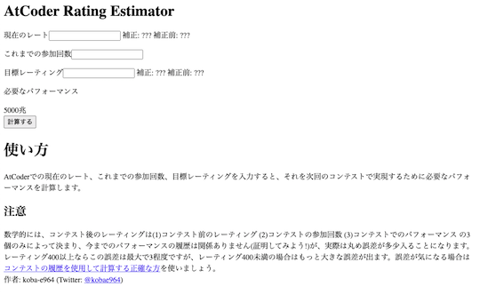
    

- [AtCoder Rating Simulator](https://atcoderratingsimulator.herokuapp.com/) - 目標とするレーティングに到達するまでに必要なパフォーマンスを表示する。任意の回数だけ同じパフォーマンスを取ったと仮定した場合についても計算できる。

  

    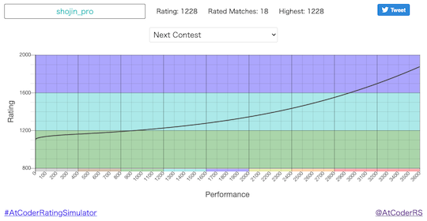
  

### ヒューリスティック部門

- [AtCoder Heuristic Rating Estimator](https://3w36zj6.github.io/atcoder-heuristic-rating-estimator/) - AtCoder Heuristic Contest(AHC)で目標とするレーティングに到達するために、次のコンテストで必要となるパフォーマンス値を計算する。利用にあたっては、過去に参加したコンテストのパフォーマンス値の入力が必要。また、作者による[技術解説記事](https://zenn.dev/3w36zj6/articles/5797217ce0f9ee)も公開されている。

    
 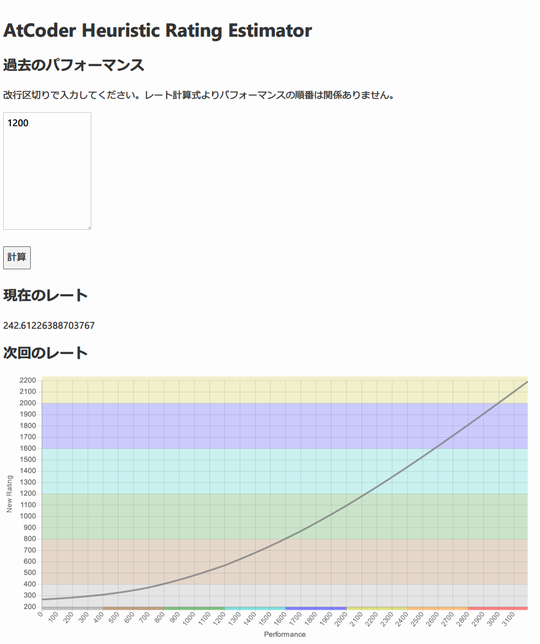
    

## ライバルを探す・競う

- [AtCoder Find Rivals](https://atcoder-find-rivals.herokuapp.com/) - 指定したユーザに近いレーティングのユーザを探すことができる。

    

      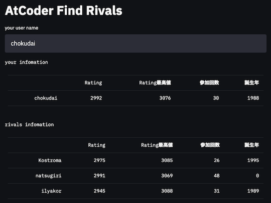
    

- [AtCoder Rivals](https://atcoder-rivals.web.app/) - パフォーマンスやレーティングの遷移、日々の練習(通称、精進)状況などをライバルと比べることができる。また、作者による[技術記事](https://note.com/sacckey/n/nf0b7ed1e9d1a)も公開されている。

    

      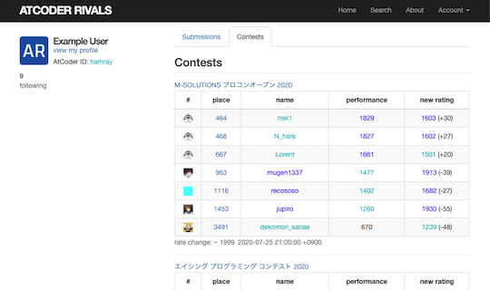
    

## レーティングとパフォーマンス値の推移を表示

- [AtCoder Charts](https://atcoder-charts.netlify.com/) - 任意のユーザのレーティングとパフォーマンス値の推移を表示する。

    

      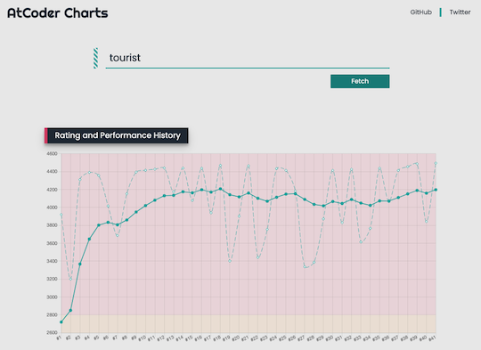
    

- [AtCoder Competition History Chart Maker](https://colab.research.google.com/github/bo9chan/AtCoderCharts/blob/main/CompetitionHistoryChart.ipynb) - 任意のユーザのレーティングとパフォーマンス値の推移を表示する。

    

      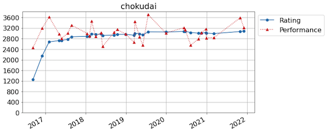
    

## レーティングを推移を表示

### 1人

- [AtCoder Anytime](https://atcoder-anytime.sonoapp.page/) - 「バーチャル参加」の結果を利用して、レーティングの変動を表示する。同一の作者により[Codeforces版](https://codeforces-anytime.firebaseapp.com/)も公開されている。

    

      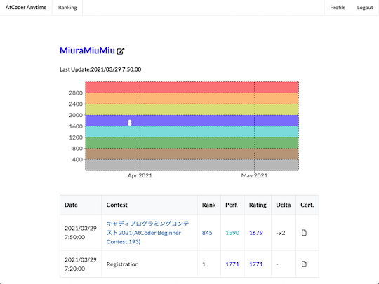
    

- [Atcoder RatingGraph Generator](https://atcoder-ratinggraph-generator.herokuapp.com/) - 任意のユーザのレーティンググラフを表示する。PCの場合、グラフの点をつまむと自由に形状を変えられる。

    

      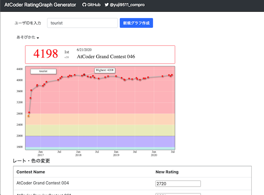
    

- [AtCoder Rollback](https://phocom.github.io/atcoder-rollback/index.html) - 指定した日時までのレーティングの推移を表示する。

    

      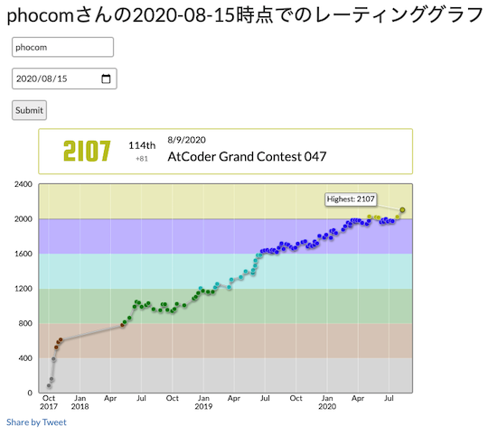
    

- [Rating History](https://rating-history.herokuapp.com/index.html) - 複数のコンテストサイトで、解いた問題数とレーティングの推移を表示する。

    

      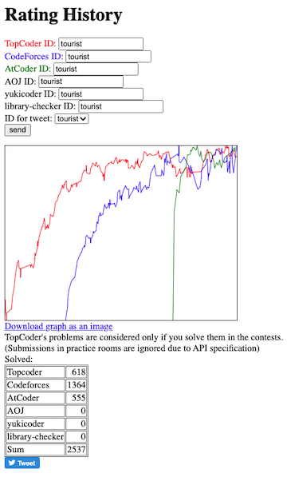
    

### 2人以上

- [AtCoder Rating Comparison](https://atcoder-rating-comparison.herokuapp.com/?q=) - 指定した2人以上のレーティングの比較ができる。[Codeforces版](https://rika0384.github.io/codeforces_rating_comparison/)も公開されている。

    

      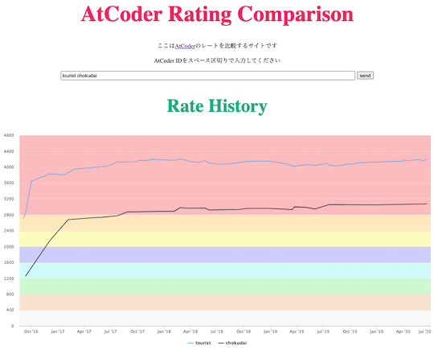
    

- [AtCoder Rating Graph](https://github.com/hiramekun/AtCoderRatingGraph) - 任意のユーザのレーティングの推移を比較できる。

    !!! warning "注意"
        [Jupyter Notebook](https://jupyter.org/)の実行環境を用意する必要がある。

    

      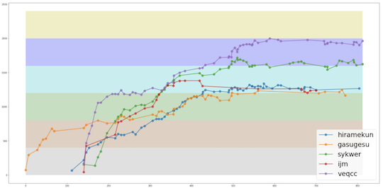
    

## パフォーマンス値の推移を表示

### 1人

- [Atcoder Performance Chart](https://atcoder-chart.web.app/) - パフォーマンス値、それらの短期・長期平均値を表示する。

    

      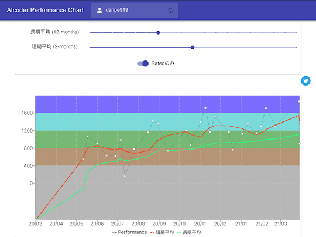
    

### 2人以上

- [AtCoder Performances](https://atcoderapps.herokuapp.com/atcoderperformances/) - 指定した2人以上のパフォーマンスの推移が比較できる。

    

      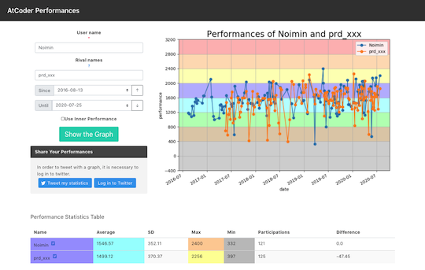
    

## 順位の推移を表示・順位を比較

### アルゴリズム部門

- [AtCoder Replay](https://atcoder-replay.kakira.dev/) - 任意のユーザを対象として、参加したコンテストの開始〜終了までの順位変化を表示する。

    

      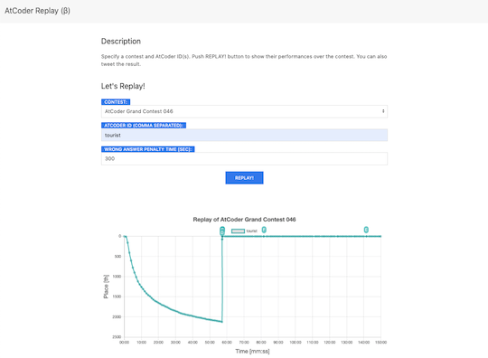
    

- [atcoder じゃんけん(not 本家)](https://hotman78.github.io/atcoder-janken/) - 指定した2人のユーザが共通して出場したコンテストの順位を比較できる。[本家](../archived/no_longer_available.md)のリンク切れに伴い、有志が新たに作成・公開した。

    

      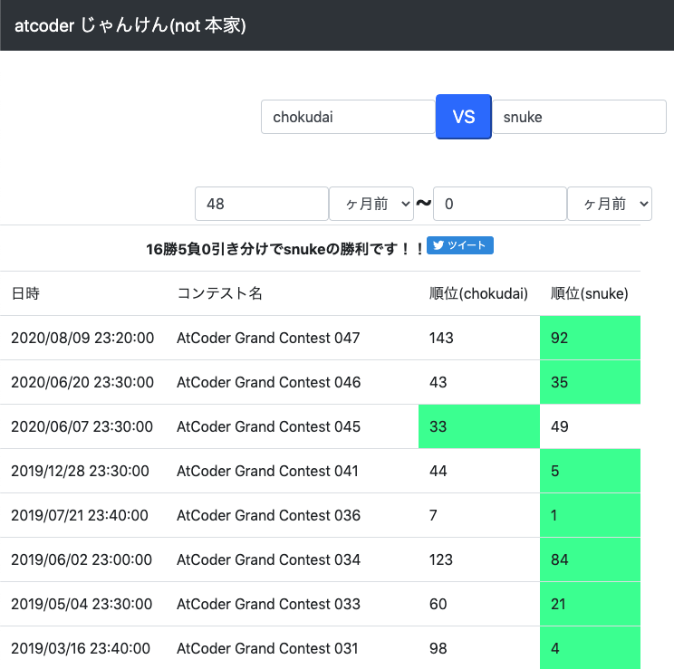
    

### ヒューリスティック部門

- [AtCoder Marathon Replay](https://iilj.github.io/AtCoderMarathonReplay/#/chart/) - 任意のユーザを対象として、参加したマラソン系コンテストの開始〜終了までの順位や得点の推移を表示する。

    

      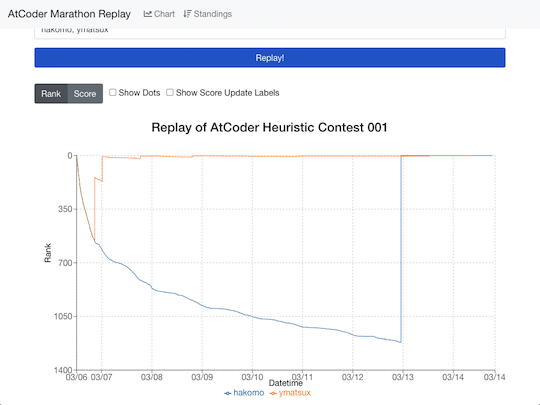
    

## 成績からバッジを作成

### 最新のレーティング

- [AtCoder Badges](https://atcoder-badges.now.sh/) - 任意のユーザのレーティングとレーティングに対応した色を表示するバッジを生成する。[M5StickC](https://github.com/makutamoto/atcoder-badges-for-m5stickc) に表示させることもできる。

  

    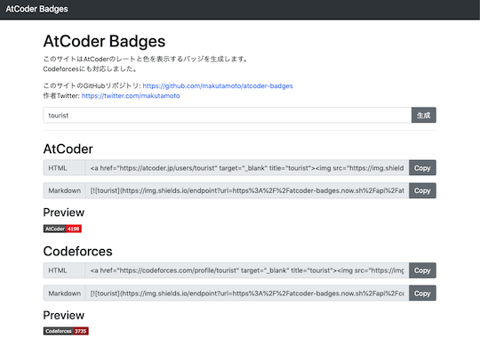
  

- [CP-Badges](https://github.com/kehsihba19/CP-Badges)  - 複数のコンテストサイトのレーティングをGitHubのプロフィールなどに掲載することができる。[AtCoder](https://atcoder.jp/)だけでなく、[Codeforces](https://codeforces.com/)、[CodeChef](https://www.codechef.com/)、[Topcoder](https://www.topcoder.com/)、[yukicoder](https://yukicoder.me/)にも対応している。

  

    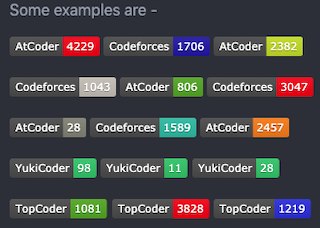
  

### レーティングの推移

- [AtCoder Widget](https://github.com/rdrgn/atcoder-widget)  - ユーザのレーティングの推移をWebページに表示するためウィジェット。

  

    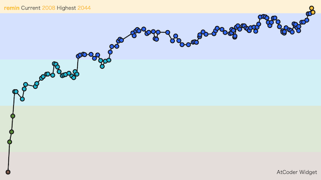
  

