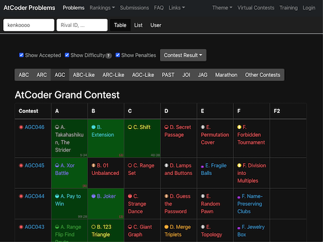
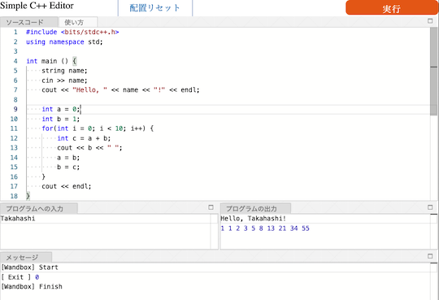

## 目次

<!-- START doctoc generated TOC please keep comment here to allow auto update -->
<!-- DON'T EDIT THIS SECTION, INSTEAD RE-RUN doctoc TO UPDATE -->

- [For Beginners](#for-beginners)
  - [Q0: アルゴリズム、競技プログラミングとは?](#q0-%E3%82%A2%E3%83%AB%E3%82%B4%E3%83%AA%E3%82%BA%E3%83%A0%E7%AB%B6%E6%8A%80%E3%83%97%E3%83%AD%E3%82%B0%E3%83%A9%E3%83%9F%E3%83%B3%E3%82%B0%E3%81%A8%E3%81%AF)
  - [Q1: アルゴリズムや競技プログラミングに興味はありますが、何から始めたらいいですか?](#q1-%E3%82%A2%E3%83%AB%E3%82%B4%E3%83%AA%E3%82%BA%E3%83%A0%E3%82%84%E7%AB%B6%E6%8A%80%E3%83%97%E3%83%AD%E3%82%B0%E3%83%A9%E3%83%9F%E3%83%B3%E3%82%B0%E3%81%AB%E8%88%88%E5%91%B3%E3%81%AF%E3%81%82%E3%82%8A%E3%81%BE%E3%81%99%E3%81%8C%E4%BD%95%E3%81%8B%E3%82%89%E5%A7%8B%E3%82%81%E3%81%9F%E3%82%89%E3%81%84%E3%81%84%E3%81%A7%E3%81%99%E3%81%8B)
  - [Q2: プログラムの実行環境を用意するには?](#q2-%E3%83%97%E3%83%AD%E3%82%B0%E3%83%A9%E3%83%A0%E3%81%AE%E5%AE%9F%E8%A1%8C%E7%92%B0%E5%A2%83%E3%82%92%E7%94%A8%E6%84%8F%E3%81%99%E3%82%8B%E3%81%AB%E3%81%AF)
  - [Q3: コンテストは、いつ開催されていますか?](#q3-%E3%82%B3%E3%83%B3%E3%83%86%E3%82%B9%E3%83%88%E3%81%AF%E3%81%84%E3%81%A4%E9%96%8B%E5%82%AC%E3%81%95%E3%82%8C%E3%81%A6%E3%81%84%E3%81%BE%E3%81%99%E3%81%8B)
  - [Q4: コンテストで出題された問題が解けません](#q4-%E3%82%B3%E3%83%B3%E3%83%86%E3%82%B9%E3%83%88%E3%81%A7%E5%87%BA%E9%A1%8C%E3%81%95%E3%82%8C%E3%81%9F%E5%95%8F%E9%A1%8C%E3%81%8C%E8%A7%A3%E3%81%91%E3%81%BE%E3%81%9B%E3%82%93)
  - [Q5: 提出したコードが不正解となる理由が分かりません](#q5-%E6%8F%90%E5%87%BA%E3%81%97%E3%81%9F%E3%82%B3%E3%83%BC%E3%83%89%E3%81%8C%E4%B8%8D%E6%AD%A3%E8%A7%A3%E3%81%A8%E3%81%AA%E3%82%8B%E7%90%86%E7%94%B1%E3%81%8C%E5%88%86%E3%81%8B%E3%82%8A%E3%81%BE%E3%81%9B%E3%82%93)
  - [Q6: 解説で登場するアルゴリズムが分かりません](#q6-%E8%A7%A3%E8%AA%AC%E3%81%A7%E7%99%BB%E5%A0%B4%E3%81%99%E3%82%8B%E3%82%A2%E3%83%AB%E3%82%B4%E3%83%AA%E3%82%BA%E3%83%A0%E3%81%8C%E5%88%86%E3%81%8B%E3%82%8A%E3%81%BE%E3%81%9B%E3%82%93)
  - [Q7: レートがなかなか伸びなくて、心が折れそうです](#q7-%E3%83%AC%E3%83%BC%E3%83%88%E3%81%8C%E3%81%AA%E3%81%8B%E3%81%AA%E3%81%8B%E4%BC%B8%E3%81%B3%E3%81%AA%E3%81%8F%E3%81%A6%E5%BF%83%E3%81%8C%E6%8A%98%E3%82%8C%E3%81%9D%E3%81%86%E3%81%A7%E3%81%99)
  - [Q8: 脱初心者に向けて、次は何をすればいいですか?](#q8-%E8%84%B1%E5%88%9D%E5%BF%83%E8%80%85%E3%81%AB%E5%90%91%E3%81%91%E3%81%A6%E6%AC%A1%E3%81%AF%E4%BD%95%E3%82%92%E3%81%99%E3%82%8C%E3%81%B0%E3%81%84%E3%81%84%E3%81%A7%E3%81%99%E3%81%8B)

<!-- END doctoc generated TOC please keep comment here to allow auto update -->

## For Beginners

[AtCoder](https://atcoder.jp/)に興味・関心がある方、アカウントを登録したものの何をすればよいか困っている方のために、おすすめのサービス・ツール・記事・動画などを紹介するページです。

### Q0: アルゴリズム、競技プログラミングとは?

A0: 入門者、初心者向けの記事や動画に目を通してみましょう。

- [初心者こそ、競技プログラミングに挑戦してほしい。髙橋直大の「世界にAtCoderを広める」という夢](https://persol-tech-s.co.jp/i-engineer/human/atcoder) - [AtCoder](https://atcoder.jp/)社長の[chokudai](https://twitter.com/chokudai)さんが、プログラミング初心者に競技プログラミングを勧めている記事です。
- [アルゴリズムの世界地図](https://qiita.com/square1001/items/6d414167ca95c97bd8b2) - アルゴリズムを7つのカテゴリーに分けて俯瞰的に紹介されている記事です。各カテゴリーの概観と解けるようになる問題の紹介に力点が置かれているが特徴です。
- [アルゴリズムとは何か！？ ～ 文系理系問わず楽しめる精選6問 ～](https://qiita.com/drken/items/f909b79ee03e679c7142) - アルゴリズムとは何か?という疑問に対して、平易で分かりやすい文章と図表を駆使して解説されている記事です。また、アルゴリズムを学ぶ意義・メリットについても書かれています。
- [未経験者のアナタもハマる？競技プログラミング「AtCoder」って何だ？【理系通信】](https://www.youtube.com/watch?v=WGNQrH0AV2k) - テレビ東京総合ニュースサイト([テレ東NEWS](https://www.youtube.com/c/tvtokyonews/playlists))のサイエンスニュースで、[AtCoder](https://atcoder.jp/)が紹介されている動画です。番組ディレクターが、実際のコンテストで出題された問題を解きながら競技プログラミングの魅力を伝えるとともに、企業における高度IT人材の需要などについても取材しています。
- [AtCoder 布教 PV](https://www.youtube.com/watch?v=-z3bTeA_SEY&feature=youtu.be) - 有志による[AtCoder](https://atcoder.jp/)のプロモーションビデオです。特に、競技プログラミングを始めようと思っている人や周囲に布教したい人におすすめです。
- [2分で始める競技プログラミング【高井茅乃 #31】](https://www.youtube.com/watch?v=F4_1yWI5Z-Y&feature=youtu.be) - 競技プログラミングの概説、[AtCoder](https://atcoder.jp/)のアカウント登録、練習問題を解く方法が2分で紹介されています。
- [AtCoderの始め方。競プロに興味はあるけどやっていないという方へ。](https://www.youtube.com/watch?v=vxBOC08XZ44&feature=youtu.be) - 教育系エンジニアによる[AtCoder](https://atcoder.jp/)の紹介動画です。競技プログラミングの解説に加えて、便利なサービス・ツールが紹介されています。

### Q1: アルゴリズムや競技プログラミングに興味はありますが、何から始めたらいいですか?

A1: 入門者、初心者向けの教材や記事を読んでみましょう。[AtCoder](https://atcoder.jp/)アカウントを登録し、コンテスト参加前に練習問題を解くことをおすすめします。

- [【初心者向け】AtCoder Beginner Contestの取り組み方](https://qiita.com/rute_not_route/items/d1ae32a80d1c3a50d017) - [AtCoder](https://atcoder.jp/)アカウントの作成方法からコンテストの参加登録・問題の取り組み方と注意事項、コンテスト後の復習までの流れを丁寧に解説した記事です。
- [APG4bからAtCoderを始めた人向けの導線](https://mogurin1000000007.hatenablog.com/entry/2021/02/09/162158) - 公式が提供するプログラミングの入門教材[C++入門 AtCoder Programming Guide for beginners (通称APG4b)](https://atcoder.jp/contests/APG4b)の概説と、APG4bをある程度学習した人に向けた基本的な練習方法やTipsが紹介されている記事です。
- [C++入門 AtCoder Programming Guide for beginners (APG4b)](https://atcoder.jp/contests/APG4b) - 公式が提供する汎用的なプログラミングの基礎を学ぶための入門教材です。また、知識の定着を図るための練習問題と自分で書いたプログラムを自動で採点してくれるシステムがあるのが大きな特徴です。また、有志により[Fortran版](https://qiita.com/jj1guj/items/43a1c876360ddf180f1f)、[Python版](https://qiita.com/saba/items/b9418d7b54cce4b106e4)、[Rust版](https://zenn.dev/toga/books/apg4b-rust-ver)も作成・公開されています。

  

    
  

- [AtCoderに登録したら次にやること ～ これだけ解けば十分闘える！過去問精選10問 ～](https://qiita.com/drken/items/fd4e5e3630d0f5859067) - [AtCoder](https://atcoder.jp/)のコンテストに初めて参加する方に向けた精選10問を紹介した記事です。さまざまな言語による解答例のリンクなどの資料も充実しています。

  

    
  

  C++以外の言語による解答例(リンク元より一部抜粋。注:記事に掲載されているコードが最新のジャッジシステムで動作しない場合もあります)

  

    
各言語で実装された解答例のリンクを開く/閉じる

    <ul>
      <li><a href="https://qiita.com/cielavenir/items/ee1e47b844d05dcfc66e">C</a></li>
      <li><a href="https://qiita.com/tomerun/items/23ce2a2ed6ead291d222">Crystal</a></li>
      <li><a href="https://qiita.com/NotFounds/items/7b166af69a6f52a332de">C#</a></li>
      <li><a href="http://takeo1116.sakura.ne.jp/ABS_D.html">D</a></li>
      <li><a href="https://qiita.com/koyo-miyamura/items/9f224a3e56ea75939dca">Elixir</a></li>
      <li><a href="https://yukiutaai.wordpress.com/2018/03/21/atcoder%e3%81%ab%e7%99%bb%e9%8c%b2%e3%81%97%e3%81%9f%e3%82%89%e8%a7%a3%e3%81%8f%e3%81%b9%e3%81%8d%e7%b2%be%e9%81%b8%e9%81%8e%e5%8e%bb%e5%95%8f10%e3%82%92fortran%e3%81%a7%e8%a7%a3%e3%81%84%e3%81%a6/">Fortran</a></li>
      <li><a href="https://qiita.com/kuuso1/items/606b75c172cafa1d07f6">F#</a></li>
      <li><a href="https://qiita.com/ktateish/items/afdda77497c8e2ee0742">Go</a></li>
      <li><a href="https://qiita.com/hsjoihs/items/25a08b426196ab2b9bb0">Haskell</a></li>
      <li><a href="https://qiita.com/0x841/items/0ce887c86cf081312a08#">Java</a></li>
      <li><a href="https://qiita.com/ytanto/items/caf7bf0ba287da81b20f">JavaScript</a></li>
      <li><a href="https://sites.google.com/view/ymatsux/atcoder-abs-kotlin">Kotlin</a></li>
      <li><a href="https://qiita.com/Kutimoti_T/items/635bacddfa1304de40db">Nim</a></li>
      <li><a href="https://qiita.com/kotatsugame/items/dd73cf6441b17f27bb01">Perl6 (Raku)</a></li>
      <li><a href="https://qiita.com/rock619/items/3c4cc60416c94d081c54">PHP</a></li>
      <li><a href="http://delta114514.hatenablog.jp/entry/2018/03/15/014555">Python3</a></li>
      <li><a href="https://qiita.com/d_nishiyama85/items/f79e034f6dcd4175cdc1">Ruby</a></li>
      <li><a href="https://qiita.com/tubo28/items/e6076e9040da57368845">Rust</a></li>
      <li><a href="https://qiita.com/kgtkr/items/9b5798d02563e885d2ac">Scala</a></li>
      <li><a href="https://qiita.com/cielavenir/items/b90a94dce60a620fa2dc">Swift</a></li>
    </ul>
  

- [AtCoderの練習方法](https://atcoder.jp/posts/677) - [AtCoder](https://atcoder.jp/)の公式ブログで紹介されている練習方法です。上達のために、問題を多く解く方法や典型的なアルゴリズムを学ぶ方法が説明されています。
- [アルゴ式](https://algo-method.com/) - プログラミングを道具として利用しながら、論理的思考力やコーディング力を身につけることができるWebアプリです。[公式アカウント](https://twitter.com/algo_method)も用意されています。注: サービスを利用する前に、作者によるサービス開始の理由とアルゴリズムを学ぶ意義について書かれた[記事](https://note.com/sak_algo/n/nfb0058237ed5)を一読されることをお勧めします。
- [どきんちゃんねる](https://www.youtube.com/channel/UCRtRY2sRe36LXjaiyhqEqCg) - [dokin](https://atcoder.jp/users/dokin)さんのYouTubeチャンネルです。入門者・初心者向けに、問題の考察・C++での実装過程が丁寧に解説されています。
- [AtCoderでの勉強の仕方（コンテスト編）](http://chokudai.hatenablog.com/entry/2014/08/07/212849) - [AtCoder](https://atcoder.jp/)社長の[chokudai](https://twitter.com/chokudai)さんによる記事です。プログラミングコンテストの参加を通して、アルゴリズムの学習を継続的に行う方法が解説されています。
- [AtCoder Problems](https://kenkoooo.com/atcoder/) - コンテストの過去問を一覧できるWebアプリです。登録したアカウント名を入力すると、問題の正誤状況や各種集計結果などを確認できます。有志による[使い方を解説した記事](https://ntk-ta01.hatenablog.com/entry/2020/04/15/001405)もご参照ください。注: 記事に掲載されている図やバーチャルコンテストの名称・内容は、最新情報と異なる場合もあリます。

  

    
  

- [レッドコーダーが教える、競プロ・AtCoder上達のガイドライン【初級編：競プロを始めよう】](https://qiita.com/e869120/items/f1c6f98364d1443148b3) - 初心者に向けて競技プログラミングの特徴・面白さ、アカウントの登録方法やレーティングの説明がされている記事です。さらに、上達するためのガイドラインが丁寧に解説されています。

### Q2: プログラムの実行環境を用意するには?

A2: オンラインでプログラムを実行できるサービスを利用するか、自分のPCでプログラムの実行環境を用意するための記事を読んでみましょう。

- [AtCoder](https://atcoder.jp/)のコンテストページにある「コードテスト」を利用する方法
  - メリット: すぐにコードを書くことができ、特定の入力に対して出力結果を確認することができます。
  - デメリット: 入力補完などの便利な機能は含まれていません。

  

    
  

- ブラウザでC++が実行できるコードエディタ「[Simple C++ Editor](https://tumoiyorozu.github.io/SimpleCppEditor/)」を利用する方法
  - メリット: すぐにコードを書くことができ、入出力の結果を確認できます。また、便利な機能が多数用意されています。詳しくは、作者の[紹介記事](https://qiita.com/TumoiYorozu/items/7a9b862071edd5427200)をご参照ください。
  - デメリット: C++以外の言語で問題を解きたい場合は、別の方法を検討する必要があります。

  

    
  

- [オンラインのプログラミング実行環境サービスを紹介した記事](https://paiza.hatenablog.com/entry/2020/09/29/140000)
  - メリット: すぐにコードを書くことができます。基本的な機能に関しては、無料のサービスが多いです。
  - デメリット: 利用したい言語・ライブラリに対応していないサービス、対応言語のバージョンが古いサービスもあるので注意が必要です。

- [自分のPCで実行環境を用意するための記事](https://kato-hiro.github.io/AtCoderClans/media#%E3%82%B3%E3%83%BC%E3%83%89%E3%82%92%E5%BF%AB%E9%81%A9%E3%81%AB%E6%9B%B8%E3%81%8F%E3%81%9F%E3%82%81%E3%81%AE%E7%92%B0%E5%A2%83%E6%A7%8B%E7%AF%89)
  - メリット: お気に入りの言語、エディタ、有志が公開している非公式のサービス・ツールなどが利用できます。
  - デメリット: 初学者にとってプログラムの実行環境を用意するのは難易度がやや高く、コンテストに参加する前に挫折する可能性があるのが難点です。

### Q3: コンテストは、いつ開催されていますか?

A3: 基本的には、土曜日もしくは日曜日の21時から1時間40分〜2時間程度です。また、コンテスト終了後には、解説資料の公開とYouTubeを利用した[解説放送](https://www.youtube.com/channel/UCtG3StnbhxHxXfE6Q4cPZwQ)が行われます。

注1: <strong>最初のうちは、AtCoder Beginner Contest (通称、ABC)に出場することをお勧めいたします。</strong>特に、AtCoder Grand Contestは上級者向けのコンテストのため、ABCと同じ配点でも非常に難しい問題が出題される傾向にあるためです。

注2: 開催日時は急きょ変更されることもあるため、最新の情報をTwitterアカウントやWebサービスで確認することを推奨いたします。

- Twitterで[公式アカウント](https://twitter.com/atcoder)や[AtCoder](https://atcoder.jp/)社長の[chokudai](https://twitter.com/chokudai)さんをフォローすると、最新の情報が得られます。

- [競プロリマインダー](https://twitter.com/ComproReminder) - TwitterのBotアカウントをフォローすると、毎朝8:00にコンテストの情報をつぶやいてくれます。

  

    
  

- [CLIST](https://clist.by/) - コンテストの開始・終了時刻、制限時間と閲覧時点での残り時間が一覧で表示されるWebアプリです。検索で「AtCoder」のコンテストを抽出するとより見やすくなります。

  

    
  

### Q4: コンテストで出題された問題が解けません

A4: 公式による解説や有志が書いた解説ブログで復習しましょう。

- コンテスト終了後に、公式による問題の解説が公開されます。また、YouTubeで[解説放送](https://www.youtube.com/channel/UCtG3StnbhxHxXfE6Q4cPZwQ)が公開されており、問題を解くポイントや実装方法を学ぶことができます。注: コンテストの種類や問題によっては、実装に関する説明が省略される場合もあります。

- さらに、有志によって[解説ブログ](https://kato-hiro.github.io/AtCoderClans/media#%E3%82%B3%E3%83%B3%E3%83%86%E3%82%B9%E3%83%88%E3%81%A7%E5%87%BA%E9%A1%8C%E3%81%95%E3%82%8C%E3%81%9F%E5%95%8F%E9%A1%8C%E3%82%A2%E3%83%AB%E3%82%B4%E3%83%AA%E3%82%BA%E3%83%A0%E3%81%AE%E8%A7%A3%E8%AA%AC)が公開されています。問題の考察・実装が詳細に解説されている記事が多く、前述の公式解説と合わせて読むのが効果的です。

- それでも分からないときは、少し時間を置いて解き直すといいかもしれません。

### Q5: 提出したコードが不正解となる理由が分かりません

A5: まずは、不正解となるテストケースを見つけるための方法やツールを利用して確認しましょう。それでも解決しないときは、他の参加者に質問してみましょう。

- [間違っているテストケースが見つけられないときの手法](https://sumatome.com/su/1294961358119739392) - [chokudai](https://twitter.com/chokudai)さんによる一連のツイートをまとめた記事です。[ABC175-C問題](https://atcoder.jp/contests/abc175/tasks/abc175_c)を例に、間違っているテストケースを見つける方法が解説されています。
- [AtCoder TestCase Extension](https://chrome.google.com/webstore/detail/atcoder-testcase-extensio/klmflnjcfalpmeldgkcinfilloihmbdh?hl=ja&gl=UA) - 公開されているテストケースのリンクを表示するChrome拡張機能を利用してみましょう。入出力データを使って、回答コードのデバッグを行うことができます。注: 一部のコンテストでは、対応していない場合があります。

  

    
  

- Twitter(例えば、[AtCoder公式が提供するコミュニティ](https://twitter.com/atcoder/status/1502641775609249793))、Discordのチャンネル(例えば、[競プロer集会所](http://discord.gg/2xCjYvK))などで質問してみましょう。以下の項目を明記すると、回答が得られやすくなると思います。
  - 問題名
  - 考察したこと
  - 詰まっている(と思われる)ポイント
  - 提出コードのURL
  - 質問者のレーティングの色(黒、灰、茶、緑、…)

### Q6: 解説で登場するアルゴリズムが分かりません

A6: 該当する[アルゴリズムの解説記事](https://kato-hiro.github.io/AtCoderClans/media#%E3%82%A2%E3%83%AB%E3%82%B4%E3%83%AA%E3%82%BA%E3%83%A0%E3%81%AE%E8%A7%A3%E8%AA%AC)を読んでみましょう。また、A5で示したように、他の参加者に不明点・疑問点を質問するのも有効な方法だと思います。

### Q7: レートがなかなか伸びなくて、心が折れそうです

A7: さまざまな要因が考えられます。現時点では、[AtCoder](https://atcoder.jp/)におけるレーティングシステムの特性と、競技プログラミングにおけるメンタル面でのアドバイスが書かれた記事を紹介します。

- リセマラ防止のためにコンテストの参加回数が少ないうちは、レーティングが低めに出る傾向にあります([出典](https://qiita.com/drken/items/8a6f139158cde8a61dce))。

- [競技プログラミングとの向き合い方に関する記事](https://note.com/fidia0709/n/n3bde5443cd17) - 競技プログラミングを続ける上で必要なメンタル面に関するアドバイスが書かれた記事です。

### Q8: 脱初心者に向けて、次は何をすればいいですか?

- コンテストの参加前に目標とするレーティング・パフォーマンスを設定しましょう。
  - 1．自分の実力と相談しながら、目標とするレーティング(もしくは、特定のレーティング帯に相当する色)と達成するまで期限を設定してみましょう。[AtCoder](https://atcoder.jp/)社長の[chokudai](https://twitter.com/chokudai)さんによる、[レーティングとアルゴリズムに関する実力の関係を説明した記事](http://chokudai.hatenablog.com/entry/2019/02/11/155904)も参考になると思います(注: 2020年6月下旬に更新されているものの、特定のレーティング帯については到達するまでの要求水準がさらに上がっている可能性があります)。
  - 2．次に参加するコンテストで、どの程度の成績(パフォーマンス値)を目指すか設定してみましょう。有志が公開している[Webサービス](https://atcoderratingsimulator.herokuapp.com/)を利用すると、簡単に目標とするレーティングとパフォーマンス値を知ることができます。

    

      
    

  - 3．また、コンテスト開催中に[参加者のパフォーマンス値の推定値をリアルタイムで見られるスクリプト](https://greasyfork.org/ja/scripts/369954-ac-predictor)が公開されています。注: 初めてユーザスクリプトを利用される方は、[スクリプトマネージャ](https://greasyfork.org/ja)を事前にインストールしてください。下の図は、左側がパフォーマンス値を、右側がレーティングの変動と前回との差分をそれぞれ表しています。

    

      
    

- 過去問を解いて、コンテストに出場しましょう。
  - 公式が提供している「バーチャル参加」機能や[AtCoder Problems](https://kenkoooo.com/atcoder/)のVirtual Contest機能(注: GitHubアカウントが必要)を利用して、本番に近い環境で練習するのがおすすめです。
  - [競プロ典型90問](https://twitter.com/e869120/status/1376089196100653060) - 競技プログラミング・アルゴリズムに関する教育的な問題が[常設コンテスト](https://atcoder.jp/contests/typical90)として、まとめられています。また、同コンテンツの活用方法が[Qiita](https://qiita.com/e869120/items/1b2a5f0f07fd927e44e9)で、解説やサンプルコードなどが[GitHub](https://github.com/E869120/kyopro_educational_90)で、非公式の難易度表が[Googleスプレッドシート](https://docs.google.com/spreadsheets/d/1GG4Higis4n4GJBViVltjcbuNfyr31PzUY_ZY1zh2GuI/edit#gid=0)で、それぞれ公開されています。

  

    
  

  

    
  

- 回答コードを提出する前に、サンプルを使った確認([自動テストツール](https://kato-hiro.github.io/AtCoderClans/cli)の活用)をおすすめします。

  - [AtCoder Easy Test v2](https://greasyfork.org/ja/scripts/433152-atcoder-easy-test-v2) - 「問題」ページで、入出力サンプルを使って素早くテストを実行できるユーザスクリプトです。また、自分で作成したテストケースも実行できます。注: 初めてユーザスクリプトを利用される方は、[スクリプトマネージャ](https://greasyfork.org/ja)を事前にインストールしてください。

    

      
    

  - メリット1: サンプルの入出力例と合わないコードを提出し、不正解によるペナルティを受ける、といった可能性が低くなります。
  - メリット2: 提出した回答が不正解だったとしても、境界条件を含むようなコーナーケースを素早く特定することができます。
  - メリット3: 問題を正確かつ素早く解く力が身に付きます。これによって、高いパフォーマンス値(コンテスト当日の成績に相当)を得ることができ、レーティングの上昇につながる可能性があります。
  - デメリット: ツールの導入が難しいと感じる場合があります。ツールの作成者や有志が作成したドキュメントを読んだり、他の参加者に質問したりしましょう。

- 色々なサービス、ツール、ライブラリ、記事を見てみましょう。
  - [各ページの説明](https://kato-hiro.github.io/AtCoderClans/#%E5%90%84%E3%83%9A%E3%83%BC%E3%82%B8%E3%81%AE%E8%AA%AC%E6%98%8E)
  - [Recommendation](https://kato-hiro.github.io/AtCoderClans/recommendation) - 快適なコンテスト生活を送るための12種類のサービス・ツール(一部、本ページと重複する内容を含む)を厳選して掲載しています。
