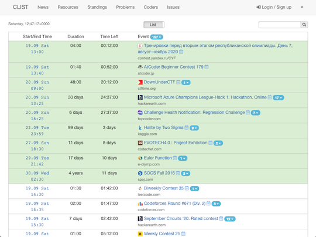

## 目次

<!-- START doctoc -->
<!-- END doctoc -->

## For Beginners

[AtCoder](https://atcoder.jp/)に興味・関心がある方、アカウントを登録したものの何をすればよいか困っている方のために、おすすめのサービス・ツール・記事などを紹介するページです。

### Q1: アルゴリズムや競技プログラミングに興味はありますが、何から始めたらいいですか?

A1: 入門者、初心者向けの教材や記事を読んでみましょう。[AtCoder](https://atcoder.jp/)アカウントを登録し、コンテスト参加前に練習問題を解くことをおすすめします。

- [アルゴリズムとは何か！？ ～ 文系理系問わず楽しめる精選6問 ～](https://qiita.com/drken/items/f909b79ee03e679c7142) - アルゴリズムとは何か?という疑問に対して、平易で分かりやすい文章と図表を駆使して解説されている記事です。また、アルゴリズムを学ぶ意義・メリットについても書かれています。
- [C++入門 AtCoder Programming Guide for beginners (APG4b)](https://atcoder.jp/contests/APG4b) - 公式が提供する汎用的なプログラミングの基礎を学ぶための入門教材です。また、知識の定着を図るための練習問題と自分で書いたプログラムを自動で採点してくれるシステムがあるのが大きな特徴です。

  

    
  

- [AtCoderに登録したら次にやること ～ これだけ解けば十分闘える！過去問精選10問 ～](https://qiita.com/drken/items/fd4e5e3630d0f5859067) - [AtCoder](https://atcoder.jp/)のコンテストに初めて参加する方に向けた精選10問を紹介した記事です。さまざまな言語による回答例のリンクなどの資料も充実しています。

  

    
  

- [レッドコーダーが教える、競プロ・AtCoder上達のガイドライン【初級編：競プロを始めよう】](https://qiita.com/e869120/items/f1c6f98364d1443148b3) - 初心者に向けて競技プログラミングの特徴・面白さ、アカウントの登録方法やレーティングの説明がされている記事です。さらに、上達するためのガイドラインが丁寧に解説されています。
- [AtCoderでの勉強の仕方（コンテスト編）](http://chokudai.hatenablog.com/entry/2014/08/07/212849) - [AtCoder](https://atcoder.jp/)社長の[chokudai](https://twitter.com/chokudai)さんによる記事です。プログラミングコンテストの参加を通して、アルゴリズムの学習を継続的に行う方法について解説しています。
- [AtCoder Problems](https://kenkoooo.com/atcoder/) - コンテストの過去問を一覧できるWebアプリです。登録したアカウント名を入力すると、問題の正誤状況や各種集計結果などを確認できます。有志による[使い方を解説した記事](https://ntk-ta01.hatenablog.com/entry/2020/04/15/001405)もご参照ください。

  

    
  

### Q2: プログラムの実行環境を用意するには?

A2: オンラインでプログラムを実行できるサービスを利用するか、自分のPCでプログラムの実行環境を用意するための記事を読んでみましょう。

- [AtCoder](https://atcoder.jp/)のコンテストページにある「コードテスト」を利用する方法
  - メリット: すぐにコードを書くことができ、特定の入力に対して出力結果を確認することができます。
  - デメリット: 入力補完などの便利な機能は含まれていません。

  

    
  

- [オンラインのプログラミング実行環境サービスを紹介した記事](https://paiza.hatenablog.com/entry/2020/09/29/140000)
  - メリット: すぐにコードを書くことができます。基本的な機能に関しては、無料のサービスが多いです。
  - デメリット: 利用したい言語・ライブラリに対応していないサービス、対応言語のバージョンが古いサービスもあるので注意が必要です。

- [自分のPCで実行環境を用意するための記事](https://kato-hiro.github.io/AtCoderClans/media#%E3%82%B3%E3%83%BC%E3%83%89%E3%82%92%E5%BF%AB%E9%81%A9%E3%81%AB%E6%9B%B8%E3%81%8F%E3%81%9F%E3%82%81%E3%81%AE%E7%92%B0%E5%A2%83%E6%A7%8B%E7%AF%89)
  - メリット: お気に入りの言語、エディタ、有志が公開している非公式のサービス・ツールなどが利用できます。
  - デメリット: 初学者にとってプログラムの実行環境を用意するのは難易度がやや高く、コンテストに参加する前に挫折する可能性があるのが難点です。

### Q3: コンテストは、いつ開催されていますか?

A3: 基本的には、土曜日もしくは日曜日の21時から1時間40分〜2時間程度です。また、コンテスト終了後には、解説資料の公開とYouTubeを利用した[解説放送](https://www.youtube.com/channel/UCtG3StnbhxHxXfE6Q4cPZwQ)が行われます。

注1: <strong>最初のうちは、AtCoder Beginner Contest (通称、ABC)に出場することをお勧めいたします。</strong>特に、AtCoder Grand Contestは上級者向けのコンテストのため、ABCと同じ配点でも非常に難しい問題が出題される傾向にあるためです。

注2: 開催日時は急きょ変更されることもあるため、最新の情報をTwitterアカウントやWebサービスで確認することを推奨いたします。

- Twitterで[公式アカウント](https://twitter.com/atcoder)や[AtCoder](https://atcoder.jp/)社長の[chokudai](https://twitter.com/chokudai)さんをフォローすると、最新の情報が得られます。

- [競プロリマインダー](https://twitter.com/ComproReminder) - TwitterのBotアカウントをフォローすると、毎朝8:00にコンテストの情報をつぶやいてくれます。

  

    
  

- [CLIST](https://clist.by/) - コンテストの開始・終了時刻、制限時間と閲覧時点での残り時間が一覧で表示されるWebアプリです。検索で「AtCoder」のコンテストを抽出するとより見やすくなります。

  

    
  

### Q4: コンテストで出題された問題が解けません

A4: 公式による解説や有志が書いた解説ブログで復習しましょう。

- コンテスト終了後に、公式による問題の解説が公開されます。また、YouTubeで[解説放送](https://www.youtube.com/channel/UCtG3StnbhxHxXfE6Q4cPZwQ)が公開されており、問題を解くポイントや実装方法を学ぶことができます。注: コンテストの種類や問題によっては、実装に関する説明が省略される場合もあります。

- さらに、有志によって[解説ブログ](https://kato-hiro.github.io/AtCoderClans/media#%E3%82%B3%E3%83%B3%E3%83%86%E3%82%B9%E3%83%88%E3%81%A7%E5%87%BA%E9%A1%8C%E3%81%95%E3%82%8C%E3%81%9F%E5%95%8F%E9%A1%8C%E3%82%A2%E3%83%AB%E3%82%B4%E3%83%AA%E3%82%BA%E3%83%A0%E3%81%AE%E8%A7%A3%E8%AA%AC)が公開されています。問題の考察・実装が詳細に解説されている記事が多く、前述の公式解説と合わせて読むのが効果的です。

- それでも分からないときは、少し時間を置いて解き直すといいかもしれません。

### Q5: 提出したコードが不正解となる理由が分かりません

A5: まずは、不正解となるテストケースを見つけるための方法やツールを利用して確認しましょう。それでも解決しないときは、他の参加者に質問してみましょう。

- [間違っているテストケースが見つけられないときの手法](https://sumatome.com/su/1294961358119739392) - [chokudai](https://twitter.com/chokudai)さんによる一連のツイートをまとめた記事です。[ABC175-C問題](https://atcoder.jp/contests/abc175/tasks/abc175_c)を例に、間違っているテストケースを見つける方法が解説されています。
- [AtCoder TestCase Extension](https://chrome.google.com/webstore/detail/atcoder-testcase-extensio/klmflnjcfalpmeldgkcinfilloihmbdh?hl=ja&gl=UA) - 公開されているテストケースのリンクを表示するChrome拡張機能を利用してみましょう。入出力データを使って、回答コードのデバッグを行うことができます。注: 一部のコンテストでは、対応していない場合があります。

  

    
  

- Twitter、[競技プログラミング専用のQ&Aサービス](https://procon-qa.herokuapp.com/)、Discordのチャンネル(例えば、[競プロer集会所](http://discord.gg/2xCjYvK))などで質問してみましょう。以下の項目を明記すると、回答が得られやすくなると思います。
  - 問題名
  - 考察したこと
  - 詰まっている(と思われる)ポイント
  - 提出コードのURL
  - 質問者のレーティングの色(黒、灰、茶、緑、…)

### Q6: 解説で登場するアルゴリズムが分かりません

A6: 該当する[アルゴリズムの解説記事](https://kato-hiro.github.io/AtCoderClans/media#%E3%82%A2%E3%83%AB%E3%82%B4%E3%83%AA%E3%82%BA%E3%83%A0%E3%81%AE%E8%A7%A3%E8%AA%AC)を読んでみましょう。また、A5で示したように、他の参加者に不明点・疑問点を質問するのも有効な方法だと思います。

### Q7: レートがなかなか伸びなくて、心が折れそうです

A7: さまざまな要因が考えられます。現時点では、[AtCoder](https://atcoder.jp/)におけるレーティングシステムの特性と、競技プログラミングにおけるメンタル面でのアドバイスが書かれた記事を紹介します。

- リセマラ防止のためにコンテストの参加回数が少ないうちは、レーティングが低めに出る傾向にあります([出典](https://qiita.com/drken/items/8a6f139158cde8a61dce))。

- [競技プログラミングとの向き合い方に関する記事](https://note.com/fidia0709/n/n3bde5443cd17) - 競技プログラミングを続ける上で必要なメンタル面に関するアドバイスが書かれた記事です。

### Q8: 脱初心者に向けて、次は何をすればいいですか?

- コンテストの参加前に目標とするレーティング・パフォーマンスを設定しましょう。
  - 1．自分の実力と相談しながら、目標とするレーティング(もしくは、特定のレーティング帯に相当する色)と達成するまで期限を設定してみましょう。
  - 2．次に参加するコンテストで、どの程度の成績(パフォーマンス値)を目指すか設定してみましょう。有志が公開している[登録制のTwitter Bot](https://twitter.com/AtCoderRS)をフォローすると、簡単に目標とするレーティングとパフォーマンス値を知ることができます。

    

      
    

  - 3．また、コンテスト開催中に[参加者のパフォーマンス値の推定値をリアルタイムで見られるスクリプト](https://greasyfork.org/ja/scripts/369954-ac-predictor)が公開されています。注: 初めてユーザスクリプトを利用される方は、[スクリプトマネージャ](https://greasyfork.org/ja)を事前にインストールしてください。下の図は、左側がパフォーマンス値を、右側がレーティングの変動と前回との差分をそれぞれ表しています。

    

      
    

- 過去問を解いて、コンテストに出場しましょう。
  - 公式が提供している「バーチャル参加」機能や[AtCoder Problems](https://kenkoooo.com/atcoder/)のVirtual Contest機能(注: GitHubアカウントが必要)を利用して、本番に近い環境で練習するのがおすすめです。

  

    
  

  

    
  

- 回答コードを提出する前に、サンプルを使った確認([自動テストツール](https://kato-hiro.github.io/AtCoderClans/cli)の活用)をおすすめします。
  - メリット1: サンプルの入出力例と合わないコードを提出し、不正解によるペナルティを受ける、といった可能性が低くなります。
  - メリット2: 提出した回答が不正解だったとしても、境界条件を含むようなコーナーケースを素早く特定することができます。
  - メリット3: 問題を正確かつ素早く解く力が身に付きます。これによって、高いパフォーマンス値(コンテスト当日の成績に相当)を得ることができ、レーティングの上昇につながる可能性があります。
  - デメリット: ツールの導入が難しいと感じる場合があります。ツールの作成者や有志が作成したドキュメントを読んだり、他の参加者に質問したりしましょう。

- 色々なサービス、ツール、ライブラリ、記事を見てみましょう。
  - ここで紹介した内容は、多くのコンテスト参加者が利用しているサービス・ツール・記事のリンクを厳選して掲載しています。
  - 気になったサービス・ツール・ライブラリ・記事を見てみましょう。各ページの説明は、[こちら](https://kato-hiro.github.io/AtCoderClans/#%E5%90%84%E3%83%9A%E3%83%BC%E3%82%B8%E3%81%AE%E8%AA%AC%E6%98%8E)を参照してください。
