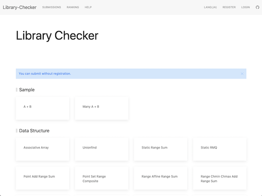

## 目次

<!-- START doctoc generated TOC please keep comment here to allow auto update -->
<!-- DON'T EDIT THIS SECTION, INSTEAD RE-RUN doctoc TO UPDATE -->

- [ライブラリ、スニペット](#%E3%83%A9%E3%82%A4%E3%83%96%E3%83%A9%E3%83%AA%E3%82%B9%E3%83%8B%E3%83%9A%E3%83%83%E3%83%88)
  - [ライブラリチェッカー](#%E3%83%A9%E3%82%A4%E3%83%96%E3%83%A9%E3%83%AA%E3%83%81%E3%82%A7%E3%83%83%E3%82%AB%E3%83%BC)
  - [AtCoder Library (ACL)の各言語への移植](#atcoder-library-acl%E3%81%AE%E5%90%84%E8%A8%80%E8%AA%9E%E3%81%B8%E3%81%AE%E7%A7%BB%E6%A4%8D)
    - [ライブラリの内容に関する記事](#%E3%83%A9%E3%82%A4%E3%83%96%E3%83%A9%E3%83%AA%E3%81%AE%E5%86%85%E5%AE%B9%E3%81%AB%E9%96%A2%E3%81%99%E3%82%8B%E8%A8%98%E4%BA%8B)
    - [各言語コミュニティでの活動状況](#%E5%90%84%E8%A8%80%E8%AA%9E%E3%82%B3%E3%83%9F%E3%83%A5%E3%83%8B%E3%83%86%E3%82%A3%E3%81%A7%E3%81%AE%E6%B4%BB%E5%8B%95%E7%8A%B6%E6%B3%81)
    - [C](#c)
    - [C++](#c)
    - [Crystal](#crystal)
    - [CSharp](#csharp)
    - [D](#d)
    - [Go](#go)
    - [Java](#java)
    - [Julia](#julia)
    - [Kotlin](#kotlin)
    - [Nim](#nim)
    - [Python](#python)
    - [Ruby](#ruby)
    - [Rust](#rust)
  - [複数の言語](#%E8%A4%87%E6%95%B0%E3%81%AE%E8%A8%80%E8%AA%9E)
  - [CSharp](#csharp-1)
  - [C++](#c-1)
  - [D](#d-1)
  - [Fortran](#fortran)
  - [FSharp](#fsharp)
  - [Go](#go-1)
  - [Haskell](#haskell)
  - [Java](#java-1)
  - [Kotlin](#kotlin-1)
  - [Nim](#nim-1)
  - [Node.js](#nodejs)
  - [PHP](#php)
  - [Python](#python-1)
  - [Ruby](#ruby-1)
  - [Rust](#rust-1)
  - [Scala](#scala)

<!-- END doctoc generated TOC please keep comment here to allow auto update -->

## ライブラリ、スニペット

ライブラリ・スニペットを採用するときの判断材料となるよう、GitHubのStar数、[AtCoder](https://atcoder.jp/)のユーザアカウント情報を掲載しています。

レポジトリ作成者による注: コンテストで利用する場合は、事前に最新のジャッジシステムやライブラリチェッカーでの動作確認を推奨します。

### ライブラリチェッカー

- [Library Checker Problems](https://judge.yosupo.jp/)  - オンラインジャッジシステムにより、ライブラリが正しく実装されているか確認できる。

  

    
  

- [Online Judge Verification Helper](https://github.com/online-judge-tools/verification-helper)  - ライブラリのテストを自動化するツールで、上述の[Library Checker Problems](https://judge.yosupo.jp/)などの問題を利用して実行する。また、ライブラリのドキュメント生成機能やC++のファイルをまとめて提出できるようにする機能もある。
- [libtest](https://github.com/pachicobue/libtest)  - C++ライブラリのテストのために使う問題集。CIでの利用を想定しており、入出力の自動生成と自動テストを行うことができる。

### AtCoder Library (ACL)の各言語への移植

- [AtCoder](https://atcoder.jp/)公式が、様々なアルゴリズムをC++で実装したライブラリを[AtCoder Library (ACL)](https://atcoder.jp/posts/517)として公開しています([GitHubレポジトリ](https://github.com/atcoder/ac-library))。
- 有志によって、各言語への移植が試みられています。また、一部の言語では、移植されたライブラリから必要な部分だけを取り出して、一つの提出用ファイルにまとめることができるツールが公開されています。

#### ライブラリの内容に関する記事

- [AtCoder Library - 西尾泰和のScrapbox](https://scrapbox.io/nishio/AtCoder_Library) - ライブラリの見出しを1ページにまとめた記事。概略を把握するのに便利。
- [AtCoder Library (日本語訳)](https://drken1215.hatenablog.com/) - [drken](https://atcoder.jp/users/drken)さんによる[公式記事](https://codeforces.com/blog/entry/82400)の日本語訳。
- [AtCoder LibraryのLazy Segtreeの使い方](https://betrue12.hateblo.jp/entry/2020/09/22/194541) - [betrue12](https://atcoder.jp/users/betrue12)さんによる遅延伝播機能を持つセグメント木の使用方法を解説した記事。`atcoder::lazy_segtree`を生成するときに、テンプレート引数に何を渡すのか、自分で考えられるようになることを目標としている。また、整数列に対するシンプルな機能の組み合わせについては、コピー&ペーストで利用できる[チートシート](https://betrue12.hateblo.jp/entry/2020/09/23/005940)も公開されている。

#### 各言語コミュニティでの活動状況

- [Unofficial Portings of AtCoder Library](https://docs.google.com/spreadsheets/d/19jMAqUbv98grVkLV_Lt54x5B8ILoTcvBzG8EbSvf5gY/edit#gid=0) - [not](https://atcoder.jp/users/not)さんによる、コミュニティの一覧表。

#### C

- [siumai1223/ac-library-c](https://github.com/siumai1223/ac-library-c)  - C版。[Slack](https://ac-library-c.slack.com/join/shared_invite/zt-h4ka7x46-kFrvaf836kJzGZkfNYCq_w#/)も作成されている。

#### C++

- [TumoiYorozu/single-file-ac-library](https://github.com/TumoiYorozu/single-file-ac-library)  - [公式ライブラリ](https://atcoder.jp/posts/517)をシングルファイルとして使えるようにしている。また、公式ドキュメントを[ブラウザ](https://tumoiyorozu.github.io/single-file-ac-library/document_ja/)で見ることもできる。

#### Crystal

- [google/ac-library.cr](https://github.com/google/ac-library.cr)  - Crystal版。

#### CSharp

- [key-moon/ac-library-cs](https://github.com/key-moon/ac-library-cs)  - C#版。

#### D

- [arkark/ac-library-d](https://github.com/arkark/ac-library-d)  - D版。

#### Go

- [monkukui/ac-library-go](https://github.com/monkukui/ac-library-go)  - Go版。
- [monkukui/gpcg](https://github.com/monkukui/gpcg)  - 複数のファイルにまたがるGoのコードを一つにまとめて、提出用のコードを生成するツール。注: レポジトリのREADMEによると、未完成の状態。

#### Java

- [NASU41/AtCoderLibraryForJava](https://github.com/NASU41/AtCoderLibraryForJava)  - Java版。[Slack](https://aclforjava.slack.com/join/shared_invite/zt-h7q1ytaa-qr2PMhMZCECG30hJTm5kjw#/)も用意されている。また、このレポジトリから派生した[Kotlin版](https://github.com/da-louis/ac-library-kt)もある。

#### Julia

- [abap34/ACL.jl](https://github.com/abap34/ACL.jl)  - Julia版。

#### Kotlin

- [da-louis/ac-library-kt](https://github.com/da-louis/ac-library-kt)  - Kotlin版。[Java版](https://github.com/NASU41/AtCoderLibraryForJava)をベースに作成されている。

#### Nim

- [zer0-star/Nim-ACL](https://github.com/zer0-star/Nim-ACL)  - Nim版。

#### Python

- [Mitarushi/ACL-Python](https://github.com/Mitarushi/ACL-Python)  - PyPy版。
- [not522/ac-library-python](https://github.com/not522/ac-library-python)  - Python版。

#### Ruby

- [universato/ac-library-rb](https://github.com/universato/ac-library-rb)  - Ruby版。[Slack](https://ruby-jp.github.io/)ワークスペースが用意されている。

#### Rust

- [rust-lang-ja/ac-library-rs](https://github.com/rust-lang-ja/ac-library-rs)  - Rust版。詳しい情報は、[Slack](https://rust-jp.rs/)で得られる。
- [kenkoooo/cargo-concat](https://github.com/kenkoooo/cargo-concat)  - コマンド一つで、Rustの依存モジュールを一つのファイルにまとめるツール。
- [shino16/cargo-auto-bundle](https://github.com/shino16/cargo-auto-bundle)  - Rustのライブラリを一つのファイルにまとめて提出するときに、コピー&ペーストの作業を補助するツール。注: レポジトリのREADMEによると、一部の機能は今後実装される可能性がある。

### 複数の言語

- [TheAlgorithms](https://github.com/TheAlgorithms) - 競技プログラミング専用ではないが、有名なアルゴリズムが複数の言語で実装されたレポジトリ群。Python, Java, C++, C, Go, JavaScriptなどが公開されている。
- [VAR-solutions/Algorithms](https://var-solutions.github.io/Algorithms/)  - アルゴリズムやデータ構造について、シンプルな例が複数の言語で実装されている。

### CSharp

- [camypaper/complib](https://github.com/camypaper/complib)  - [camypaper](https://atcoder.jp/users/camypaper)さんのライブラリ。
- [hibatibati/My-Competitive-Programming-Library](https://github.com/hibatibati/My-Competitive-Programming-Library)  - [hibatibati](https://atcoder.jp/users/hibatibati)さんのライブラリ。
- [key-moon/Library](https://github.com/key-moon/Library)  - [keymoon](https://atcoder.jp/users/keymoon)さんのライブラリ。
- [kuuso/comp_pro_csharp](https://github.com/kuuso/comp_pro_csharp)  - [kuuso](https://atcoder.jp/users/kuuso)さんのライブラリ。[Python版](https://github.com/kuuso/comp_pro_python)もある。
- [mban259/CompLib](https://github.com/mban259/CompLib)  - [mban](https://atcoder.jp/users/mban)さんのライブラリ。
- [naminodarie/AtCoderProject](https://github.com/naminodarie/AtCoderProject)  - [naminodarie](https://atcoder.jp/users/naminodarie)さんのライブラリ。
- [riantkb/csharp](https://github.com/riantkb/csharp)  - [riantkb](https://atcoder.jp/users/riantkb)さんのスニペット集。
- [terry-u16/AtCoderTemplateForNetCore](https://github.com/terry-u16/AtCoderTemplateForNetCore)  - [terry_u16](https://atcoder.jp/users/terry_u16)さんのテンプレート。
- [yupiteru/AtCoder](https://github.com/yupiteru/AtCoder)  - [yupiteru](https://atcoder.jp/users/yupiteru)さんのライブラリとテンプレート。

### C++

- [asi1024/competitive-library](https://github.com/asi1024/competitive-library)  - [asi1024](https://atcoder.jp/users/asi1024)さんのライブラリ。C++11(gcc-4.8)、C++17(gcc-7)、C++14(clang-3.8)に対応。
- [AokabiC/compro-lib](https://github.com/AokabiC/compro-lib)  - [AokabiC](https://atcoder.jp/users/AokabiC)さんのライブラリ。
- [beet-aizu/library](https://beet-aizu.github.io/library/)  - [beet](https://atcoder.jp/users/beet)さんのライブラリ。
- [drafear/competitive-library](https://github.com/drafear/competitive-library)  - [drafear](https://atcoder.jp/users/drafear)さんのライブラリ。
- [drken1215/algorithm](https://github.com/drken1215/algorithm)  - [drken](https://atcoder.jp/users/drken)さんの実装例・ライブラリ。C++14で実装されている。
- [ei1333/library](https://ei1333.github.io/library/)  - [ei13333](https://atcoder.jp/users/ei13333)さんのライブラリ。
- [fumiphys/programming_contest](https://github.com/fumiphys/programming_contest)  - [fumiphys](https://atcoder.jp/users/fumiphys)さんのライブラリ。
- [fuppy0716/kyopro](https://github.com/fuppy0716/kyopro)  - [fuppy0716](https://atcoder.jp/users/fuppy0716)さんのライブラリ。
- [Ganariya/library](https://ganariya.github.io/library/)  - [ganariya2525](https://atcoder.jp/users/ganariya2525)さんのライブラリ。
- [hamko/procon](https://github.com/hamko/procon)  - [hamko](https://atcoder.jp/users/hamko)さんのライブラリ。問題の典型的な要素を可視化する試みが行われている。
- [hiramekun/Algorithm](https://github.com/hiramekun/Algorithm)  - [hiramekun](https://atcoder.jp/users/hiramekun)さんのライブラリ。
- [hoget157/library](https://github.com/hoget157/library)  - [hoget157](https://atcoder.jp/users/hoget157)さんのライブラリ。
- [kazunetakahashi/library](https://github.com/kazunetakahashi/library)  - [kazunetakahashi](https://atcoder.jp/users/kazunetakahashi)さんのライブラリ。
- [kmyk/competitive-programming-library](https://kmyk.github.io/competitive-programming-library/)  - [kimiyuki](https://atcoder.jp/users/kimiyuki)さんのライブラリ。
- [koba-e964/contest](https://github.com/koba-e964/contest)  - [kobae964](https://atcoder.jp/users/kobae964)さんのライブラリ。Rustの実装も含まれている。
- [kotatsugame/library](https://github.com/kotatsugame/library)  - [kotatsugame](https://atcoder.jp/users/kotatsugame)さんのライブラリ。
- [KryKsk/Algorithm](https://github.com/KryKsk/Algorithm)  - C++で実装されたアルゴリズムのライブラリ。
- [kumaraditya1999/Algorithms](https://github.com/kumaraditya1999/Algorithms)  - [kumaraditya1999](https://atcoder.jp/users/kumaraditya1999)さんのライブラリ。
- [latte0119/Library](https://github.com/latte0119/Library)  - [latte0119](https://atcoder.jp/users/latte0119)さんのライブラリ。
- [monkukui/Library](https://github.com/monkukui/Library)  - [monkukui](https://atcoder.jp/users/monkukui)さんのライブラリ。
- [morioprog/cpplib](https://morioprog.github.io/cpplib/)  - [morio__](https://atcoder.jp/users/morio__)さんのライブラリ。
- [ngtkana/ngtlibcpp](https://github.com/ngtkana/ngtlibcpp)  - [ngtkana](https://atcoder.jp/users/ngtkana)さんのライブラリ。[Rust版](https://github.com/ngtkana/ac-adapter-rs)もある。
- [ningenMe/compro-library](https://github.com/ningenMe/compro-library)  - [ningenMe](https://atcoder.jp/users/ningenMe)さんのライブラリ。
- [noshi91/Library](https://noshi91.github.io/Library/)  - [noshi91](https://atcoder.jp/users/noshi91)さんのライブラリ。
- [NyaanNyaan/library](https://github.com/NyaanNyaan/library)  - [Nyaan](https://atcoder.jp/users/Nyaan)さんのライブラリ。
- [primenumber/ProconLib](https://github.com/primenumber/ProconLib)  - [primenumber](https://atcoder.jp/users/primenumber)さんのライブラリ。
- [rsk0315/library](https://github.com/rsk0315/library)  - [rsk0315](https://atcoder.jp/users/rsk0315)さんのライブラリ。[Rust版](https://github.com/rsk0315/rust-library)もある。
- [satanic0258/library](https://github.com/satanic0258/library)  - [satanic0258](https://atcoder.jp/users/satanic0258)さんのライブラリ。
- [sigma425/library](https://github.com/sigma425/library)  - [sigma425](https://atcoder.jp/users/sigma425)さんのライブラリ。
- [smiken/kyopuro-library](https://github.com/smiken/kyopuro-library)  - [smiken](https://atcoder.jp/users/smiken)さんのライブラリ。
- [snuke/LibraryPaste](https://github.com/snuke/LibraryPaste)  - [snuke](https://atcoder.jp/users/snuke)さんの[Sublime Text](https://www.sublimetext.com/3)プラグイン。
- [square1001/algorithm-contest-library](https://github.com/square1001/algorithm-contest-library)  - [square1001](https://atcoder.jp/users/square1001)さんのライブラリ。
- [tatyam-prime/kyopro_library](https://github.com/tatyam-prime/kyopro_library)  - [tatyam](https://atcoder.jp/users/tatyam)さんのライブラリ。
- [Tiramister/CppLibrary](https://github.com/Tiramister/CppLibrary)  - [Tiramister](https://atcoder.jp/users/Tiramister)さんのライブラリ。
- [tubuann/library](https://github.com/tubuann/library)  - [tubuann](https://atcoder.jp/users/tubuann)さんのライブラリ。
- [yosupo06/Algorithm](https://github.com/yosupo06/Algorithm)  - [yosupo](https://atcoder.jp/users/yosupo)さんのライブラリ。C++11で実装されている。[D版](https://github.com/yosupo06/dunkelheit)もある。
- [zerokpr/Kpr_Library](https://github.com/zerokpr/Kpr_Library)  - [zero_kpr](https://atcoder.jp/users/zero_kpr)さんのライブラリ。

### D

- [arkark/d-prolog](https://github.com/arkark/d-prolog)  - [arkark](https://atcoder.jp/users/arkark)さんのライブラリ。
- [cedretaber/competitive_programming_library](https://github.com/cedretaber/competitive_programming_library)  - [cedretaber](https://atcoder.jp/users/cedretaber)さんのライブラリ。RubyやRustのライブラリも含まれている。
- [fluffyowl/algo-d](https://github.com/fluffyowl/algo-d)  - [nebukuro09](https://atcoder.jp/users/nebukuro09)さんのライブラリ。
- [hos-lyric/libra](https://github.com/hos-lyric/libra)  - [hos_lyric](https://atcoder.jp/users/hos_lyric)さんのライブラリ。
- [private-yusuke/Competitive-Programming](https://github.com/private-yusuke/Competitive-Programming/tree/master/template)  - [private_yusuke](https://atcoder.jp/users/private_yusuke)さんのライブラリ。
- [Sobaya007/sbylib](https://github.com/Sobaya007/sbylib)  - [sobaya](https://atcoder.jp/users/sobaya)さんのライブラリ。
- [yosupo06/dunkelheit](https://github.com/yosupo06/dunkelheit)  - [yosupo](https://atcoder.jp/users/yosupo)さんのライブラリ。[C++版](https://github.com/yosupo06/Algorithm)もある。

### Fortran

- [DSCF-1224/Fortran](https://github.com/DSCF-1224/Fortran)  - [DSCF_1224](https://atcoder.jp/users/DSCF_1224)さんのライブラリ。
- [otafuro/library1](https://github.com/otafuro/library1)  - [otafuro](https://atcoder.jp/users/otafuro)さんのライブラリ。
- [ue1221/fortran-utilities](https://github.com/ue1221/fortran-utilities)  - [ue1221](https://atcoder.jp/users/ue1221)さんのライブラリ。

### FSharp

- [guricerin/compro-fsharp](https://github.com/guricerin/compro-fsharp)  - [guricerin](https://atcoder.jp/users/guricerin)さんのライブラリ。
- [kazurego7/AtCoderTools_FSharp](https://github.com/kazurego7/AtCoderTools_FSharp)  - [kazurego7](https://atcoder.jp/users/kazurego7)さんのライブラリ。

### Go

- [aruaru0/golang_myatcoder](https://github.com/aruaru0/golang_myatcoder/tree/master/algo)  - [Aruaru0](https://atcoder.jp/users/Aruaru0)さんのライブラリ。
- [naipia/competitive-programming-go](https://github.com/naipia/competitive-programming-go)  - [naipia](https://atcoder.jp/users/naipia)さんのライブラリ。

### Haskell

- [cojna/iota](https://cojna.github.io/iota/)  - [cojna](https://atcoder.jp/users/cojna)さんのライブラリ。
- [jasy/alglib](https://github.com/jasy/alglib)  - [jasy](https://atcoder.jp/users/jasy)さんのライブラリ。
- [tjnt/atcoder-haskell](https://github.com/tjnt/atcoder-haskell/tree/master/src)  - [tjnt](https://atcoder.jp/users/tjnt)さんのライブラリ。

### Java

- [amotoma3/competitive-programming-java](https://github.com/amotoma3/competitive-programming-java)  - [amotoma3](https://atcoder.jp/users/amotoma3)さんのライブラリ。
- [hamadu/competitive-programming-snippets](https://github.com/hamadu/competitive-programming-snippets)  - [hamadu](https://atcoder.jp/users/hamadu)さんのライブラリ。
- [Hiromi-Ayase/competitive-programming-old](https://github.com/Hiromi-Ayase/competitive-programming-old)  - [hiromi_ayase](https://atcoder.jp/users/hiromi_ayase)さんのライブラリ。
- [hiro116s/atcoder_library](https://github.com/hiro116s/atcoder_library)  - [hiro116s](https://atcoder.jp/users/hiro116s)さんのライブラリ。
- [tomerun/CompLib](https://github.com/tomerun/CompLib)  - [tomerun](https://atcoder.jp/users/tomerun)さんのライブラリ。CrystalやC++のライブラリも含まれている。

### Kotlin

- [shin2ro/algorithms-in-kotlin](https://github.com/shin2ro/algorithms-in-kotlin)  - [shin2ro](https://atcoder.jp/users/shin2ro)さんのライブラリ。
- [kirimin/AtCoderLog](https://github.com/kirimin/AtCoderLog/tree/master/src/main/kotlin/utilities)  - [kirimin](https://atcoder.jp/users/kirimin)さんのライブラリ。
- [sciencesakura/atcoder-sandbox](https://github.com/sciencesakura/atcoder-sandbox)  - [sciencesakura](https://atcoder.jp/users/sciencesakura)さんのライブラリ。
- [t-matsumo/myLibForKotlin](https://github.com/t-matsumo/myLibForKotlin)  - [mt_kum](https://atcoder.jp/users/mt_kuma)さんのライブラリ。

### Nim

- [chaemon/library-nim](https://github.com/chaemon/library-nim)  - [chaemon](https://atcoder.jp/users/chaemon)さんのライブラリ。

### Node.js

- [DecoratedKnight/js-cp-template](https://github.com/DecoratedKnight/js-cp-template/tree/0a09186b4bbf8dcb040f23e202957b40071f8b35)  - [decoratedknight](https://atcoder.jp/users/decoratedknight)さんのテンプレート。

### PHP

- [hideyuk1-jp/AtCoder](https://github.com/hideyuk1-jp/AtCoder/tree/master/php/lib)  - [hideyuk1](https://atcoder.jp/users/hideyuk1)さんのライブラリ。
- [takamiyaatusi/algorithm](https://github.com/takamiyaatusi/algorithm)  - [takamiyaatusi](https://atcoder.jp/users/takamiyaatusi)さんのライブラリ。
- [takepan/mylib](https://github.com/takepan/mylib)  [takepan](https://atcoder.jp/users/takepan)さんのライブラリ。

### Python

- [Coki628/Python/lib](https://github.com/Coki628/Python/tree/master/lib)  - [Coki628](https://atcoder.jp/users/Coki628)さんのライブラリ。
- [horiso0921/Mylib](https://github.com/horiso0921/Mylib)  - [horiso0921](https://atcoder.jp/users/horiso0921)さんのライブラリ。
- [iehn/lib](https://github.com/iehn/lib)  - [iehn](https://atcoder.jp/users/iehn)さんのライブラリ。
- [kerroggu/AtCoderLibrary](https://github.com/kerroggu/AtCoderLibrary)  - Pythonで実装されたアルゴリズムのライブラリ。
- [kuuso/comp_pro_python](https://github.com/kuuso/comp_pro_python)  - [kuuso](https://atcoder.jp/users/kuuso)さんのライブラリ。[C#版](https://github.com/kuuso/comp_pro_csharp)もある。
- [maspypy/compro_library](https://github.com/maspypy/compro_library)  - [maspy](https://atcoder.jp/users/maspy)さんのライブラリ。
- [matsu7874/competitive-programming-snippets](https://github.com/matsu7874/competitive-programming-snippets)  - [matsu7874](https://atcoder.jp/users/matsu7874)さんのスニペット集。
- [Neterukun1993/algorithm](https://github.com/Neterukun1993/algorithm)  - [neterukun](https://atcoder.jp/users/neterukun)さんのライブラリ。
- [nrkt/Algorithms](https://github.com/nrkt/Algorithms)  - [nrkt](https://atcoder.jp/users/nrkt)さんのライブラリ。
- [tachyon777/AtCoder](https://github.com/tachyon777/AtCoder)  - [tachyon777](https://atcoder.jp/users/tachyon777)さんのライブラリ。
- [tjkendev/procon-library](https://github.com/tjkendev/procon-library)  - [yaketake08](https://atcoder.jp/users/yaketake08)さんのライブラリ。

### Ruby

- [corvvs/shorthanded](https://github.com/corvvs/shorthanded)  - [Corvvs](https://atcoder.jp/users/Corvvs)さんのライブラリ。
- [universato/compro](https://github.com/universato/compro)  - [universato](https://atcoder.jp/users/universato)さんのライブラリ。

### Rust

- [hatoo/competitive-rust-snippets](https://github.com/hatoo/competitive-rust-snippets)  - [hatoo](https://atcoder.jp/users/hatoo)さんのスニペット集。
- [ichyo/algorithms](https://github.com/ichyo/algorithms)  - [ichyo](https://atcoder.jp/users/ichyo)さんのライブラリ。
- [kenkoooo/competitive-programming-rs](https://github.com/kenkoooo/competitive-programming-rs)  - [kenkoooo](https://atcoder.jp/users/kenkoooo)さんのスニペット集。
- [koba-e964/contest](https://github.com/koba-e964/contest/tree/master/comm)  - [kobae964](https://atcoder.jp/users/kobae964)さんのライブラリ。C++の実装も含まれている。
- [manta1130/Competitive_Programming_Template_Rust](https://github.com/manta1130/Competitive_Programming_Template_Rust)  - [manta1130](https://atcoder.jp/users/manta1130)さんのライブラリ。
- [ngtkana/ac-adapter-rs](https://github.com/ngtkana/ac-adapter-rs)  - [ngtkana](https://atcoder.jp/users/ngtkana)さんのライブラリ。[C++版](https://github.com/ngtkana/ngtlibcpp)もある。
- [niuez/cp-rust-library](https://github.com/niuez/cp-rust-library)  - [niuez](https://atcoder.jp/users/niuez)さんのライブラリ。
- [rsk0315/rust-library](https://github.com/rsk0315/rust-library)  - [rsk0315](https://atcoder.jp/users/rsk0315)さんのライブラリ。[C++版](https://github.com/rsk0315/library)もある。
- [tanakh/competitive-rs](https://github.com/tanakh/competitive-rs)  - [tanakh](https://atcoder.jp/users/tanakh)さんのライブラリ。
- [yoshrc/rust-atcoder-snippets](https://github.com/yoshrc/rust-atcoder-snippets)  - [yoshrc](https://atcoder.jp/users/yoshrc)さんのスニペット集。

### Scala

- [Goryudyuma/scala-work](https://github.com/Goryudyuma/scala-work)  - [goryudyuma](https://atcoder.jp/users/goryudyuma)さんのライブラリ。template.scalaにまとめられている。
- [yakamoto69/atcoder_scala](https://github.com/yakamoto69/atcoder_scala)  - [yakamoto](https://atcoder.jp/users/yakamoto)さんのライブラリ。
