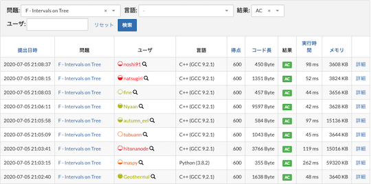

## 目次

<!-- START doctoc generated TOC please keep comment here to allow auto update -->
<!-- DON'T EDIT THIS SECTION, INSTEAD RE-RUN doctoc TO UPDATE -->

- [Recommendation (Beta)](#recommendation-beta)
  - [過去問を解く](#%E9%81%8E%E5%8E%BB%E5%95%8F%E3%82%92%E8%A7%A3%E3%81%8F)
    - [定番のサービスを利用する](#%E5%AE%9A%E7%95%AA%E3%81%AE%E3%82%B5%E3%83%BC%E3%83%93%E3%82%B9%E3%82%92%E5%88%A9%E7%94%A8%E3%81%99%E3%82%8B)
    - [特定のカテゴリーに関する問題を重点的に解く](#%E7%89%B9%E5%AE%9A%E3%81%AE%E3%82%AB%E3%83%86%E3%82%B4%E3%83%AA%E3%83%BC%E3%81%AB%E9%96%A2%E3%81%99%E3%82%8B%E5%95%8F%E9%A1%8C%E3%82%92%E9%87%8D%E7%82%B9%E7%9A%84%E3%81%AB%E8%A7%A3%E3%81%8F)
  - [ソースコードの提出前後の操作、確認を便利にする](#%E3%82%BD%E3%83%BC%E3%82%B9%E3%82%B3%E3%83%BC%E3%83%89%E3%81%AE%E6%8F%90%E5%87%BA%E5%89%8D%E5%BE%8C%E3%81%AE%E6%93%8D%E4%BD%9C%E7%A2%BA%E8%AA%8D%E3%82%92%E4%BE%BF%E5%88%A9%E3%81%AB%E3%81%99%E3%82%8B)
    - [入出力例を使って、不正解となるソースコードを提出する可能性を減らす](#%E5%85%A5%E5%87%BA%E5%8A%9B%E4%BE%8B%E3%82%92%E4%BD%BF%E3%81%A3%E3%81%A6%E4%B8%8D%E6%AD%A3%E8%A7%A3%E3%81%A8%E3%81%AA%E3%82%8B%E3%82%BD%E3%83%BC%E3%82%B9%E3%82%B3%E3%83%BC%E3%83%89%E3%82%92%E6%8F%90%E5%87%BA%E3%81%99%E3%82%8B%E5%8F%AF%E8%83%BD%E6%80%A7%E3%82%92%E6%B8%9B%E3%82%89%E3%81%99)
    - [ショートカットを使って素早くソースコードを提出する](#%E3%82%B7%E3%83%A7%E3%83%BC%E3%83%88%E3%82%AB%E3%83%83%E3%83%88%E3%82%92%E4%BD%BF%E3%81%A3%E3%81%A6%E7%B4%A0%E6%97%A9%E3%81%8F%E3%82%BD%E3%83%BC%E3%82%B9%E3%82%B3%E3%83%BC%E3%83%89%E3%82%92%E6%8F%90%E5%87%BA%E3%81%99%E3%82%8B)
    - [ソースコードの正誤判定を自動的に通知する](#%E3%82%BD%E3%83%BC%E3%82%B9%E3%82%B3%E3%83%BC%E3%83%89%E3%81%AE%E6%AD%A3%E8%AA%A4%E5%88%A4%E5%AE%9A%E3%82%92%E8%87%AA%E5%8B%95%E7%9A%84%E3%81%AB%E9%80%9A%E7%9F%A5%E3%81%99%E3%82%8B)
    - [ソースコードの正誤判定の内容を素早く確認する](#%E3%82%BD%E3%83%BC%E3%82%B9%E3%82%B3%E3%83%BC%E3%83%89%E3%81%AE%E6%AD%A3%E8%AA%A4%E5%88%A4%E5%AE%9A%E3%81%AE%E5%86%85%E5%AE%B9%E3%82%92%E7%B4%A0%E6%97%A9%E3%81%8F%E7%A2%BA%E8%AA%8D%E3%81%99%E3%82%8B)
  - [コンテストの終了後に情報収集、発信する](#%E3%82%B3%E3%83%B3%E3%83%86%E3%82%B9%E3%83%88%E3%81%AE%E7%B5%82%E4%BA%86%E5%BE%8C%E3%81%AB%E6%83%85%E5%A0%B1%E5%8F%8E%E9%9B%86%E7%99%BA%E4%BF%A1%E3%81%99%E3%82%8B)
  - [UIを見やすくする](#ui%E3%82%92%E8%A6%8B%E3%82%84%E3%81%99%E3%81%8F%E3%81%99%E3%82%8B)
    - [コンテストの成績表をより見やすくする](#%E3%82%B3%E3%83%B3%E3%83%86%E3%82%B9%E3%83%88%E3%81%AE%E6%88%90%E7%B8%BE%E8%A1%A8%E3%82%92%E3%82%88%E3%82%8A%E8%A6%8B%E3%82%84%E3%81%99%E3%81%8F%E3%81%99%E3%82%8B)
    - [問題の提出、正誤状況を確認する](#%E5%95%8F%E9%A1%8C%E3%81%AE%E6%8F%90%E5%87%BA%E6%AD%A3%E8%AA%A4%E7%8A%B6%E6%B3%81%E3%82%92%E7%A2%BA%E8%AA%8D%E3%81%99%E3%82%8B)
    - [問題の難易度を表示して、解くかどうかを判断する](#%E5%95%8F%E9%A1%8C%E3%81%AE%E9%9B%A3%E6%98%93%E5%BA%A6%E3%82%92%E8%A1%A8%E7%A4%BA%E3%81%97%E3%81%A6%E8%A7%A3%E3%81%8F%E3%81%8B%E3%81%A9%E3%81%86%E3%81%8B%E3%82%92%E5%88%A4%E6%96%AD%E3%81%99%E3%82%8B)
    - [提出されたコードを見るかどうかを判断する](#%E6%8F%90%E5%87%BA%E3%81%95%E3%82%8C%E3%81%9F%E3%82%B3%E3%83%BC%E3%83%89%E3%82%92%E8%A6%8B%E3%82%8B%E3%81%8B%E3%81%A9%E3%81%86%E3%81%8B%E3%82%92%E5%88%A4%E6%96%AD%E3%81%99%E3%82%8B)
    - [便利な機能が詰め込まれたChrome拡張機能](#%E4%BE%BF%E5%88%A9%E3%81%AA%E6%A9%9F%E8%83%BD%E3%81%8C%E8%A9%B0%E3%82%81%E8%BE%BC%E3%81%BE%E3%82%8C%E3%81%9Fchrome%E6%8B%A1%E5%BC%B5%E6%A9%9F%E8%83%BD)

<!-- END doctoc generated TOC please keep comment here to allow auto update -->

## Recommendation (Beta)

おすすめのサービス・ツールを厳選して紹介するページです(Beta版)。

注1: [For Beginners](https://kato-hiro.github.io/AtCoderClans/for_beginners)ページに目を通されることを推奨いたします。

注2: ユーザスクリプト(⭐️印が付いたサービス)を初めて利用される場合は、最初に[スクリプトマネージャ](https://greasyfork.org/ja)を導入する必要があります。

注3: 皆さまのご意見や今後のサービス・ツールの公開状況によって、掲載内容が変更される場合があります。

### 過去問を解く

  

    <a href="https://kato-hiro.github.io/AtCoderClans/web_app">もっと見る</a>
  

#### 定番のサービスを利用する

- [AtCoder Problems](https://kenkoooo.com/atcoder/) - 開催されたコンテストの問題を一覧できるWebアプリです。問題の正誤状況や各種集計結果を確認できるだけでなく、バーチャルコンテストなどの機能もあります。詳しくは、有志による[AtCoder Problemsの使い方](https://ntk-ta01.hatenablog.com/entry/2020/04/15/001405)や[定期的に開催されているバーチャルコンテスト(通称:くじかつ)の紹介記事](https://www.terry-u16.net/entry/kujikatsu-contest)などをご覧ください。

  

    
  

#### 特定のカテゴリーに関する問題を重点的に解く

- [AtCoder Tags](https://atcoder-tags.herokuapp.com/) - カテゴリーごとに問題を見ることができるWebアプリです。ユーザ登録を行えば、問題にふさわしいと思うカテゴリーを投票できます。[⭐ AtCoderTags_Helper](https://greasyfork.org/ja/scripts/393121-atcodertags-helper)を導入すると、[AtCoder](https://atcoder.jp/)の「問題」ページからも投票できます。

  

    
  

### ソースコードの提出前後の操作、確認を便利にする

  

    <a href="https://kato-hiro.github.io/AtCoderClans/scripts">もっと見る</a>
  

#### 入出力例を使って、不正解となるソースコードを提出する可能性を減らす

- [⭐ AtCoder Easy Test](https://greasyfork.org/ja/scripts/415946-atcoder-easy-test) - 「問題」ページで、入出力サンプルを使って素早くテストを実行できます。また、自分で作成したテストケースも実行できます。

  

    
  

  

    <a href="https://kato-hiro.github.io/AtCoderClans/cli">もっと見る</a>
  

#### ショートカットを使って素早くソースコードを提出する

- [⭐ AtCoder_submit_keyboard_shortcut](https://greasyfork.org/ja/scripts/378760-atcoder-submit-keyboard-shortcut) - Ctrl+Enterを押すだけでソースコードが提出できます。

#### ソースコードの正誤判定を自動的に通知する

- [⭐ AtCoderResultNotifier](https://greasyfork.org/ja/scripts/371225-atcoderresultnotifier) - 提出したソースコードの正誤判定の結果を自動的に通知します。

  

    
  

#### ソースコードの正誤判定の内容を素早く確認する

- [⭐ AtCoder Submission Status](https://greasyfork.org/ja/scripts/383817-atcoder-submission-status) - 提出した解答について、テストケースの結果(AC、WA、…)が一目でわかるように表示できます。

  

    
  

### コンテストの終了後に情報収集、発信する

- [AtCoder TL](https://github.com/shirakia/atcoder_tl) - レーティング帯ごとのTwitterタイムラインを生成することができます。

  

    
  

### UIを見やすくする

  

    <a href="https://kato-hiro.github.io/AtCoderClans/scripts">もっと見る</a>
  

#### コンテストの成績表をより見やすくする

- [⭐ AtCoderPerformanceColorizer](https://greasyfork.org/ja/scripts/371693-atcoderperformancecolorizer) - ユーザの「コンテスト成績表」のパフォーマンス値、レーティング値に色付けします。

  

    
  

#### 問題の提出、正誤状況を確認する

- [⭐ atcoder-tasks-page-colorizer](https://greasyfork.org/ja/scripts/380404-atcoder-tasks-page-colorizer) - 「問題」ページで、提出した問題に色付けします。「AC」が緑色で、「WA」が赤色でそれぞれ表示されます。

  

    
  

#### 問題の難易度を表示して、解くかどうかを判断する

- [⭐ AtCoder Difficulty Display](https://greasyfork.org/ja/scripts/397185-atcoder-difficulty-display) - 「問題」のページに[AtCoder Problems](https://kenkoooo.com/atcoder/)の難易度を表示します。

  

    
  

#### 提出されたコードを見るかどうかを判断する

- [⭐ AtCoder Submission User Colorizer](https://greasyfork.org/ja/scripts/397710-atcoder-submission-user-colorizer) - 「提出結果」ページのユーザ名を、レーティング帯に応じて色付けします。

  

    
  

#### 便利な機能が詰め込まれたChrome拡張機能

- [Comfortable Atcoder](https://chrome.google.com/webstore/detail/comfortable-atcoder/ipmmkccdccnephfilbjdnmnfcbopbpaj?hl=ja&gl=UA) - 提出結果の通知、問題をドロップダウンリストで表示、などを設定できるChrome拡張機能です。

  

    
  

