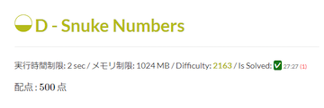

## 目次

<!-- START doctoc -->
<!-- END doctoc -->

## Recommendation (Beta)

おすすめのサービス・ツールを厳選して紹介するページです(Beta版)。

注1: [For Beginners](https://kato-hiro.github.io/AtCoderClans/for_beginners)ページに目を通されることを推奨いたします。

注2: ユーザスクリプト(⭐️印が付いたサービス)を初めて利用される場合は、最初に[スクリプトマネージャ](https://greasyfork.org/ja)を導入する必要があります。

注3: 皆さまのご意見や今後のサービス・ツールの公開状況によって、掲載内容が変更される場合があります。

### 過去問を解く

#### 定番のサービスを利用する

- [AtCoder Problems](https://kenkoooo.com/atcoder/) - 開催されたコンテストの問題を一覧できるWebアプリです。問題の正誤状況や各種集計結果を確認できるだけでなく、バーチャルコンテストなどの機能もあります。詳しくは、有志による[AtCoder Problemsの使い方](https://ntk-ta01.hatenablog.com/entry/2020/04/15/001405)や[定期的に開催されているバーチャルコンテスト(通称:くじかつ)の紹介記事](https://www.terry-u16.net/entry/kujikatsu-contest)などをご覧ください。

  

    
  

#### 特定のカテゴリーに関する問題を重点的に解く

- [AtCoder Tags](https://atcoder-tags.herokuapp.com/) - カテゴリーごとに問題を見ることができるWebアプリです。ユーザ登録を行えば、問題にふさわしいと思うカテゴリーを投票できます。[AtCoderTags_Helper](https://greasyfork.org/ja/scripts/393121-atcodertags-helper)を導入すると、[AtCoder](https://atcoder.jp/)の「問題」ページからも投票できます。

  

    
  

### ソースコードの提出前後の操作、確認を便利にする

#### 入出力例を使って、不正解となるソースコードを提出する可能性を減らす

- [⭐ AtCoder Easy Test](https://greasyfork.org/ja/scripts/415946-atcoder-easy-test) - 「問題」ページで、入出力サンプルを使って素早くテストを実行できます。また、自分で作成したテストケースも実行できます。

  

    
  

#### ショートカットを使って素早くソースコードを提出する

- [⭐ AtCoder_submit_keyboard_shortcut](https://greasyfork.org/ja/scripts/378760-atcoder-submit-keyboard-shortcut) - Ctrl+Enterを押すだけでソースコードが提出できます。

#### ソースコードの正誤判定を自動的に通知する

- [⭐ AtCoderResultNotifier](https://greasyfork.org/ja/scripts/371225-atcoderresultnotifier) - 提出したソースコードの正誤判定の結果を自動的に通知します。

  

    
  

#### ソースコードの正誤判定の内容を素早く確認する

- [⭐ AtCoder Submission Status](https://greasyfork.org/ja/scripts/383817-atcoder-submission-status) - 提出した解答について、テストケースの結果(AC、WA、…)が一目でわかるように表示できます。

  

    
  

### コンテストの終了後に情報収集、発信する

- [AtCoder TL](https://github.com/shirakia/atcoder_tl) - レーティング帯ごとのTwitterタイムラインを生成することができます。

  

    
  

### UIを見やすくする

#### コンテストの成績表をより見やすくする

- [⭐ AtCoderPerformanceColorizer](https://greasyfork.org/ja/scripts/371693-atcoderperformancecolorizer) - ユーザの「コンテスト成績表」のパフォーマンス値、レーティング値に色付けします。

  

    
  

#### 問題の提出、正誤状況を確認する

- [⭐ atcoder-tasks-page-colorizer](https://greasyfork.org/ja/scripts/380404-atcoder-tasks-page-colorizer) - 「問題」ページで、提出した問題に色付けします。「AC」が緑色で、「WA」が赤色でそれぞれ表示されます。

  

    
  

#### 問題の難易度を表示して、解くかどうかを判断する

- [⭐ AtCoder Difficulty Display](https://greasyfork.org/ja/scripts/397185-atcoder-difficulty-display) - 「問題」のページに[AtCoder Problems](https://kenkoooo.com/atcoder/)の難易度を表示します。

  

    
  

#### 提出されたコードを見るかどうかを判断する

- [⭐ AtCoder Submission User Colorizer](https://greasyfork.org/ja/scripts/397710-atcoder-submission-user-colorizer) - 「提出結果」ページのユーザ名を、レーティング帯に応じて色付けします。

  

    
  

#### 便利な機能が詰め込まれたChrome拡張機能

- [Comfortable Atcoder](https://chrome.google.com/webstore/detail/comfortable-atcoder/ipmmkccdccnephfilbjdnmnfcbopbpaj?hl=ja&gl=UA) - 提出結果の通知、問題をドロップダウンリストで表示、などを設定できるChrome拡張機能です。

  

    
  

