## 目次

<!-- START doctoc generated TOC please keep comment here to allow auto update -->
<!-- DON'T EDIT THIS SECTION, INSTEAD RE-RUN doctoc TO UPDATE -->

- [アルゴ式](#%E3%82%A2%E3%83%AB%E3%82%B4%E5%BC%8F)
- [AOJ (Aizu Online Judge)](#aoj-aizu-online-judge)
- [CafeCoder](#cafecoder)
- [Codeforces](#codeforces)
  - [記事](#%E8%A8%98%E4%BA%8B)
  - [Webアプリ、Webサイト](#web%E3%82%A2%E3%83%97%E3%83%AAweb%E3%82%B5%E3%82%A4%E3%83%88)
  - [ユーザスクリプト](#%E3%83%A6%E3%83%BC%E3%82%B6%E3%82%B9%E3%82%AF%E3%83%AA%E3%83%97%E3%83%88)
  - [コマンドラインツール、GUIツール](#%E3%82%B3%E3%83%9E%E3%83%B3%E3%83%89%E3%83%A9%E3%82%A4%E3%83%B3%E3%83%84%E3%83%BC%E3%83%ABgui%E3%83%84%E3%83%BC%E3%83%AB)
- [CTF (Capture The Flag)](#ctf-capture-the-flag)
- [HOJ (Hamako Online Judge)](#hoj-hamako-online-judge)
- [JOI (Japanese Olympiad in Informatics)と関連サービス](#joi-japanese-olympiad-in-informatics%E3%81%A8%E9%96%A2%E9%80%A3%E3%82%B5%E3%83%BC%E3%83%93%E3%82%B9)
  - [JOI](#joi)
  - [JOIに関連する記事](#joi%E3%81%AB%E9%96%A2%E9%80%A3%E3%81%99%E3%82%8B%E8%A8%98%E4%BA%8B)
  - [JOIの関連サービス](#joi%E3%81%AE%E9%96%A2%E9%80%A3%E3%82%B5%E3%83%BC%E3%83%93%E3%82%B9)
- [くそなぞなぞ Beginner Contest](#%E3%81%8F%E3%81%9D%E3%81%AA%E3%81%9E%E3%81%AA%E3%81%9E-beginner-contest)
- [MAO (Markov Algorithm Online)](#mao-markov-algorithm-online)
- [MORP (Math Olympiad Rating Project)](#morp-math-olympiad-rating-project)
- [New Year's Puzzles](#new-years-puzzles)
- [入試数学コンテスト](#%E5%85%A5%E8%A9%A6%E6%95%B0%E5%AD%A6%E3%82%B3%E3%83%B3%E3%83%86%E3%82%B9%E3%83%88)
- [OMC (OnlineMathContest)](#omc-onlinemathcontest)
- [Shitforces](#shitforces)
- [Topcoder](#topcoder)
  - [Webサイトと関連リンク](#web%E3%82%B5%E3%82%A4%E3%83%88%E3%81%A8%E9%96%A2%E9%80%A3%E3%83%AA%E3%83%B3%E3%82%AF)
  - [記事](#%E8%A8%98%E4%BA%8B-1)
  - [プラグイン](#%E3%83%97%E3%83%A9%E3%82%B0%E3%82%A4%E3%83%B3)
- [Wind Bel Contest](#wind-bel-contest)
- [yukicoder](#yukicoder)

<!-- END doctoc generated TOC please keep comment here to allow auto update -->

サービス・ツールのサポート対象に[AtCoder](https://atcoder.jp/)が含まれていないものの、歴史的な経緯・利用者数の多さなどの理由から掲載しています。

### アルゴ式

- [アルゴ式](https://algo-method.com/) - プログラミングを道具として利用しながら、論理的思考力やコーディング力を身につけることができるWebアプリ。[公式アカウント](https://twitter.com/algo_method)も用意されている。注: サービスを利用する前に、作者によるサービス開始の理由とアルゴリズムを学ぶ意義について書かれた[記事](https://note.com/sak_algo/n/nfb0058237ed5)を一読されたい。

  

    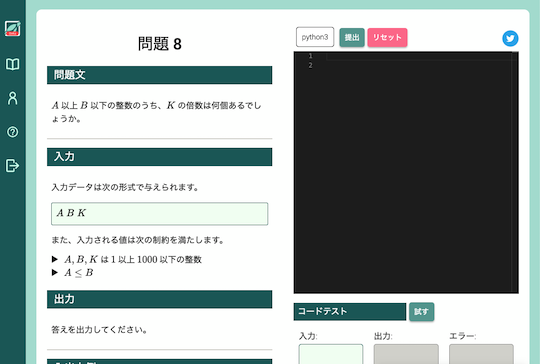
  

### AOJ (Aizu Online Judge)

- [AOJ-ICPC](http://aoj-icpc.ichyo.jp/) - [ICPC 日本リージョン](https://icpc.iisf.or.jp/)の国内予選・アジア地区予選および[ICPC OB/OG の会](https://jag-icpc.org/)で出題された問題の難易度を、有志が評価したWebサイト。

  

    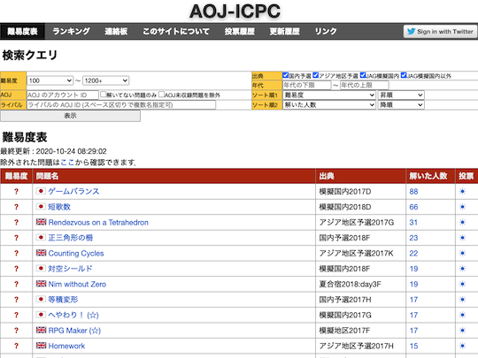
  

- [AOJ-PCK](http://aoj-pck.vsw.jp/) - パソコン甲子園の過去問やユーザの提出状況を確認できるWebサイト。

  

    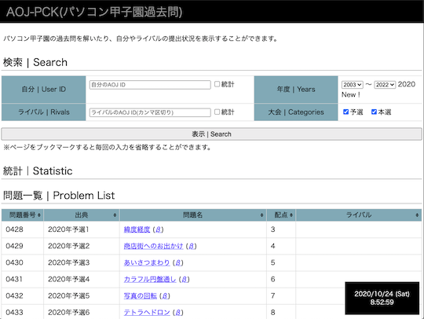
  

- [AOJ Problems by Category](http://aoj-problem-category-list.appspot.com/) - [AOJ](http://judge.u-aizu.ac.jp/onlinejudge/)のAPIを利用して、問題をカテゴリ分けしたWebサイト。

  

    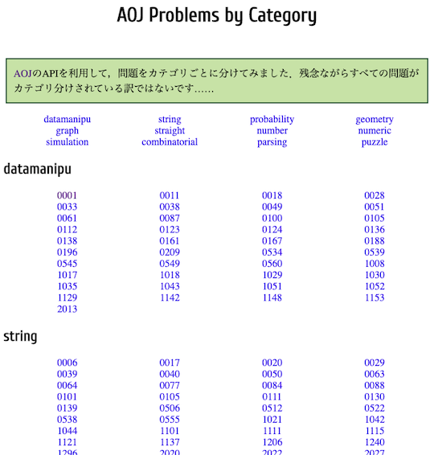
  

### CafeCoder

- [CafeCoder](https://cafecoder.top/) - 有志によって、不定期にコンテストが開催されている。

  

    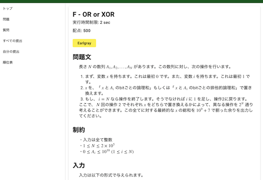
  

### Codeforces

#### 記事

- [AtCoderだけじゃない！こどふぉ(Codeforces) にも参加しよう🔥](https://qiita.com/Jessica_nao_/items/a7b621ee90856041d25d) - [Codeforces](https://codeforces.com/)のバーチャルコンテスト参加を勧めている記事。提出コードのテンプレート(Python)だけでなく、同コンテストで不便な点について解決方法も紹介されている。
- [Codeforcesのすすめ for AtCoderユーザー](https://ywmt.hatenablog.com/entry/2019/10/17/120914) - [AtCoder](https://atcoder.jp/)ユーザに向けて、[Codeforces](https://codeforces.com/)の特徴・おすすめポイントを解説した記事。
- [はじめてのCodeforces 前編 (参加登録〜コンテスト本番)](https://noimin.hatenablog.com/entry/2019/10/18/162521) -[Codeforces](https://codeforces.com/)に関心があるユーザに向けて、コンテストに出場登録するところから参加するまでの流れを日本語でわかりやすく解説した記事。[後編](https://noimin.hatenablog.com/entry/2019/10/19/152633)では、レーティングの変化をプロフィールページで確認する方法やコンテストの復習方法などについて解説されている。

#### Webアプリ、Webサイト

- [CF-Predictor](https://cf-predictor-frontend.herokuapp.com/) - コンテストの結果に基づいて、レーティングの変化を推定するWebアプリ。また、複数のブラウザに対応した拡張機能をダウンロードして利用することもできる。

  

    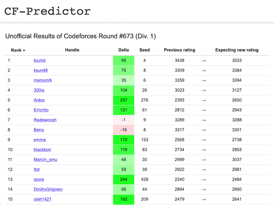
  

- [CF Problems](https://cf.kira924age.com/#/table/) - 開催されたコンテストの問題、ユーザの正誤状況などを一覧できるWebアプリ。作者による使用技術の[解説記事](https://kira000.hatenadiary.jp/entry/2021/03/06/123556)もある。また、類似したWebアプリとして[CONTEST MANIA](https://contestmania.web.app/)がある。

  

    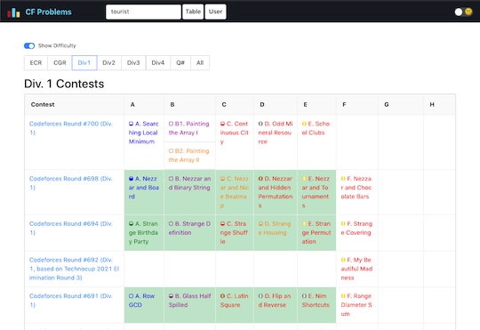
  

- [Codeforces Anytime](https://codeforces-anytime.firebaseapp.com/) - バーチャルコンテストの結果を利用して、レーティングの変動を表示するWebアプリ。同一の作者により[AtCoder版](https://atcoder-anytime.sonoapp.page/)も公開されている。

  

    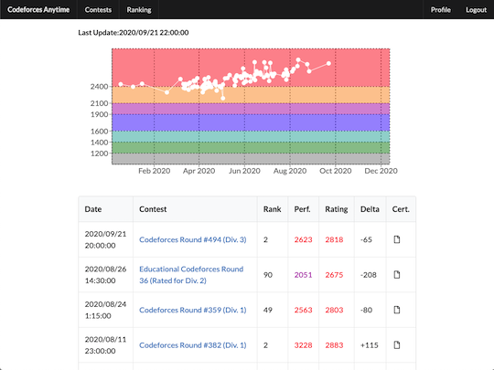
  

- [CONTEST MANIA](https://contestmania.web.app/) - 開催されたコンテストの問題を一覧できるWebアプリ「[Codeforces Problems](https://yang33-kassa.jp/Codeforces-Problems/)」の後継プロジェクトの一つ。ユーザ名を入力することで、正誤状況を把握できる。

  

    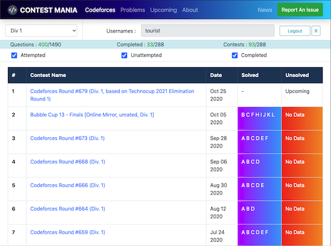
  

#### ユーザスクリプト

- [cf-fast-submit](https://greasyfork.org/ja/scripts/371117-cf-fast-submit) - コンテストの問題ページに提出用のフォームを設置し、直接submitすることができる。

  

    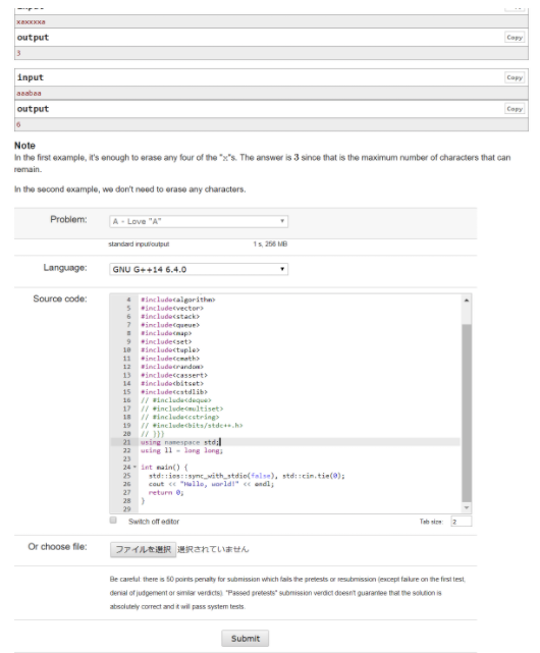
  

- [Codeforces Performance](https://greasyfork.org/ja/scripts/402180-codeforces-performance) - コンテストでのパフォーマンスの推定値をコンテスト履歴に表示する。また、レーティングやパフォーマンスの色付けも可能。

  

    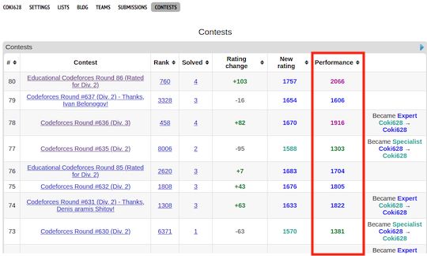
  

#### コマンドラインツール、GUIツール

- [Codeforces Tool](https://github.com/xalanq/cf-tool)  - サンプルの入出力の取得、テスト、解答コードの提出などができるCLIツール。

  

    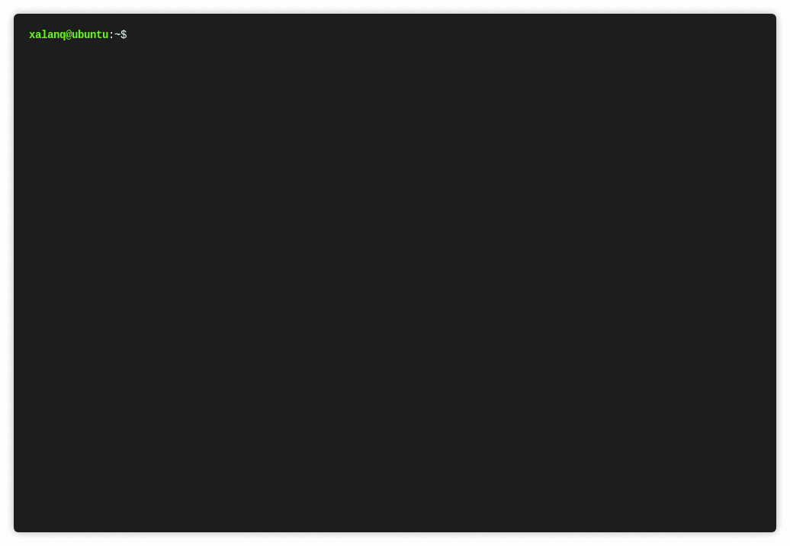
  

- [CP Editor](https://cpeditor.org/)  - サンプルの入出力の取得、テスト、文法チェック、解答コードの提出などができる競技プログラミング専用のIDE。

  

    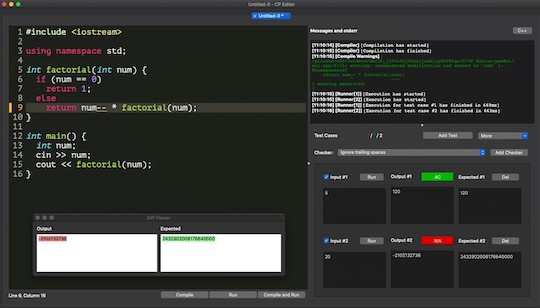
  

- [Hightail](https://github.com/dj3500/hightail)  - サンプルの入出力を取得し、ローカル環境でテストするGUIツール。

  

    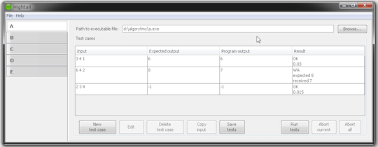
  

### CTF (Capture The Flag)

- [CTF-Ratings](https://github.com/theoremoon/ctf-ratings) - CTF(Capture The Flag)のレーティングシステム。レーティングとパフォーマンスは、AtCoderに準拠している。

  

    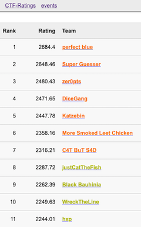
  

- [CTF TIME](https://ctftime.org/) - CTFのコンテスト一覧(新着・アーカイブ)やレーティングをはじめとする統計情報などが閲覧できるWebサイト。

  

    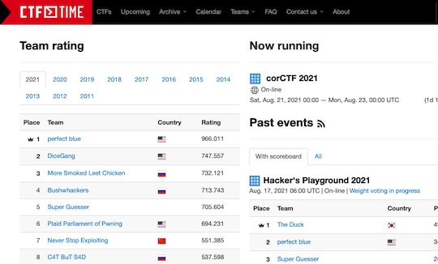
  

### HOJ (Hamako Online Judge)

- [Hamako Online Judge](https://hoj.hamako-ths.ed.jp/onlinejudge/) - 不定期にコンテストが開催されている。

  

    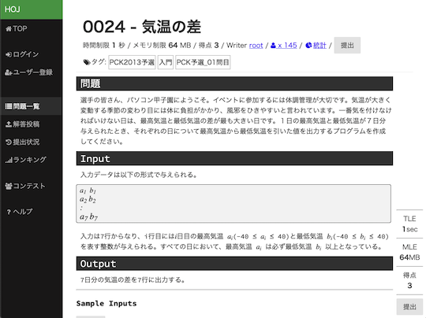
  

### JOI (Japanese Olympiad in Informatics)と関連サービス

#### JOI

- [日本情報オリンピック](https://www.ioi-jp.org/) - 情報オリンピック日本委員会のWebページ。[予選・本選で出題された問題と解説](https://www.ioi-jp.org/problem_archive.php)や[春季トレーニング合宿の過去問](https://www.ioi-jp.org/camp/index.html)などが掲載されている。

  

    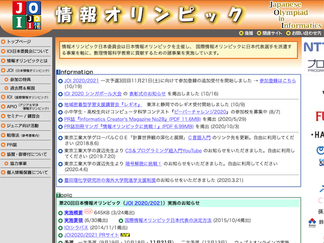
  

- [AOJ/Atcoder-JOI](https://joi.goodbaton.com/) - [AOJ](http://judge.u-aizu.ac.jp/onlinejudge/)や[AtCoder](https://atcoder.jp/)のユーザIDを利用して、難易度別の回答状況や個別の問題の正誤状況を把握できるWebサイト。

  

    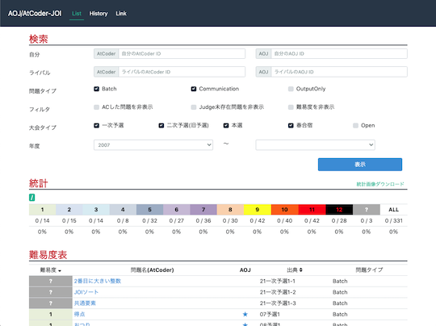
  

- [JOI非公式難易度表](https://docs.google.com/spreadsheets/d/1zXDtkFmskO5NSxkqck8uDbcJtAhTVZtzPh2hLw64Sw4/edit#gid=0) - JOIで出題された問題に関する非公式の難易度表。有志の投票に基づいて決められている。

  

    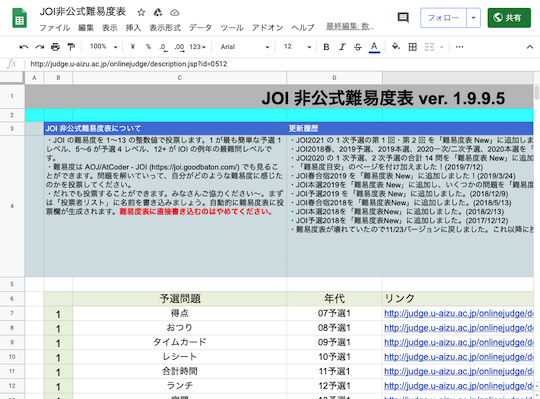
  

#### JOIに関連する記事

- [Introducion to JOI](https://pro-ktmr.github.io/joig-course/text/index.html) - C++の基礎文法について、JOIの過去問を通して学ぶことができる。
- [JOI春合宿2020 参加記](https://drive.google.com/file/d/1iW2sTAz9VyhzWbO0ByVHiha0jG0aIJ7H/view) - [E869120](https://atcoder.jp/users/E869120)さんによる2020年日本情報オリンピック春季トレーニング合宿の参加記。情報オリンピック日本代表の選考までの練習過程と選考会での立ち回りについて詳細に書かれている。
- [IOI2020 参加記](https://drive.google.com/file/d/1UOFW6Vtxz5S5hWBK78swQg368F6L15kp/view) - [E869120](https://atcoder.jp/users/E869120)さんによる第32回国際情報オリンピック(IOI2020)の参加記。「金メダルを確実に取る」という観点から、本番での立ち回りが詳細に解説されている。また、筆者が5年間の競技生活を通して得た経験は、後進に勇気と希望を与えてくれる内容だと思われる。
- [国際情報オリンピック (IOI 2020) 参加記 ~ 情報オリンピックへの感謝の気持ちを込めて ~](https://drive.google.com/file/d/1NGhlPCmRadq8j2oNeFmH4LfPiooI7H_1/view) - [square1001](https://atcoder.jp/users/square1001)さんによる第32回国際情報オリンピック(IOI2020)の参加記。部分点を確実に取りながら、満点を目指す戦略が詳しく解説されている。また、筆者が大会に参加するまでの過程や競技プログラミングを通して得られた経験には、後進にとって有益な情報が多く含まれていると思われる。

#### JOIの関連サービス

- [oj.uz](https://oj.uz/) - 海外の情報オリンピックの問題を閲覧・回答できるWebサイト。

  

    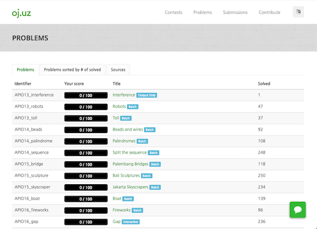
  

- [OI Checklist](https://oichecklist.pythonanywhere.com/) - [oj.uz](https://oj.uz/)の回答状況を把握するためのWebサイト。注: 回答状況の更新は自動で行われず、利用者が手動で行う必要がある。

  

    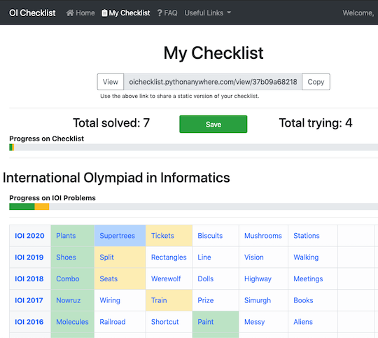
  

- [OI Public Library](https://github.com/enkerewpo/OI-Public-Library) - アルゴリズムに関する資料集。中国語と英語で提供されている。

### くそなぞなぞ Beginner Contest

- [くそなぞなぞ Beginner Contest](https://twitter.com/BeginnerContest) - ウィットに富んだ「なぞなぞ」が出題されるコンテスト。

  

    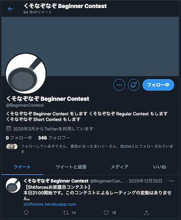
  

- [競技くそなぞなぞ関連ページ一覧：コンテストとその解説を中心に](https://hamukichi.hatenablog.jp/entry/kuso-nazonazo-portal#f-0e4fd4eb) - 「くそなぞなぞコンテスト」へのリンク、解説、支援ツールなどが網羅的にまとめられている記事。

### MAO (Markov Algorithm Online)

- [Markov Algorithm Online](https://mao.snuke.org/) - マルコフアルゴリズムを利用したパズル形式の問題を解くことができるWebサイト。有志によって、[チュートリアル](https://dic.nicovideo.jp/a/%E3%83%9E%E3%83%AB%E3%82%B3%E3%83%95%E3%82%A2%E3%83%AB%E3%82%B4%E3%83%AA%E3%82%BA%E3%83%A0)が用意されている。

  

    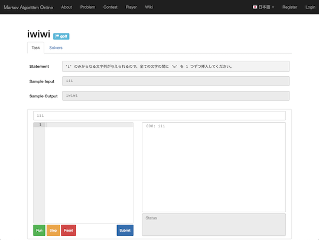
  

### MORP (Math Olympiad Rating Project)

- [Math Olympiad Rating Project](https://twitter.com/MORatingProject) - 数学オリンピックの過去問を利用したコンテスト(が定期的に開催される予定)。この結果を用いて、問題の難易度を推定したデータベース「Math Olympiad problems」を作成することが最終目標として掲げられている。

### New Year's Puzzles

- [New Year's Puzzles](https://nyp.snuke.org/) - オートマトンなどを利用したパズル形式の問題を解くことができる。

  

    
  

### 入試数学コンテスト

- [入試数学コンテスト](https://manabitimes.jp/tests) - 数学の入試対策ができるコンテストサイト。

  

    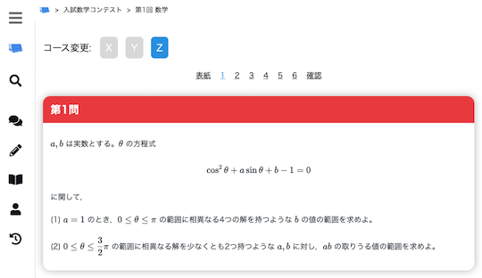
  

### OMC (OnlineMathContest)

- [OMC problems](https://rusa6111.github.io/OMCproblems/) - [OnlineMathContest](https://onlinemathcontest.com/)で開催されたコンテストの問題一覧を確認できる。ベータ版。

  

    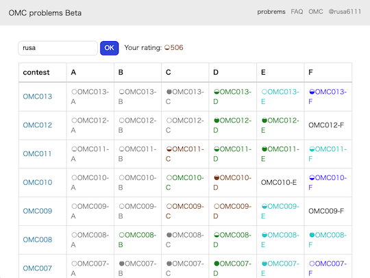
  

### Shitforces

- [Shitforces](https://shitforces.herokuapp.com/) - ウィットに富んだ「なぞなぞ」が出題されるコンテスト。[公式アカウント](https://twitter.com/shitforces)で、最新情報を確認することができる。

  

    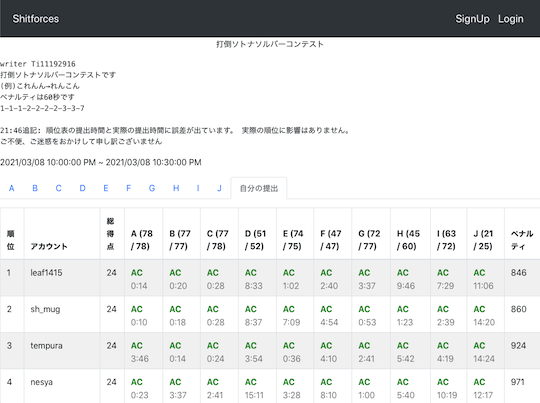
  

### Topcoder

#### Webサイトと関連リンク

- [How To Compete in SRMs](https://www.topcoder.com/community/competitive-programming/how-to-compete) - Single Round Match (SRM) に登録・参加するための方法を説明した公式サイトのページ。
- [Topcoder ARENA (Applet)](https://www.topcoder.com/contest/arena/ContestAppletProd7.2.jnlp) - 過去問を解くときに必要なアプリをダウンロードするためのリンク。非公式ではあるが、[導入方法を日本語で解説した記事](https://www.tc3.co.jp/topcodersrm/)もある。
- [Topcoder ARENA (Practice Problem List)](https://arena.topcoder.com/index.html#/u/practiceProblemList) - 過去問の一覧とその詳細が閲覧できるWebサイト。

  

    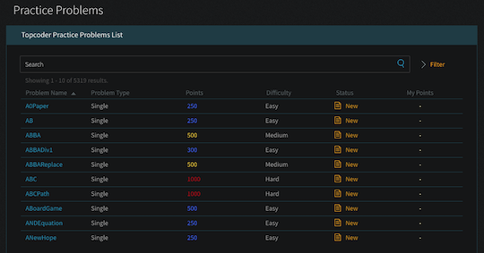
  

- [Topcoder (Problem Search)](https://community.topcoder.com/tc?module=ProblemArchive) - 過去問を検索・閲覧できるWebサイト。

  

    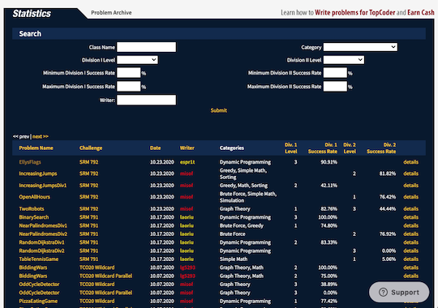
  

#### 記事

- [TopCoderをはじめよう！(2021年版) Python/C++対応版](https://qiita.com/recuraki/items/a359624c2981e82853d5) - Single Round Match (SRM)に参加するために必要な環境構築の方法と基本操作を日本語で解説した記事。注意事項が丁寧に解説されているのが特徴。

#### プラグイン

- [Greed](https://github.com/zen0wu/topcoder-greed)  - 問題を解くときに、普段使っているエディタを使えるようにするためのJava Arenaプラグイン。入出力フォーマットに沿ったテンプレートコードの生成やサンプルのテストができる。対応言語は、C++、C#、Java、Python。また、環境構築の方法を日本語で解説した記事([Java Appletの導入](https://ferin-tech.hatenablog.com/entry/2017/02/22/223141)、[Greedの設定](https://imulan.hatenablog.jp/entry/2016/01/21/154640))もある。注: 近年は更新頻度がかなり低下しており、最新の環境に対応していない可能性もある。

  

    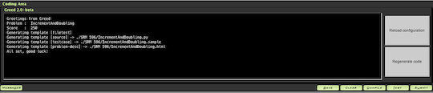
  

### Wind Bel Contest

- [Wind Bel Contest](https://mario.exout.net/contests/) - テーマ別のコンテストが不定期に開催されている。注: [AtCoder](https://atcoder.jp/)とは、提出方法やSNSへの書き込みのルールが異なるため、事前の確認を推奨。

  

    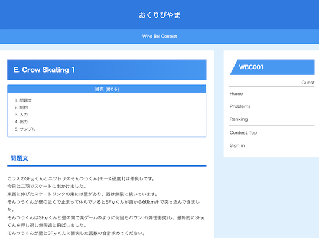
  

### yukicoder

- [comfortable-yukicoder](https://greasyfork.org/ja/scripts/431129-comfortable-yukicoder) - [yukicoder](https://yukicoder.me/)に、汎用的な機能を追加するユーザスクリプト。主な機能として、指定したページに移動できるタブ、提出結果のハイライト、正誤状況の要約などがある。注: ユーザスクリプトを初めて利用する場合は、事前に[スクリプトマネージャー](https://greasyfork.org/ja)を導入する必要がある。

  

    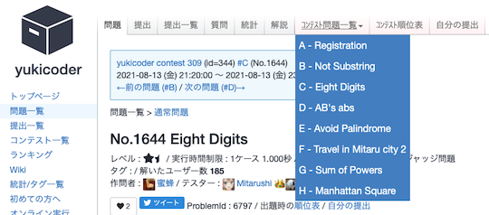
  

- [yukicoder-md](https://github.com/koyumeishi/yukicoder-md) - 問題の作成を補助するツール。[CommonMark](https://commonmark.org/)形式で書かれた問題文をHTMLに変換する。また、Webブラウザ上で利用できる[Playground](https://koyumeishi.github.io/yukicoder-md/)も公開されている(注: 一部の機能は利用不可)。

  

    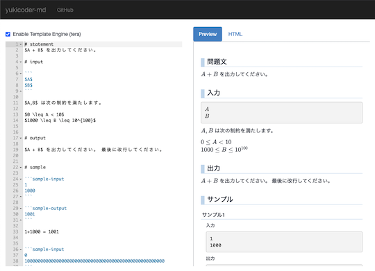
  

- [yukicoder problems](https://iilj.github.io/yukicoder-problems/#/table/) - 開催されたコンテストの問題一覧、ユーザの正誤状況などを確認できるWebアプリ。

  

    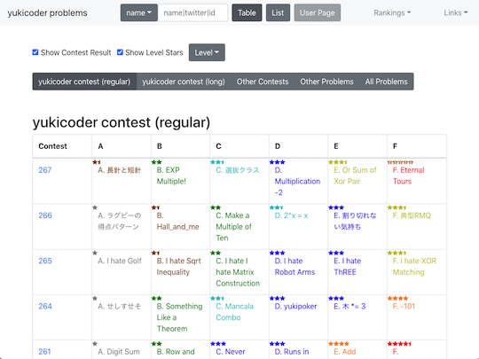
  

