## 目次

<!-- START doctoc generated TOC please keep comment here to allow auto update -->
<!-- DON'T EDIT THIS SECTION, INSTEAD RE-RUN doctoc TO UPDATE -->

- [ユーザスクリプト](#%E3%83%A6%E3%83%BC%E3%82%B6%E3%82%B9%E3%82%AF%E3%83%AA%E3%83%97%E3%83%88)
  - [レーティング、パフォーマンスなどを表示する](#%E3%83%AC%E3%83%BC%E3%83%86%E3%82%A3%E3%83%B3%E3%82%B0%E3%83%91%E3%83%95%E3%82%A9%E3%83%BC%E3%83%9E%E3%83%B3%E3%82%B9%E3%81%AA%E3%81%A9%E3%82%92%E8%A1%A8%E7%A4%BA%E3%81%99%E3%82%8B)
  - [自動的に通知する](#%E8%87%AA%E5%8B%95%E7%9A%84%E3%81%AB%E9%80%9A%E7%9F%A5%E3%81%99%E3%82%8B)
  - [ショートカットによる効率化](#%E3%82%B7%E3%83%A7%E3%83%BC%E3%83%88%E3%82%AB%E3%83%83%E3%83%88%E3%81%AB%E3%82%88%E3%82%8B%E5%8A%B9%E7%8E%87%E5%8C%96)
  - [UIを見やすく色付けする、表示を簡略化する](#ui%E3%82%92%E8%A6%8B%E3%82%84%E3%81%99%E3%81%8F%E8%89%B2%E4%BB%98%E3%81%91%E3%81%99%E3%82%8B%E8%A1%A8%E7%A4%BA%E3%82%92%E7%B0%A1%E7%95%A5%E5%8C%96%E3%81%99%E3%82%8B)
    - [AtCoder](#atcoder)
    - [非公式サービス、ツール、外部サービスなど](#%E9%9D%9E%E5%85%AC%E5%BC%8F%E3%82%B5%E3%83%BC%E3%83%93%E3%82%B9%E3%83%84%E3%83%BC%E3%83%AB%E5%A4%96%E9%83%A8%E3%82%B5%E3%83%BC%E3%83%93%E3%82%B9%E3%81%AA%E3%81%A9)
  - [便利な機能を手軽に実行できるボタン、リンクなどを設置する](#%E4%BE%BF%E5%88%A9%E3%81%AA%E6%A9%9F%E8%83%BD%E3%82%92%E6%89%8B%E8%BB%BD%E3%81%AB%E5%AE%9F%E8%A1%8C%E3%81%A7%E3%81%8D%E3%82%8B%E3%83%9C%E3%82%BF%E3%83%B3%E3%83%AA%E3%83%B3%E3%82%AF%E3%81%AA%E3%81%A9%E3%82%92%E8%A8%AD%E7%BD%AE%E3%81%99%E3%82%8B)
- [Google Chromeの拡張機能](#google-chrome%E3%81%AE%E6%8B%A1%E5%BC%B5%E6%A9%9F%E8%83%BD)
  - [公式でサポートされている以外言語で問題を解く](#%E5%85%AC%E5%BC%8F%E3%81%A7%E3%82%B5%E3%83%9D%E3%83%BC%E3%83%88%E3%81%95%E3%82%8C%E3%81%A6%E3%81%84%E3%82%8B%E4%BB%A5%E5%A4%96%E8%A8%80%E8%AA%9E%E3%81%A7%E5%95%8F%E9%A1%8C%E3%82%92%E8%A7%A3%E3%81%8F)
  - [レーティング、パフォーマンスなどを表示する](#%E3%83%AC%E3%83%BC%E3%83%86%E3%82%A3%E3%83%B3%E3%82%B0%E3%83%91%E3%83%95%E3%82%A9%E3%83%BC%E3%83%9E%E3%83%B3%E3%82%B9%E3%81%AA%E3%81%A9%E3%82%92%E8%A1%A8%E7%A4%BA%E3%81%99%E3%82%8B-1)
  - [自動的に通知する](#%E8%87%AA%E5%8B%95%E7%9A%84%E3%81%AB%E9%80%9A%E7%9F%A5%E3%81%99%E3%82%8B-1)
  - [UIを見やすく色付けする、表示を簡略化する](#ui%E3%82%92%E8%A6%8B%E3%82%84%E3%81%99%E3%81%8F%E8%89%B2%E4%BB%98%E3%81%91%E3%81%99%E3%82%8B%E8%A1%A8%E7%A4%BA%E3%82%92%E7%B0%A1%E7%95%A5%E5%8C%96%E3%81%99%E3%82%8B-1)
  - [便利な機能を手軽に実行できるボタン、リンクなどを設置する](#%E4%BE%BF%E5%88%A9%E3%81%AA%E6%A9%9F%E8%83%BD%E3%82%92%E6%89%8B%E8%BB%BD%E3%81%AB%E5%AE%9F%E8%A1%8C%E3%81%A7%E3%81%8D%E3%82%8B%E3%83%9C%E3%82%BF%E3%83%B3%E3%83%AA%E3%83%B3%E3%82%AF%E3%81%AA%E3%81%A9%E3%82%92%E8%A8%AD%E7%BD%AE%E3%81%99%E3%82%8B-1)
    - [AtCoder](#atcoder-1)
    - [非公式サービス、ツール、外部サービスなど](#%E9%9D%9E%E5%85%AC%E5%BC%8F%E3%82%B5%E3%83%BC%E3%83%93%E3%82%B9%E3%83%84%E3%83%BC%E3%83%AB%E5%A4%96%E9%83%A8%E3%82%B5%E3%83%BC%E3%83%93%E3%82%B9%E3%81%AA%E3%81%A9-1)

<!-- END doctoc generated TOC please keep comment here to allow auto update -->

## ユーザスクリプト

主に[AtCoder](https://atcoder.jp/)のWebページにある機能を拡張することができます。

ユーザスクリプトを利用するときは、スクリプトマネージャと呼ばれるツールを導入する必要があります。[こちら](https://greasyfork.org/ja)を参照してください。

### レーティング、パフォーマンスなどを表示する

- [ac-predictor](https://greasyfork.org/ja/scripts/369954-ac-predictor) - コンテスト開催中に推定パフォーマンスを表示する。[Webページ版](https://ac-predictor.com/)もある。

  

    
  

- [ac-predictor-minimal](https://greasyfork.org/ja/scripts/386999-ac-predictor-minimal) - [ac-predictor](https://greasyfork.org/ja/scripts/369954-ac-predictor)の機能限定版。スクリプトの透明性を確保する観点から、パフォーマンスを表示するのは「順位表」ページに限定される。
- [ac-writers script](https://greasyfork.org/ja/scripts/369965-ac-writers-script) - ユーザの「コンテスト成績表」ページにコンテストのWriterを表示する。

  

    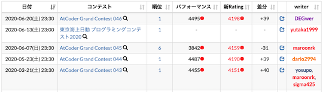
  

- [AtCoder Difficulty Display](https://greasyfork.org/ja/scripts/397185-atcoder-difficulty-display) - AtCoderの「問題」のページに[AtCoder Problems](https://kenkoooo.com/atcoder)の難易度を表示する。

  

    
  

- [AtCoder Graduation](https://greasyfork.org/ja/scripts/394079-atcoder-graduation) - ユーザの「プロフィール」ページに卒業・修了年度を表示する。
- [AtCoderStandingsAnalysis](https://greasyfork.org/ja/scripts/398439-atcoderstandingsanalysis) - 「順位表」ページから、自分の得点・正解者数 / 提出者数・正解率・平均ペナルティ数・ペナルティ率・内部レートの分布を集計する。注: コンテスト中にSNSでの言及や投稿は避ける。

  

    
  

- [atcoder-submission-wo-ikki-ni-miiru](https://greasyfork.org/ja/scripts/403062-atcoder-submission-wo-ikki-ni-miiru) - 「提出結果」ページにソースコードを表示する。

  

    
  

### 自動的に通知する

- [ac-standings-notifier](https://greasyfork.org/ja/scripts/372988-ac-standings-notifier) - コンテスト中に「順位表」ページを開いておくと、順位を通知する。
- [atcoder-bell](https://greasyfork.org/en/scripts/377923-atcoder-bell) - ジャッジシステムでの正誤判定が終了すると、ベルが鳴る。
- [AtcoderColorNEWS](https://greasyfork.org/ja/scripts/387896-atcodercolornews) - お気に入りに登録した人の色の変化を通知する。

  

    
  

- [AtCoderResultNotifier](https://greasyfork.org/ja/scripts/371225-atcoderresultnotifier) - 提出結果を通知する。

  

    
  

### ショートカットによる効率化

- [Add Shortest Tab](https://greasyfork.org/ja/scripts/391692-add-shortest-tab) - 開いている問題について、コード長に並べた提出ページのタブを追加する。コンテスト中の利用は非推奨。

  

    
  

- [atcoder_all_open](https://greasyfork.org/ja/scripts/387471-atcoder-all-open) - 「全ての問題をワンクリックで開く」タブを追加する。

  

    
  

- [AtCoder dos2unix UserScript](https://greasyfork.org/en/scripts/372122-atcoder-dos2unix-userscript) - 改行コードをCRLFからLFに変換して、コードを提出する。
- [AtCoder Jump to Submissions from Standings](https://greasyfork.org/ja/scripts/397528-atcoder-jump-to-submissions-from-standings) - 「順位表」ページの得点をダブルクリックすると、該当するコンテスタントの実装を見ることができる。[Codeforces](https://codeforces.com/)の仕様を参考にしている。

  

    
  

- [atcoder-keyboard-shortcuts](https://greasyfork.org/ja/scripts/397575-atcoder-keyboard-shortcuts) - Shift+[1-5]で、「問題」ページにあるサンプルの入力をクリップボードにコピーする。
- [AtCoderLinkCompletionForJOI](https://greasyfork.org/ja/scripts/382313-atcoderlinkcompletionforjoi) - JOIの問題ページにPDFへのリンクを追加する。
- [AtCoder_submit_keyboard_shortcut](https://greasyfork.org/ja/scripts/378760-atcoder-submit-keyboard-shortcut) - 問題の提出が、Ctrl+Enterでできる。レポジトリ作成者による注: ドキュメントから対応しているOSを確認することが難しいため、一部のOSでは動作しない可能性もある(**要確認**)。
- [AtCoderSubmitSearchSettings](https://greasyfork.org/ja/scripts/390424-atcodersubmitsearchsettings) - 「すべての提出」ページで、古いバージョンで提出されたコードを検索できる。検索のデフォルト設定も指定できる。
- [AtCoderTags_Helper](https://greasyfork.org/ja/scripts/393121-atcodertags-helper) - 「問題」ページから[AtCoderTags](https://atcoder-tags.herokuapp.com/)に投票できる。

  

    
  

### UIを見やすく色付けする、表示を簡略化する

#### AtCoder

- [ac-clar-shaper](https://greasyfork.org/ja/scripts/388211-ac-clar-shaper) - Clarから非本質な情報（アカウント名・全体公開の有無・投稿/更新日時）を消し、問題順にソートする。
- [ac-search-old-languages](https://greasyfork.org/ja/scripts/405745-ac-search-old-languages) - 「提出結果」ページで、judge-update-202004以前の言語による提出コードを検索できるようにする。

  

    
  

- [AtCoderBackGroundColorizer](https://greasyfork.org/en/scripts/377844-atcoderbackgroundcolorizer) - 各ページの背景を任意の色に変更する。

  

    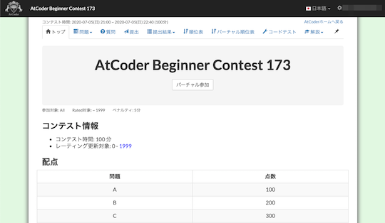
  

- [AtCoderColouringDifference](https://greasyfork.org/en/scripts/371703-atcodercolouringdifference) - ユーザの「コンテスト成績表」ページで"差分"の部分を色づけする。
- [AtCoder Custom Default Submissions](https://greasyfork.org/ja/scripts/393705-atcoder-custom-default-submissions) - 「すべての提出」ページにおける絞り込み、並び替え設定のデフォルト値を設定できる。

  

    
  

- [AtCoderDarkTheme](https://greasyfork.org/ja/scripts/388076-atcoderdarktheme) - ダークテーマに変更する。

  

    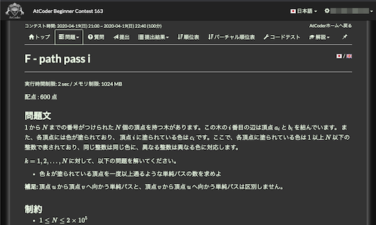
  

- [AtCoderPerformanceColorizer](https://greasyfork.org/ja/scripts/371693-atcoderperformancecolorizer) - ユーザの「コンテスト成績表」のパフォーマンス値、レーティング値に色付けする。

  

    
  

- [AtCoder Print Task Copy](https://greasyfork.org/ja/scripts/394999-atcoder-print-task-copy) - 「問題」ページにある「印刷用問題文」にCopyボタンを追加する。
- [AtCoderScoreHider](https://greasyfork.org/ja/scripts/371898-atcoderscorehider) - 「提出」ページなどの配点を隠す。日本語版のみ対応。

  

    
  

- [AtCoder Submission Status](https://greasyfork.org/ja/scripts/383817-atcoder-submission-status) - 提出した解答について、テストケースの結果(AC、WA、…)が一目でわかるように表示する。

  

    
  

- [AtCoder Submission User Colorizer](https://greasyfork.org/ja/scripts/397710-atcoder-submission-user-colorizer) - [AtCoder](https://atcoder.jp/)の「提出結果」ページのユーザ名を色付けする。

  

    
  

- [atcoder-tasks-page-colorizer](https://greasyfork.org/ja/scripts/380404-atcoder-tasks-page-colorizer) - [AtCoder](https://atcoder.jp/)の「問題」ページで、提出した問題に色付けする。

  

    
  

- [AtCoder TLE Police](https://greasyfork.org/ja/scripts/381104-atcoder-tle-police) - 提出したコードが'TLE'(Time Limit Exceeded)となった場合に'AR'(ArRested)に置き換える。
- [AtCoderタイマー削除](https://greasyfork.org/ja/scripts/393176-calmatcoder) - コンテストが開催されている間のみ、タイマーを非表示にする。
- [Snuke? Smeke?](https://greasyfork.org/ja/scripts/377622-snuke-smeke) - 問題文の「すぬけ」と「すめけ」をハイライトする。

  

    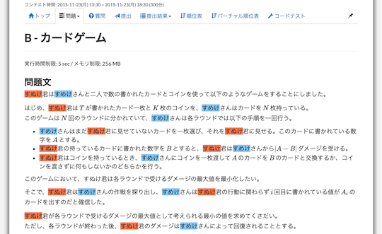
  

- [Time Limit Emphasizer](https://greasyfork.org/ja/scripts/406381-time-limit-emphasizer) - 問題の実行時間制限が2secでない場合に赤大文字で強調する。

#### 非公式サービス、ツール、外部サービスなど

- ["Atcoder" Finder](https://greasyfork.org/ja/scripts/373742-atcoder-finder) - [Twitter](https://twitter.com/)のツイートに含まれる"Atcoder"の文字列を赤色にする。
- [AtCoder Problems Marker](https://greasyfork.org/ja/scripts/395711-atcoder-problems-marker) - [AtCoder Problems](https://kenkoooo.com/atcoder) で表示される問題に、ユーザが独自のマーカー(解説ACなど)を付けられるようにする。

  

    
  

- [AtCoderProblemsRush](https://greasyfork.org/en/scripts/373299-atcoderproblemsrush) - [AtCoder Problems](https://kenkoooo.com/atcoder)のクローラが実行される前に、提出データをブラウザに保存し進捗状況を表示する。

### 便利な機能を手軽に実行できるボタン、リンクなどを設置する

- [ac-favorite-manager](https://greasyfork.org/ja/scripts/387728-ac-favorite-manager) - ユーザ名のドロップダウンメニューに、お気に入りの管理画面のリンクを追加する。

  

    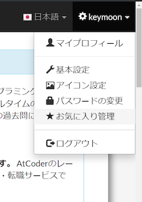
  

- [atcoder_collect_all_examples](https://greasyfork.org/ja/scripts/387240-atcoder-collect-all-examples) - 「問題」ページに入力例・出力例をまとめた項目を生成する。

  

    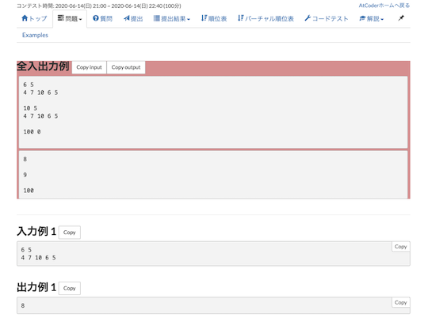
  

- [AtCoder Fav Rating](https://greasyfork.org/en/scripts/406745-atcoder-fav-rating) - 「アカウント」ページにお気に入りの順位・レーティング(現在・最高)・参加回数を一覧で表示するボタンを設置する。

  

    
  

- [AtCoder-Google-Calender](https://greasyfork.org/ja/scripts/390758-atcoder-google-calender) - 予定されたコンテストの日時をGoogle Calenderに追加するリンクを設置する。

  

    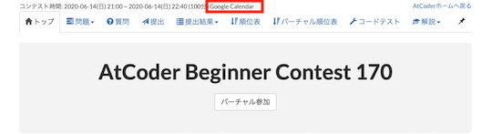
  

- [AtCoder Language Filter](https://greasyfork.org/ja/scripts/398148-atcoder-language-filter) - 「提出」ページで、提出する言語のフィルタリングと並び替えを行う。

  

    
  

- [atcoder-problem-navigator](https://greasyfork.org/en/scripts/383360-atcoder-problem-navigator) - 「問題」ページで、各問題のリンクに飛べるナビゲーションバーを追加。

  

    
  

- [AtCoder_Result_Tweet_Button](https://greasyfork.org/ja/scripts/370227-atcoder-result-tweet-button) - [AtCoder](https://atcoder.jp/)のユーザページに、参加したコンテスト情報をツイートするボタンを追加する。

  

    
  

- [AtCoderTags_Hint](https://greasyfork.org/ja/scripts/393337-atcodertags-hint) - 「問題」ページにカテゴリーを表すヒントボタンを設置する。

  

    
  

- [AtCoder TestCase Extension](https://greasyfork.org/ja/scripts/371832-atcoder-testcase-extension) - 公開されているテストケースのリンクを追加する。

  

    
  

- [AtCoderUserSearchForm](https://greasyfork.org/ja/scripts/382092-atcoderusersearchform) - 「ホーム」ページにユーザ検索のフォームを追加する。日本語版ページのみ有効。

  

    
  

- [AtCoder-Submission-RadioButton](https://greasyfork.org/ja/scripts/390828-atcoder-submission-radiobutton) - 「提出」ページに、各問題を選択するラジオボタンを設置する。[Chrome拡張版](https://chrome.google.com/webstore/detail/atcoder-submission-radiob/hkehpabdllmdfmflgjofmgcdbmjafcdd?hl=ja&gl=UA)もある。

  

    
  

- [AtCoder Twitter Avatar](https://greasyfork.org/en/scripts/372507-atcoder-twitter-avatar) - 「ユーザ」ページのtwitter IDの欄に、[Twitter](https://twitter.com/)のアバターを追加する。

  

    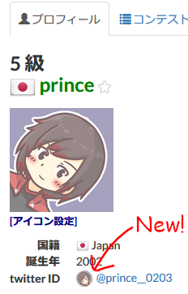
  

- [AutoSubmissionsSettings.js](https://greasyfork.org/ja/scripts/390514-autosubmissionssettings-js) - 「すべての提出」画面で、指定した言語と結果で検索するボタンを追加する。レポジトリ作成者による注: 2020年に行われた言語アップデートに伴う変更には未対応のため、最新バーションでの検索がやや難しい状況。
- [Save_Paken_AtCoder_Account](https://greasyfork.org/ja/scripts/401642-save-paken-atcoder-account) - パ研の共有アカウントで誤ってコンテストに参加するのを防ぐ。

## Google Chromeの拡張機能

Google Chromeに機能を追加します。

使い方は、[こちら](https://www.google.com/search?sxsrf=ALeKk033ZO4VOoYJmsx9txWxx32vSveVQw%3A1594530427618&ei=e5oKX9GlJaSzmAXYjZ4Y&q=chrome+%E6%8B%A1%E5%BC%B5%E6%A9%9F%E8%83%BD+%E4%BD%BF%E3%81%84%E6%96%B9&oq=chrome%E6%8B%A1%E5%BC%B5%E6%A9%9F%E8%83%BD%E3%81%A8%E3%81%AF&gs_lcp=CgZwc3ktYWIQARgBMgcIABBHELADMgcIABBHELADMgcIABBHELADMgcIABBHELADMgcIABBHELADMgcIABBHELADMgcIABBHELADMgcIABBHELADUABYAGC7uwRoAXAAeACAAQCIAQCSAQCYAQCqAQdnd3Mtd2l6&sclient=psy-ab)を参照してください。

### 公式でサポートされている以外言語で問題を解く

- [Scratcher's AtCoder](https://chrome.google.com/webstore/detail/scratchers-atcoder/hackndbjgkehhjinjjoldifbhnfddklh?hl=ja&gl=UA) - [Scratch](https://ja.wikipedia.org/wiki/Scratch_(%E3%83%97%E3%83%AD%E3%82%B0%E3%83%A9%E3%83%9F%E3%83%B3%E3%82%B0%E8%A8%80%E8%AA%9E))で問題を解くことができる。

  

    
  

### レーティング、パフォーマンスなどを表示する

- [AtCoder ACer](https://chrome.google.com/webstore/detail/atcoder-acer/pmdfjdiiiacncpgmjmeicdoidkaadjde?hl=ja&gl=UA) - 「問題一覧」ページにコンテスト中にAC(Accepted)した人数を表示する。

  

    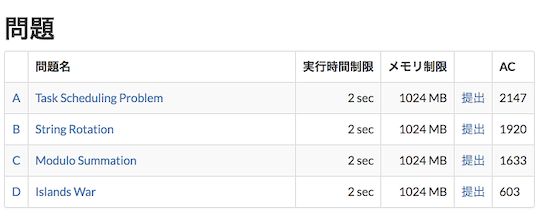
  

### 自動的に通知する

- [AtCoder judge notifier](https://chrome.google.com/webstore/detail/atcoder-judge-notifier/hcjjfcidaloadjcemebolmdphhbpehba?hl=ja&gl=UA) - 「提出」ページのジャッジ結果を通知する。

  

    
  

- [Coding Shout](https://chrome.google.com/webstore/detail/coding-shout/nggokghmfinpljihgjkkbogpgbbjjjme?hl=ja&gl=UA) - ジャッジ結果を通知する。[Codechef](https://www.codechef.com/)や[Codeforces](https://codeforces.com/)にも対応している。

  

    
  

### UIを見やすく色付けする、表示を簡略化する

- [AtCoder Color](https://chrome.google.com/webstore/detail/atcoder-color/mcefknoiablejellmicpmokcaelpdaec?hl=ja&gl=UA) - 「問題」ページで提出状況に応じて色付けする。

  

    
  

- [AtCoder Color Mark](https://chrome.google.com/webstore/detail/atcoder-color-mark/dogcmibkiolcdafifopmnghhlajpbmga?hl=ja&gl=UA) - 「順位表」や「コンテスト成績表」のページにレーティングを示す円を表示する。

  

    
  

- [AtCoderのScoreを見やすくする](https://chrome.google.com/webstore/detail/atcoder-%E3%81%AE-score-%E3%82%92%E8%A6%8B%E3%82%84%E3%81%99%E3%81%8F%E3%81%99%E3%82%8B/ndnmjoimfdcpjbnnlkieikajbbcaockp?hl=ja&gl=UA) - マラソン形式のスコアをカンマ区切りやlogで表示する。

  

    
  

### 便利な機能を手軽に実行できるボタン、リンクなどを設置する

#### AtCoder

- [AtCoderBook](https://chrome.google.com/webstore/detail/atcoderbook/lcojnofidkanlkoaagdbjkdnelbnlnng?hl=ja&gl=UA) - 問題のリンクを保存する。復習やお気に入りの管理用など。[Codeforces](https://codeforces.com/)にも対応している

  

    
  

- [AtCoder Calendar](https://chrome.google.com/webstore/detail/atcoder-calendar/dokfhaljgioiaeappgnmibgoipegbldf?hl=ja&gl=UA) - コンテストの「トップ」ページにGoogle Calendarのスケジュール作成リンクを生成する。

  

    
  

- [AtCoder-Submission-RadioButton](https://chrome.google.com/webstore/detail/atcoder-submission-radiob/hkehpabdllmdfmflgjofmgcdbmjafcdd?hl=ja&gl=UA) - 「提出」ページに、各問題を選択するラジオボタンを設置する。[ユーザスクリプト版](https://greasyfork.org/ja/scripts/390828-atcoder-submission-radiobutton)もある。

  

    
  

- [AtCoder TestCase Extension](https://chrome.google.com/webstore/detail/atcoder-testcase-extensio/klmflnjcfalpmeldgkcinfilloihmbdh?hl=ja&gl=UA) - 公開されているテストケースへのリンクを追加する。ABC/ARC/AGC以外のコンテストは一部未対応の場合もある。

  

    
  

- [AtCoder Unit Test](https://chrome.google.com/webstore/detail/atcoder-unit-test/lmahhninbclefepjbcdfbcjnancipfmi?hl=ja&gl=UA) - 「問題」ページから、単体(ユニット)テストを生成する。Java (JUnit)、C# (MS Test)、Python3 (unittest)に対応。

  

    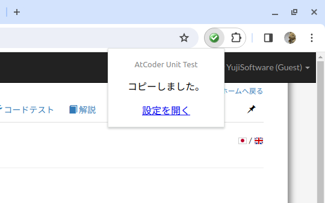
  

- [Coder's Calendar](https://chrome.google.com/webstore/detail/coders-calendar/bageaffklfkikjigoclfgengklfnidll?hl=ja&gl=UA) - 開催予定のコンテスト情報を表示する。[Codechef](https://www.codechef.com/)、 [HackerEarth](https://www.hackerearth.com/)、[Hackerrank](https://www.hackerrank.com/)、[Topcoder](https://www.topcoder.com/)、[Codeforces](https://codeforces.com/)、[CSAcademy](https://csacademy.com/)、 [LeetCode](https://leetcode.com/)、[Kaggle](https://www.kaggle.com/)などにも対応している。

  

    
  

- [Coding Schedule](https://chrome.google.com/webstore/detail/coding-schedule/jbekfkgidfgnjgnnaiklfjhepdbhclme?hl=ja&gl=UA) - 開催中・開催予定のコンテスト情報を表示する。[Codeforces](https://codeforces.com/)、[Codechef](https://www.codechef.com/)、[CSAcademy](https://csacademy.com/)、[HackerEarth](https://www.hackerearth.com/)、[Hackerrank](https://www.hackerrank.com/)、[Topcoder](https://www.topcoder.com/)、[Sphere online judge (Spoj)](https://www.spoj.com/)などにも対応している。

  

    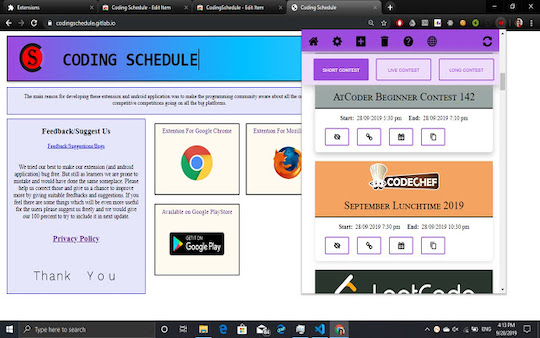
  

- [Comfortable Atcoder](https://chrome.google.com/webstore/detail/comfortable-atcoder/ipmmkccdccnephfilbjdnmnfcbopbpaj?hl=ja&gl=UA) - 提出結果の通知、問題をドロップダウンリストで表示、などを設定できる。

  

    
  

- [KONTESTS](https://chrome.google.com/webstore/detail/kontests/agpdemlkalmmeenclchlajdcmbcacoea?hl=ja&gl=UA) - コンテスト情報を表示する。[Codeforces](https://codeforces.com/)、Codeforces::Gym、[TopCoder](https://www.topcoder.com/)、[CSAcademy](https://csacademy.com/)にも対応している。

  

    
  

- [NextPage](https://chrome.google.com/webstore/detail/nextpage/mhhmddcnnehdkpclpjpmidpeejohlmfb?hl=ja&gl=UA) - あるコンテストの次の回のページに移動できる。

#### 非公式サービス、ツール、外部サービスなど

- [Solve Later Again](https://chrome.google.com/webstore/detail/solve-later-again/emndffmnlppiaelhdneheagpaancfahk?hl=ja&gl=UA) - [AtCoder Problems](https://kenkoooo.com/atcoder)のTableページに、「Solve Later Again（またあとで解く）」テーブルを追加し、解き直したい問題を管理できる。
