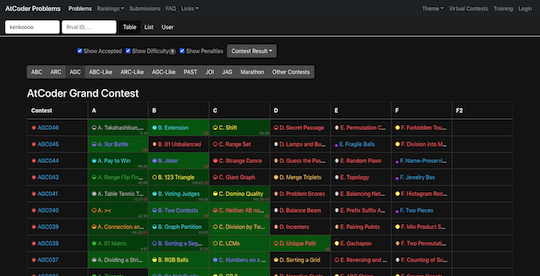
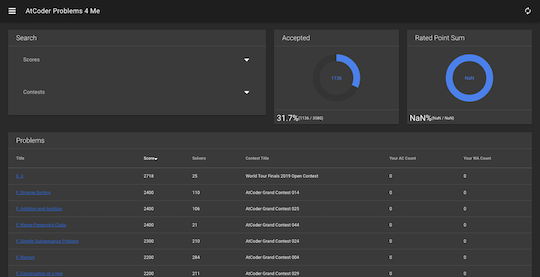
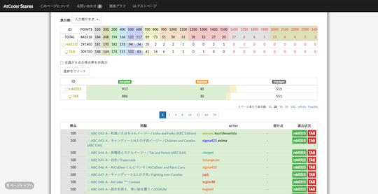
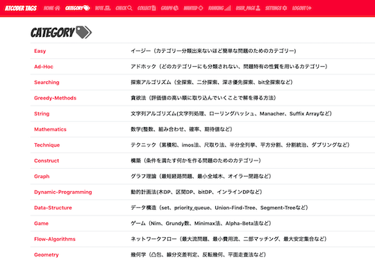
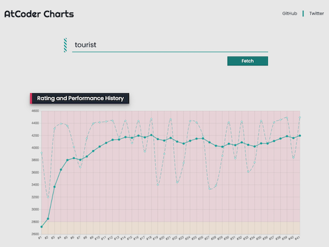
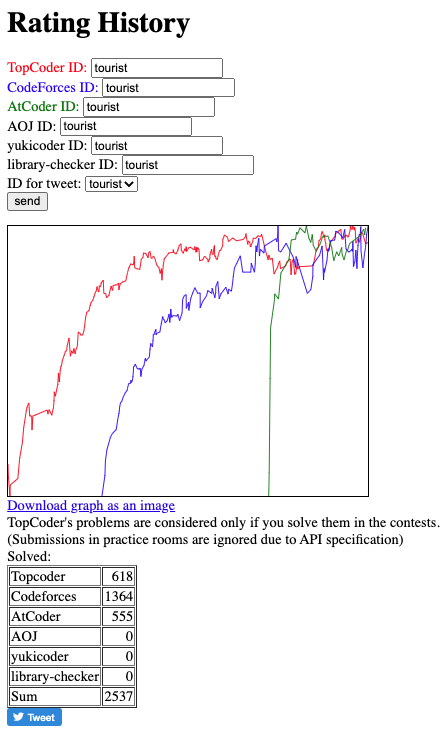
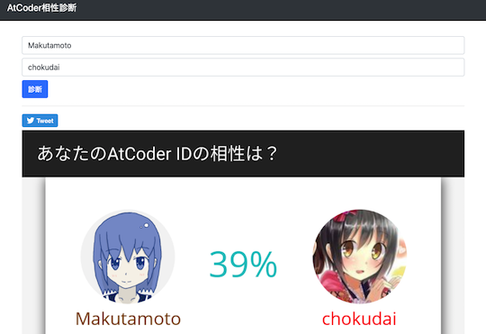
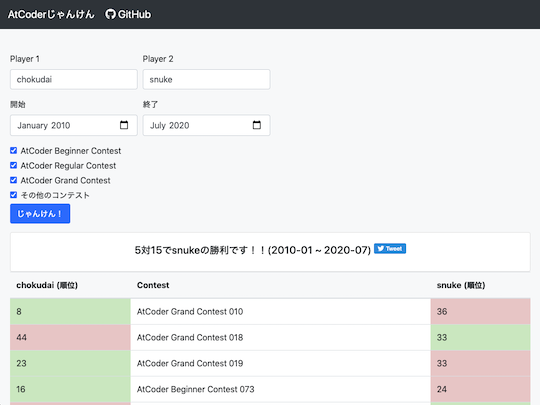
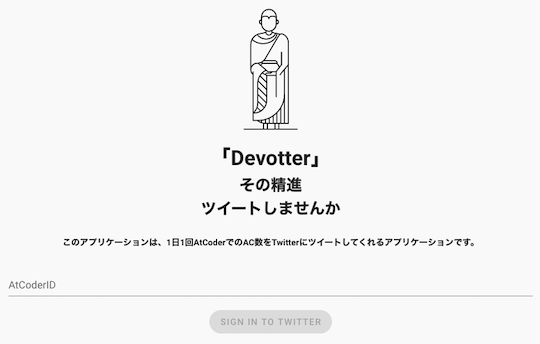
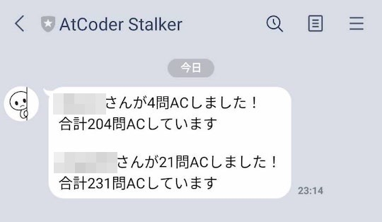

## 目次

<!-- START doctoc generated TOC please keep comment here to allow auto update -->
<!-- DON'T EDIT THIS SECTION, INSTEAD RE-RUN doctoc TO UPDATE -->

- [Webアプリ、Webページ](#web%E3%82%A2%E3%83%97%E3%83%AAweb%E3%83%9A%E3%83%BC%E3%82%B8)
  - [過去問を解く](#%E9%81%8E%E5%8E%BB%E5%95%8F%E3%82%92%E8%A7%A3%E3%81%8F)
  - [コンテストの開催予定を確認する、登録する](#%E3%82%B3%E3%83%B3%E3%83%86%E3%82%B9%E3%83%88%E3%81%AE%E9%96%8B%E5%82%AC%E4%BA%88%E5%AE%9A%E3%82%92%E7%A2%BA%E8%AA%8D%E3%81%99%E3%82%8B%E7%99%BB%E9%8C%B2%E3%81%99%E3%82%8B)
  - [統計情報を見る](#%E7%B5%B1%E8%A8%88%E6%83%85%E5%A0%B1%E3%82%92%E8%A6%8B%E3%82%8B)
  - [レーティング、パフォーマンス、順位などを表示する、比較する](#%E3%83%AC%E3%83%BC%E3%83%86%E3%82%A3%E3%83%B3%E3%82%B0%E3%83%91%E3%83%95%E3%82%A9%E3%83%BC%E3%83%9E%E3%83%B3%E3%82%B9%E9%A0%86%E4%BD%8D%E3%81%AA%E3%81%A9%E3%82%92%E8%A1%A8%E7%A4%BA%E3%81%99%E3%82%8B%E6%AF%94%E8%BC%83%E3%81%99%E3%82%8B)
  - [レーティング、パフォーマンス、順位などを使った派生サービス](#%E3%83%AC%E3%83%BC%E3%83%86%E3%82%A3%E3%83%B3%E3%82%B0%E3%83%91%E3%83%95%E3%82%A9%E3%83%BC%E3%83%9E%E3%83%B3%E3%82%B9%E9%A0%86%E4%BD%8D%E3%81%AA%E3%81%A9%E3%82%92%E4%BD%BF%E3%81%A3%E3%81%9F%E6%B4%BE%E7%94%9F%E3%82%B5%E3%83%BC%E3%83%93%E3%82%B9)
- [ボット](#%E3%83%9C%E3%83%83%E3%83%88)
  - [Discord](#discord)
  - [LINE](#line)
  - [Slack](#slack)
  - [Twitter](#twitter)
- [Web API](#web-api)
- [その他](#%E3%81%9D%E3%81%AE%E4%BB%96)
  - [Google Apps Script](#google-apps-script)
  - [Google Sheets](#google-sheets)
  - [TouchBarアプリ](#touchbar%E3%82%A2%E3%83%97%E3%83%AA)

<!-- END doctoc generated TOC please keep comment here to allow auto update -->

## Webアプリ、Webページ

[AtCoder](https://atcoder.jp/)のハンドルネームなどを入力するだけで、気軽に各種サービスを利用することができます。

### 過去問を解く

- [AtCoder Problems](https://kenkoooo.com/atcoder) - 開催されたコンテストの問題を一覧できる。問題の正誤状況や各種集計結果を確認できるだけでなく、バーチャルコンテストなどの機能もある。

  

    
  

- [AtCoder Problems 4 Me](https://compro.192.works/#/problems) - [AtCoder Problems](https://kenkoooo.com/atcoder)をオマージュしたサービス。

  

    
  

- [AtCoder Scores](http://atcoder-scores.herokuapp.com/) - AtCoder Grand Contest 001(AGC 001)以降の問題が点数順に並んでいる。

  

    
  

- [AtCoder Tags](https://atcoder-tags.herokuapp.com/) - 問題のカテゴリーを分類する。ユーザ登録を行えば、問題にふさわしいと思うカテゴリーを投票できる。[AtCoderTags_Helper](https://greasyfork.org/ja/scripts/393121-atcodertags-helper)を導入すると、[AtCoder](https://atcoder.jp/)の「問題」ページからも投票できる。

  

    
  

- [AtCoderTranslations](https://github.com/ADJA/AtCoderTranslations) - 日本語で出題されているコンテストの問題を英語に翻訳している。

  

    
  

- [PROCON Q&A](https://procon-qa.herokuapp.com/) - 競技プログラミングを対象とした質問と回答を投稿できる。

  

    
  

### コンテストの開催予定を確認する、登録する

- [Competitive Programming Contests Calendar](https://competitiveprogramming.info/calendar) - 開催予定のコンテスト情報をカレンダー形式で表示する。[Codeforces](https://codeforces.com/)、[CSAcademy](https://csacademy.com/)、[Google Kick Start](https://codingcompetitions.withgoogle.com/kickstart/about)、[HackerRank](https://www.hackerrank.com/)、[LeetCode](https://leetcode.com/)、[Topcoder](https://www.topcoder.com/)、[yukicoder](https://yukicoder.me/)にも対応している。

  

    
  

- [Future Contest](https://future-contest.appspot.com/) - 開催予定のコンテスト情報を表示する。[yukicoder](https://yukicoder.me/)、[CS Academy](https://csacademy.com/)、[Codeforces](https://codeforces.com/)にも対応している。

  

    
  

### 統計情報を見る

- [AtCoder Code Evaluate](https://ac-code-eval.com/) - 問題の実装の重さをAC(Accepted)コードをもとに評価している。
- [AtCoder Stats](https://atcoderstats.appspot.com/) - コンテスト、問題、ユーザに関する様々な統計情報が閲覧できる。

  

    
  

### レーティング、パフォーマンス、順位などを表示する、比較する

- [AtCoder Charts](https://atcoder-charts.netlify.com/) - 任意のユーザのレーティングとパフォーマンスの推移を表示する。

  

    
  

- [atcoder_marathon_ranking](https://github.com/tomerun/atcoder_marathon_ranking) - マラソン系コンテストの順位を[AtCoder レースランキング](https://atcoder.jp/posts/170)と同じ形式でポイント化し、ランキングをつける。
- [AtCoder Performances](https://atcoderapps.herokuapp.com/atcoderperformances/) - 指定した2人以上のパフォーマンスの推移が比較できる。

  

    
  

- [AtCoder Rating Comparison](https://atcoder-rating-comparison.herokuapp.com/?q=) - 指定した2人以上のレーティングの比較ができる。

  
 
  

- [AtCoder Rating Estimator](https://koba-e964.github.io/atcoder-rating-estimator/test-handle.html) - 所定のレーティングに到達するために、次のコンテストで必要なパフォーマンスを計算する。
- [AtCoder Rating Graph](https://github.com/hiramekun/AtCoderRatingGraph) - 任意のユーザのレーティングの推移を比較できる。

  

    
  

- [Atcoder RatingGraph Generator](https://atcoder-ratinggraph-generator.herokuapp.com/) - 任意のユーザのレーティンググラフを表示する。PCの場合、グラフの点をつまむと自由に形状を変えられる。

  

    
  

- [AtCoder Replay](https://atcoder-replay.kakira.dev/) - 任意のユーザを対象として、参加したコンテストの開始〜終了までの順位変化を表示する。

  

    
  

- [AtCoder Rivals](https://atcoder-rivals.herokuapp.com/) - パフォーマンスやレーティングの遷移、日々の精進などをライバルと比べることができる。

  

    
  

- [Rating History](https://rating-history.herokuapp.com/index.html) - 複数のコンテストサイトで、解いた問題数とレーティングの推移を表示する。

  

    
  

### レーティング、パフォーマンス、順位などを使った派生サービス

- [AtCoder相性診断](https://atcoder-aisho-shindan.vercel.app/) - レーティングを元に相性を診断する。

  

    
  

- [AtCoder Badges](https://atcoder-badges.now.sh/) - 任意のユーザのレーティングとレーティングに対応した色を表示するバッジを生成する。

  

    
  

- [AtCoder Friend Finder](http://atcoder-friend-finder.herokuapp.com/) - [Twitter](https://twitter.com/)でフォローしている[AtCoder](https://atcoder.jp/)ユーザを表示する。

  

    
  

- [AtCoder Games](https://atcoder-games.herokuapp.com/games/) - 過去問に登場したゲームで遊ぶことができる。

  

    
  

- [AtCoder じゃんけん](https://atcoder-janken.appspot.com/) - 指定した2人のユーザが共通して出場したコンテストの順位を比較する。

  

    
  

- [AtCoder Prophet](https://sotanishy.github.io/atcoder-prophet) - 機械学習モデルを使って、将来のレーティングを予測する。

  

    
  

- [atcoder-synchronicity](https://phocom.github.io/atcoder-synchronicity/) - 指定した2人のユーザのシンクロ率(**要確認:** 両者のパフォーマンス値の相関をとった値?)を表示する。

  

    
  

- [AtCoder TL](https://github.com/shirakia/atcoder_tl) - レーティング帯ごとのTwitterタイムラインを生成する。

  

    
  

- [AtCoder Widget](https://github.com/rdrgn/atcoder-widget) - ユーザのレーティングの推移をWebページに表示するためウィジェット。

  

    
  

- [Devotter](https://devotter.app/) - 1日1回AC(Accepted)数を[Twitter](https://twitter.com/)にツイートする。

  

    
  

## ボット

### Discord

- [AtCoderChokuZen](https://github.com/KATO-Hiro/AtCoderChokuZen) - コンテスト当日に、コンテスト情報(開催日時・開始までの残り時間)をスマートフォンにプッシュ通知する。

  

    
  

- [shino-sky/AtCoder-bot](https://github.com/shino-sky/AtCoder-bot) - レーティング(色)をもとに、自動でメンバーにロールを割り当てる。

### LINE

- [AtCoder Notify](https://atcoder-bot.firebaseapp.com/) - コンテスト情報を通知する。

  

    
  

- [AtCoder Stalker](https://line.me/R/ti/p/@381fkvdg) - ライバルが精進したときLINEにプッシュ通知される。

  

    
  

- [Contests-Line-Bot](https://github.com/granddaifuku/Contests-Line-Bot) - 「コンテスト」を含む文章を送ると、コンテストの日程が通知される。AtCoderだけでなく、[Codeforces](https://codeforces.com/)にも対応している。

  

    
  

### Slack

- [atcoder-rate-notify](https://github.com/ysk1180/atcoder-rate-notify) - レーティングを毎週お知らせしてくれる。
- [atcoder_useful](https://github.com/Kota-Y/atcoder_useful) - [AtCoder Problems](https://kenkoooo.com/atcoder)のCurrent Streakを切らさないように通知する。
- [Notificate AtCoder Date to Slack](https://github.com/EisKern/notification-slack-atcoder-date) - コンテストの1、24時間前に通知する。ベータ版。
- [rcoder-todays-problem](https://github.com/mmck328/rcoder-todays-problem) - 今日の問題をおすすめしてくれる。

### Twitter

- [AtCoderカレンダー通知](https://twitter.com/AtcoderCalendar) - イベント開始15分前に通知する。
- [競プロer Bot](https://twitter.com/cper_bot) - AC(Accepted)、日単位のランキング、コンテストの予定を通知する。
- [競プロリマインダー](https://twitter.com/ComproReminder) - 毎朝8:00にコンテスト情報を通知する。[Codeforces](https://codeforces.com/)、[CSAcademy](https://csacademy.com/)、[Google Code Jam](https://codingcompetitions.withgoogle.com/codejam)、[LeetCode](https://leetcode.com/)、[Topcoder](https://www.topcoder.com/)、[yukicoder](https://yukicoder.me/)にも対応している。

## Web API

- [AtCoderUsersAPI](https://github.com/miozune/AtCoderUsersAPI) - 登録されているユーザー情報を取得できるAPI。作者注: [AtCoder](https://atcoder.jp/)公式のサーバへの負荷を下げるため、スクレイピングの間隔を一定時間空けており、全ユーザの情報取得には長時間かかる。

## その他

### Google Apps Script

- [AtCoder Daily AC Checker](https://github.com/purple-jwl/atcoder-daily-ac-checker) - AC(Accepted)している人をSlack上で褒める（紹介する）。

### Google Sheets

- [AtCoder賞金ランキング](https://docs.google.com/spreadsheets/d/1E7Ho85znRw7ebB7ZATWBQckM2P_7qZYc35XZExlL_a4/edit#gid=1741891477) - 賞金付きコンテストの獲得額(目安)を集計している。[元ツイート](https://twitter.com/gojira_kyopro/status/1281199066408292353)を参照。

### TouchBarアプリ

- [ACTouchBar](https://github.com/tallestorange/ACTouchBar) - コンテストでの正解者数/提出者数、提出状況、レーティング・解いた問題数などの確認やメモを残すことができる。
