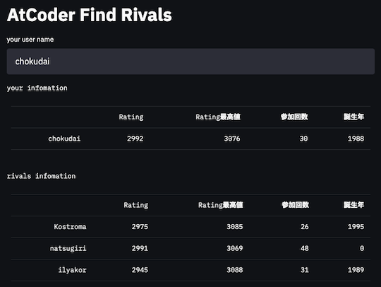
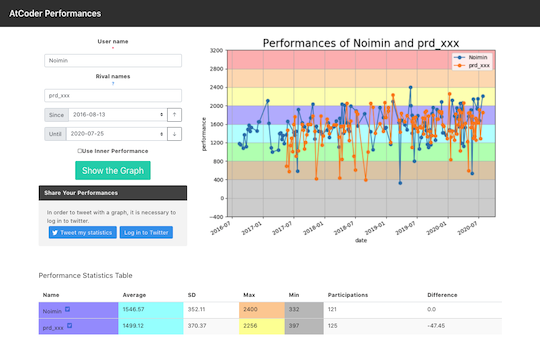
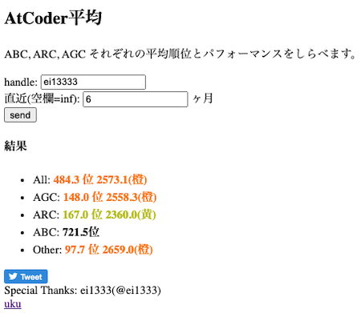
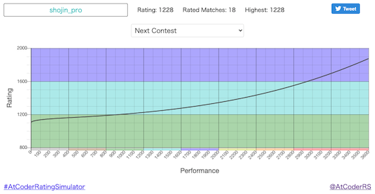
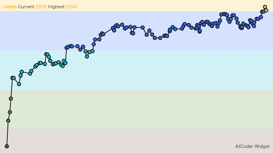
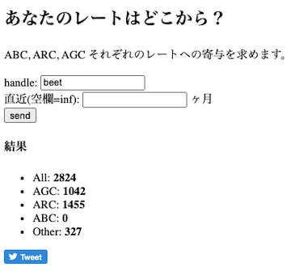
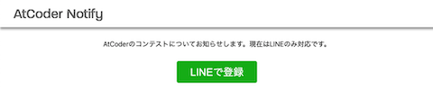
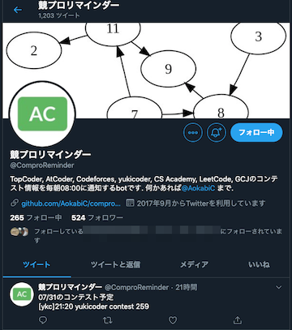

## 目次

<!-- START doctoc generated TOC please keep comment here to allow auto update -->
<!-- DON'T EDIT THIS SECTION, INSTEAD RE-RUN doctoc TO UPDATE -->

- [Webアプリ、Webページ](#web%E3%82%A2%E3%83%97%E3%83%AAweb%E3%83%9A%E3%83%BC%E3%82%B8)
  - [過去問を解く](#%E9%81%8E%E5%8E%BB%E5%95%8F%E3%82%92%E8%A7%A3%E3%81%8F)
  - [コンテストのルールを確認する](#%E3%82%B3%E3%83%B3%E3%83%86%E3%82%B9%E3%83%88%E3%81%AE%E3%83%AB%E3%83%BC%E3%83%AB%E3%82%92%E7%A2%BA%E8%AA%8D%E3%81%99%E3%82%8B)
  - [コンテストの開催予定を確認する、登録する](#%E3%82%B3%E3%83%B3%E3%83%86%E3%82%B9%E3%83%88%E3%81%AE%E9%96%8B%E5%82%AC%E4%BA%88%E5%AE%9A%E3%82%92%E7%A2%BA%E8%AA%8D%E3%81%99%E3%82%8B%E7%99%BB%E9%8C%B2%E3%81%99%E3%82%8B)
  - [ヒューリスティック(マラソン)型コンテストにおける入出力の結果をWebブラウザなどで見やすく表示する](#%E3%83%92%E3%83%A5%E3%83%BC%E3%83%AA%E3%82%B9%E3%83%86%E3%82%A3%E3%83%83%E3%82%AF%E3%83%9E%E3%83%A9%E3%82%BD%E3%83%B3%E5%9E%8B%E3%82%B3%E3%83%B3%E3%83%86%E3%82%B9%E3%83%88%E3%81%AB%E3%81%8A%E3%81%91%E3%82%8B%E5%85%A5%E5%87%BA%E5%8A%9B%E3%81%AE%E7%B5%90%E6%9E%9C%E3%82%92web%E3%83%96%E3%83%A9%E3%82%A6%E3%82%B6%E3%81%AA%E3%81%A9%E3%81%A7%E8%A6%8B%E3%82%84%E3%81%99%E3%81%8F%E8%A1%A8%E7%A4%BA%E3%81%99%E3%82%8B)
  - [レーティング、パフォーマンス、順位などを表示する、比較する](#%E3%83%AC%E3%83%BC%E3%83%86%E3%82%A3%E3%83%B3%E3%82%B0%E3%83%91%E3%83%95%E3%82%A9%E3%83%BC%E3%83%9E%E3%83%B3%E3%82%B9%E9%A0%86%E4%BD%8D%E3%81%AA%E3%81%A9%E3%82%92%E8%A1%A8%E7%A4%BA%E3%81%99%E3%82%8B%E6%AF%94%E8%BC%83%E3%81%99%E3%82%8B)
  - [レーティング、パフォーマンス、順位などを使った派生サービス](#%E3%83%AC%E3%83%BC%E3%83%86%E3%82%A3%E3%83%B3%E3%82%B0%E3%83%91%E3%83%95%E3%82%A9%E3%83%BC%E3%83%9E%E3%83%B3%E3%82%B9%E9%A0%86%E4%BD%8D%E3%81%AA%E3%81%A9%E3%82%92%E4%BD%BF%E3%81%A3%E3%81%9F%E6%B4%BE%E7%94%9F%E3%82%B5%E3%83%BC%E3%83%93%E3%82%B9)
  - [競技プログラミングに関する問題を投稿する、解答する](#%E7%AB%B6%E6%8A%80%E3%83%97%E3%83%AD%E3%82%B0%E3%83%A9%E3%83%9F%E3%83%B3%E3%82%B0%E3%81%AB%E9%96%A2%E3%81%99%E3%82%8B%E5%95%8F%E9%A1%8C%E3%82%92%E6%8A%95%E7%A8%BF%E3%81%99%E3%82%8B%E8%A7%A3%E7%AD%94%E3%81%99%E3%82%8B)
  - [チーム戦に参加する](#%E3%83%81%E3%83%BC%E3%83%A0%E6%88%A6%E3%81%AB%E5%8F%82%E5%8A%A0%E3%81%99%E3%82%8B)
  - [公式グッズを購入する](#%E5%85%AC%E5%BC%8F%E3%82%B0%E3%83%83%E3%82%BA%E3%82%92%E8%B3%BC%E5%85%A5%E3%81%99%E3%82%8B)
- [ボット](#%E3%83%9C%E3%83%83%E3%83%88)
  - [Discord](#discord)
  - [LINE](#line)
  - [Slack](#slack)
  - [Twitter](#twitter)
- [Web API](#web-api)
- [その他](#%E3%81%9D%E3%81%AE%E4%BB%96)
  - [Google Apps Script](#google-apps-script)
  - [Google Sheets](#google-sheets)
  - [IDE](#ide)
  - [TouchBarアプリ](#touchbar%E3%82%A2%E3%83%97%E3%83%AA)

<!-- END doctoc generated TOC please keep comment here to allow auto update -->

## Webアプリ、Webページ

[AtCoder](https://atcoder.jp/)のハンドルネームなどを入力するだけで、気軽に各種サービスを利用することができます。

### 過去問を解く

- [AtCoder-Ebbing](https://atcoder-ebbing.web.app/) - 任意のユーザのレーティング・回答状況に応じて、復習すると効果が高い問題が出題される。作者による[解説記事](https://qiita.com/numeric_tuba/items/9898e31e2566e7296c5d)もある。

  

    
  

- [AtCoder List](http://atcoder-list.herokuapp.com) - 過去問から自分専用の問題リストを作ることができる。コンテストで出題された問題の情報は、後述の[AtCoder Problems](https://kenkoooo.com/atcoder/)や[AtCoder Scores](http://atcoder-scores.herokuapp.com/)などを参照されたい。

  

    
  

- [AtCoder Problems](https://kenkoooo.com/atcoder/) - 開催されたコンテストの問題を一覧できる。問題の正誤状況や各種集計結果を確認できるだけでなく、バーチャルコンテストなどの機能もある。詳しくは、有志による[AtCoder Problemsの使い方](https://ntk-ta01.hatenablog.com/entry/2020/04/15/001405)を参照されたい。注: 記事に掲載されている図やバーチャルコンテストの名称・内容は、最新情報と異なる場合もある。

  

    
  

- [AtCoder Problems 4 Me](https://compro.192.works/#/problems) - [AtCoder Problems](https://kenkoooo.com/atcoder/)をオマージュしたサービス。

  

    
  

- [AtCoder Scores](http://atcoder-scores.herokuapp.com/) - AtCoder Grand Contest 001(AGC 001)以降の問題が点数順に並んでいる。

  

    
  

- [AtCoder Tags](https://atcoder-tags.herokuapp.com/) - 問題のカテゴリーを分類する。ユーザ登録を行えば、問題にふさわしいと思うカテゴリーを投票できる。[AtCoderTags_Helper](https://greasyfork.org/ja/scripts/393121-atcodertags-helper)を導入すると、[AtCoder](https://atcoder.jp/)の「問題」ページからも投票できる。

  

    
  

- [AtCoderTranslations](https://github.com/ADJA/AtCoderTranslations) - 日本語で出題されているコンテストの問題を英語に翻訳している。

  

    
  

- [GRAPH × GRAPH](https://hello-world-494ec.firebaseapp.com/) - グラフの問題の入力例を可視化する。ターミナル上で同サイトを起動するためのCLIツール[ggg(go GRAPH × GRAPH)](https://github.com/monkukui/ggg)と[作者による紹介記事](https://monkukui.hatenablog.com/entry/2020/10/01/173918)もある。

  

    
  

- [online-judge-tools/template-generator-webapp](https://online-judge-tools.github.io/template-generator-webapp/) - コンテストの問題を解析して、提出用コードのテンプレートを出力する[Online Judge Template Generator](https://github.com/online-judge-tools/template-generator)のWebアプリ版。C++とPython3に対応している。作者による注: コンテスト中はコマンドライン版のみ利用できる。

  

    
  

- [Simple C++ Editor](https://tumoiyorozu.github.io/SimpleCppEditor/) - ブラウザでC++が実行できるコードエディタ。特徴的な機能として、ソースコードの自動保存・標準出力の順次出力・エラーメッセージの日本語化・実行時エラーの捕捉などがある。詳しくは、作者の[紹介記事](https://qiita.com/TumoiYorozu/items/7a9b862071edd5427200)を参照されたい。

  

    
  

- [Virtual Judge](https://vjudge.net/) - 30以上のコンテストサイトの問題を利用して、バーチャルコンテストが開催できる。

  

    
  

### コンテストのルールを確認する

- [AtCoderルールクイズ](https://quiz-maker.site/quiz/play/IuEjiJ20220508114221) - AtCoderのルールの理解度をクイズ形式(全10問)で確認できる。レポジトリ作成者による注: コンテスト参加前に確認されることを強く推奨。

  

    
  

### コンテストの開催予定を確認する、登録する

- [CLIST](https://clist.by/) - [60以上のコンテストサイト](https://clist.by/resources/)を対象として開始・終了時刻、コンテスト時間と閲覧時点での残り時間が一覧で表示される。また、順位表や問題の一覧なども確認できる。

  

    
  

- [Competitive Programming Contests Calendar](https://competitiveprogramming.info/calendar) - 開催予定のコンテスト情報をカレンダー形式で表示する。[Codeforces](https://codeforces.com/)、[CSAcademy](https://csacademy.com/)、[Google Kick Start](https://codingcompetitions.withgoogle.com/kickstart/about)、[HackerRank](https://www.hackerrank.com/)、[LeetCode](https://leetcode.com/)、[Topcoder](https://www.topcoder.com/)、[yukicoder](https://yukicoder.me/)にも対応している。

  

    
  

### ヒューリスティック(マラソン)型コンテストにおける入出力の結果をWebブラウザなどで見やすく表示する

注: コンテスト期間中に関連ツールなどを公開する場合は、事前に運営チームへの問い合わせと了承を得ておくことを強く推奨いたします([参考](https://twitter.com/maspy_stars/status/1368224269671395331))。

- [ahc001-gen-vis-wasm](https://kenkoooo.github.io/ahc001-gen-vis-wasm/) - [AtCoder Heuristic Contest 001](https://atcoder.jp/contests/ahc001)で提供されている入力ジェネレータとビジュアライザをWebブラウザから利用することできる。ソースコードは、[GitHub](https://github.com/kenkoooo/ahc001-gen-vis-wasm)で公開されている。

  

    
  

- [Marathon General Visualizer](https://github.com/kyuridenamida/marathon-general-visualizer) - ヒューリスティック型コンテストにおける入出力の結果をリアルタイムで表示させるためのビジュアライザフレームワーク。問題に応じて、表示する内容をカスタマイズできる。

  

    
  

### レーティング、パフォーマンス、順位などを表示する、比較する

- [AtCoder Anytime](https://atcoder-anytime.sonoapp.page/) - 「バーチャル参加」の結果を利用して、レーティングの変動を表示する。同一の作者により[Codeforces版](https://codeforces-anytime.firebaseapp.com/)も公開されている。

  

    
  

- [AtCoder Charts](https://atcoder-charts.netlify.com/) - 任意のユーザのレーティングとパフォーマンスの推移を表示する。

  

    
  

- [AtCoder Competition History Chart Maker](https://colab.research.google.com/github/bo9chan/AtCoderCharts/blob/main/CompetitionHistoryChart.ipynb) - 任意のユーザのレーティングとパフォーマンスの推移を表示する。

  

    
  

- [AtCoder Find Rivals](https://atcoder-find-rivals.herokuapp.com/) - 指定したユーザに近いレーティングのユーザを探すことができる。

  

    
  

- [AtCoder Heuristic Statistics](https://heuristic-statistics.herokuapp.com/) - [AtCoder Heuristic Contest](https://atcoder.jp/contests/archive?ratedType=0&category=1200&keyword=AtCoder+Heuristic+Contest)のレーティング分布を表示する。
  

    
  

- [AtCoderマラソンランキング](https://tomerun.github.io/atcoder_marathon_ranking/index.html) - マラソン系コンテストの順位を[AtCoder レースランキング](https://atcoder.jp/posts/170)と同じ形式でポイント化し、ランキングをつける。

  

    
  

- [AtCoder Marathon Rating History](https://iilj.github.io/AtCoderMarathonRatingHistory/#/rating/) - [AtCoder Heuristic Contest](https://atcoder.jp/contests/archive?ratedType=0&category=1200&keyword=AtCoder+Heuristic+Contest)のレーティングの推移を表示する。

  

    
  

- [AtCoder Marathon Replay](https://iilj.github.io/AtCoderMarathonReplay/#/chart/) - 任意のユーザを対象として、参加したマラソン系コンテストの開始〜終了までの順位や得点の推移を表示する。

  

    
  

- [AtCoder Performances](https://atcoderapps.herokuapp.com/atcoderperformances/) - 指定した2人以上のパフォーマンスの推移が比較できる。

  

    
  

- [Atcoder Performance Chart](https://atcoder-chart.web.app/) - パフォーマンス値、それらの短期・長期平均値を表示する。

  

    
  

- [AtCoder Rating Comparison](https://atcoder-rating-comparison.herokuapp.com/?q=) - 指定した2人以上のレーティングの比較ができる。[Codeforces版](https://rika0384.github.io/codeforces_rating_comparison/)も公開されている。

  
 
  

- [AtCoder Rating Estimator](https://koba-e964.github.io/atcoder-rating-estimator/test-last.html) - 所定のレーティングに到達するために、次のコンテストで必要なパフォーマンスを計算する。

  
 
  

- [AtCoder Heuristic Rating Estimator](https://3w36zj6.github.io/atcoder-heuristic-rating-estimator/) - AtCoder Heuristic Contest(AHC)の今までのパフォーマンスを入力することで、目標とするレーティングに到達するために次のコンテストで必要となるパフォーマンスを表示する。作者による[技術解説記事](https://zenn.dev/3w36zj6/articles/5797217ce0f9ee)も公開されている。

  
 
  

- [AtCoder Rating Graph](https://github.com/hiramekun/AtCoderRatingGraph) - 任意のユーザのレーティングの推移を比較できる。

  

    
  

- [Atcoder RatingGraph Generator](https://atcoder-ratinggraph-generator.herokuapp.com/) - 任意のユーザのレーティンググラフを表示する。PCの場合、グラフの点をつまむと自由に形状を変えられる。

  

    
  

- [AtCoder Replay](https://atcoder-replay.kakira.dev/) - 任意のユーザを対象として、参加したコンテストの開始〜終了までの順位変化を表示する。

  

    
  

- [AtCoder Rivals](https://atcoder-rivals.web.app/) - パフォーマンスやレーティングの遷移、日々の精進などをライバルと比べることができる。また、作者による[技術記事](https://note.com/sacckey/n/nf0b7ed1e9d1a)も公開されている。

  

    
  

- [AtCoder Rollback](https://phocom.github.io/atcoder-rollback/index.html) - 指定した日時までのレーティングの推移を表示する。

  

    
  

- [Rating History](https://rating-history.herokuapp.com/index.html) - 複数のコンテストサイトで、解いた問題数とレーティングの推移を表示する。

  

    
  

### レーティング、パフォーマンス、順位などを使った派生サービス

- [ABC Predictor](https://abc-predictor.herokuapp.com/) - AtCoder Beginner Contestの問題を対象として、問題文・配点・変数の範囲を入力すると解法を予測することができる。作者による[紹介記事](https://qiita.com/assy0000/items/08a66203a70df3b730c3)も公開されている。

  

    
  

- [AC heatmap](https://rika0384.github.io/ac-heatmap/?handle_atcoder=&handle_codeforces=&handle_aoj=&handle_yukicoder=) - 任意のユーザが[AtCoder](https://atcoder.jp/)、[Codeforces](https://codeforces.com/)、[AOJ (AIZU ONLINE JUDGE)](https://onlinejudge.u-aizu.ac.jp/home)、[yukicoder](https://yukicoder.me/)で解いた問題のうち、unique ACをヒートマップで表示する。

  

    
  

- [AtCoder平均](http://rating-history.herokuapp.com/average.html) - 直近nか月における各種コンテストの平均順位とパフォーマンスを表示する。

  

    
  

- [AtCoder Badges](https://atcoder-badges.now.sh/) - 任意のユーザのレーティングとレーティングに対応した色を表示するバッジを生成する。[M5StickC](https://github.com/makutamoto/atcoder-badges-for-m5stickc)に表示させることもできる。

  

    
  

- [Atcoder Beginner Contest Tournament](https://abc.kenkoooo.com/#/tournament/1) - AtCoder Beginner Contestの順位を使ったトーナメント戦の結果を見ることができる。また、[Twitter](https://twitter.com/abc_tournament)で最新情報の告知が行われている。

  

    
  

- [AtCoder Difficult Quiz](https://atcoder-difficulty-quiz.appspot.com/) - 2つの問題のうち、難易度が高いほう選ぶクイズ。

  

    
  

- [AtCoderFacts](https://app.atcoder-facts.com/) - Ratedコンテストを対象として、レーティング別・問題別の正解者数・正解率を表示する。また、所定のパフォーマンスを得るための得点と所要時間の目安を知ることもできる。

  

    
  

- [AtCoder Friend Finder](http://atcoder-friend-finder.herokuapp.com/) - [Twitter](https://twitter.com/)でフォローしている[AtCoder](https://atcoder.jp/)ユーザを表示する。

  

    
  

- [AtCoder Games](https://atcoder-games.herokuapp.com/games/) - 過去問に登場したゲームで遊ぶことができる。

  

    
  

- [AtCoder Hot Problems](https://new-hot-problems.herokuapp.com/ranking/) - 任意の期間(1〜30日)における問題別の提出数を集計し、上位100問を表示する。

  

    
  

- [atcoder じゃんけん(not 本家)](https://hotman78.github.io/atcoder-janken/) - 指定した2人のユーザが共通して出場したコンテストの順位を比較できる。[本家](https://kato-hiro.github.io/AtCoderClans/archived)のリンク切れに伴い、有志が新たに作成・公開した。

  

    
  

- [AtCoder Language Visualizer](https://inazuma110.github.io/atcoder_language_visualizer/) - 各問題の言語別提出数・割合を表示する。また、作者による使い方・技術解説に関する[記事](https://qiita.com/Inazuma110/items/e02b8b1c71e101b41635)もある。

  

    
  

- [AtCoder Prophet](https://sotanishy.github.io/atcoder-prophet) - 機械学習モデルを使って、将来のレーティングを予測する。

  

    
  

- [AtCoder QQ](https://app.tsutaj.com/atcoder-qq/) - コンテストの順位を、最高順位が含まれる形で表形式 (縦軸: 10の位、横軸: 1の位) で示す。

  

    
  

- [AtCoder Rating Simulator](https://atcoderratingsimulator.herokuapp.com/) - 目標とするレーティングに到達するまでに必要なパフォーマンスを表示する。任意の回数だけ同じパフォーマンスを取ったと仮定した場合についても計算できる。注: [登録制のTwitter Bot](https://twitter.com/AtCoderRS)は、2020年11月4日に運用が終了した([出典](https://twitter.com/AtCoderRS/status/1323666246173413376))。

  

    
  

- [atcoder-synchronicity](https://phocom.github.io/atcoder-synchronicity/) - 指定した2人のユーザのシンクロ率(両者のパフォーマンス値の相関係数)を表示する。

  

    
  

- [AtCoder TL](https://github.com/shirakia/atcoder_tl) - レーティング帯ごとのTwitterタイムラインを生成する。全てのタイムラインをまとめた[Web版](https://atcoder-tl.com/)も公開されている。

  

    
  

  

    
  

- [AtCoder Training-Performance Visualizer](http://atcoder-training-performance-visualizer.azurewebsites.net/App) - 日々の精進が、コンテストのパフォーマンスにどの程度影響しているかを確認できる。

  

    
  

- [AtCoder Trophies](https://atcoder-trophies.vercel.app/) - AtCoderに関連する統計情報を利用してトロフィーアイコンを動的に生成し、GitHubのREADMEに貼ることができる。

  

    
  

- [AtCoder Twitter Profile Updater](https://atcoder-twitter-profile-updater.vercel.app/) - レーティングの推移と最新の値をTwitterのプロフィール欄に自動で追加・更新できる。また、アプリおよびその構成技術に関する[解説記事](https://qiita.com/makutamoto/items/f9761dcf8dbe4d43d2b1)も公開されている。

  

    
  

- [AtCoder Type Checker](https://atcoder-type-checker.herokuapp.com/) - コンテストの成績から、同じ(内部)レーティング帯で「多く解くタイプ」か「早く解くタイプ」かを判定してくれる。また、有志によりレーティング2800〜3000の日本人ユーザのスコアが集計されている([出典](https://twitter.com/gojira_kyopro/status/1377204092410327040))。

  

    
  

- [AtCoder Widget](https://github.com/rdrgn/atcoder-widget) - ユーザのレーティングの推移をWebページに表示するためウィジェット。

  

    
  

- [CP-Badges](https://github.com/kehsihba19/CP-Badges) - 複数のコンテストサイトのレーティングをGitHubのプロフィールなどに掲載することができる。[AtCoder](https://atcoder.jp/)だけでなく、[Codeforces](https://codeforces.com/)、[CodeChef](https://www.codechef.com/)、[Topcoder](https://www.topcoder.com/)、[yukicoder](https://yukicoder.me/)にも対応している。

  

    
  

- [Rating converter](https://silverfoxxxy.github.io/rating-converter) - [AtCoder](https://atcoder.jp/)のレーティングから、[Codeforces](https://codeforces.com/)のレーティング相当値を知ることができる。

  

    
  

- [あなたのレートはどこから?](https://rating-history.herokuapp.com/rating.html) - レーティングが、どのコンテスト区分(ABC、ARC、AGC、その他)から得られているかを求める。

  

    
  

- [一度も冷えなかった◯◯](https://tarareba.herokuapp.com/vote/) - 参加したコンテストのうち、レーティングが単調増加となる結果だけを用いて、その推移を表示する。

  

    
  

- [競技プログラミング用語の略さないやつ](https://quiz-maker.site/quiz/play/9ftelE20220328151757) - アルゴリズムに関する略語から正式名称を答えるクイズ(全10問)。

  

    
  

- [今日のコンテスト結果占い](https://shindanmaker.com/1019867) - コンテストの結果を事前に占う。

  

    
  

- [配列のサイズと型を入力すると何MBか教えてくれるうし](https://ei1333.github.io/beet/memory.html) - 配列のサイズと型を入力すると消費メモリ量が表示される。

  

    
  

### 競技プログラミングに関する問題を投稿する、解答する

- [MojaCoder](https://mojacoder.app/) - 競技プログラミングに関する問題を投稿・解答できるオンラインジャッジシステム。解答で利用できる言語(2021年11月中旬時点)は、Brainfuck、C、C++、C#、Go、Java、Python3、Ruby、Rust、Textなど。また、[Twitter](https://twitter.com/MojaCoder)で更新告知も行われている。注: サービス運営者の連絡先が削除されており、今後の不具合対応や機能追加などの可能性は低いと思われる。

  

    
  

### チーム戦に参加する

- [TeamMaker](https://compro.tsutajiro.com/cp-teammaker/index.php) - 競技プログラミングでチーム分けを補助する。beta版。

  

    
  

### 公式グッズを購入する

- [SUZURI](https://suzuri.jp/AtCoder) - [AtCoder](https://atcoder.jp/)のロゴマークが入ったグッズを購入できる。

  

    
  

## ボット

### Discord

- [AtCoderChokuZen](https://github.com/KATO-Hiro/AtCoderChokuZen) - コンテスト当日に、コンテスト情報(開催日時・開始までの残り時間)をスマートフォンにプッシュ通知する。

  

    
  

- [shino-sky/AtCoder-bot](https://github.com/shino-sky/AtCoder-bot) - レーティング(色)をもとに、自動でメンバーにロールを割り当てる。

### LINE

- [AtCoder Notify](https://atcoder-bot.firebaseapp.com/) - コンテスト情報を通知する。

  

    
  

- [Contests-Line-Bot](https://github.com/granddaifuku/Contests-Line-Bot) - 「コンテスト」を含む文章を送ると、コンテストの日程が通知される。AtCoderだけでなく、[Codeforces](https://codeforces.com/)にも対応している。

  

    
  

### Slack

- [atcoder-rate-notify](https://github.com/ysk1180/atcoder-rate-notify) - レーティングを毎週お知らせしてくれる。注: 利用にあたっては、ソースコードに含まれているユーザ名の変更と、[AWS Lambda](https://aws.amazon.com/lambda/)の導入が必要。
- [atcoder_useful](https://github.com/Kota-Y/atcoder_useful) - [AtCoder Problems](https://kenkoooo.com/atcoder/)のCurrent Streakを切らさないように通知する。
- [rcoder-todays-problem](https://github.com/mmck328/rcoder-todays-problem) - 今日の問題をおすすめしてくれる。注: 利用にあたっては、[AWS Lambda](https://aws.amazon.com/lambda/)の導入が必要。

### Twitter

- [ABC bot](https://twitter.com/abc_notifier) - AtCoder Beginner Contest (ABC)の結果が確定したときにツイートしてくれる。

- [AtCoder Alert](https://atcoderalert-2a1a8.web.app/) - 自分の解答状況を自動でツイートしてくれる。つぶやく内容をカスタマイズすることも可能。

  

    
  

- [AtCoderお知らせ更新情報 (非公式)](https://twitter.com/AtCoderInfoBot) - [AtCoder](https://atcoder.jp/)公式のお知らせが更新されたときに通知する。

  

    
  

- [AtCoder コンテスト実況 Bot](https://twitter.com/cpcontest_bot?lang=en) - コンテスト開催中に登録されているユーザの順位が上がったら通知する。

  

    
  

- [atgolfer](https://twitter.com/atgolfer1) - [コードゴルフ](https://ja.wikipedia.org/wiki/%E3%82%B3%E3%83%BC%E3%83%89%E3%82%B4%E3%83%AB%E3%83%95)の記録更新を通知する。別の作者による[yukicoder版](https://twitter.com/yukigolfer)もある。

  

    
  

- [競プロer Bot](https://twitter.com/cper_bot) - AC(Accepted)、日単位のランキング、コンテストの予定を通知する。

  

    
  

- [競プロリマインダー](https://twitter.com/ComproReminder) - 毎朝8:00にコンテスト情報を通知する。[Codeforces](https://codeforces.com/)、[CSAcademy](https://csacademy.com/)、[Google Code Jam](https://codingcompetitions.withgoogle.com/codejam)、[LeetCode](https://leetcode.com/)、[Topcoder](https://www.topcoder.com/)、[yukicoder](https://yukicoder.me/)にも対応している。

  

    
  

- [毎日C D問題通知Bot](https://twitter.com/mainitiCDmondai) - AtCoder Beginner Contest (ABC)のC問題・D問題のリンクを毎日ツイートしてくれる。

  

    
  

## Web API

注: 公開されているAPIにリクエストを送る場合は、一定の間隔を空け、回数が多くなり過ぎないようにすることを強く推奨いたします。

- [AtCoderUsersAPI](https://github.com/miozune/AtCoderUsersAPI) - 登録されているユーザー情報を取得できるAPI。作者注: [AtCoder](https://atcoder.jp/)公式のサーバへの負荷を下げるため、スクレイピングの間隔を一定時間空けており、全ユーザの情報取得には長時間かかる。

- [Kyopro-Ratings](https://github.com/algon-320/Kyopro-Ratings) - 複数のプログラミングコンテストサイトのレーティングを一度に取得できる。[Codeforces](https://codeforces.com/)、[Topcoder](https://www.topcoder.com/)にも対応している。

## その他

### Google Apps Script

- [AtCoder Daily AC Checker](https://github.com/purple-jwl/atcoder-daily-ac-checker) - AC(Accepted)している人をSlack上で褒める（紹介する）。

### Google Sheets

- [AtCoder賞金ランキング](https://docs.google.com/spreadsheets/d/1E7Ho85znRw7ebB7ZATWBQckM2P_7qZYc35XZExlL_a4/edit#gid=1741891477) - 賞金付きコンテストの獲得額(目安)を集計している。[元ツイート](https://twitter.com/gojira_kyopro/status/1281199066408292353)を参照。

  

    
  

### IDE

- [Hisui](https://github.com/adenohitu/hisui) - 競技プログラミング専用のサポートツール(Alpha版)。コードエディタ(2022年2月上旬時点では、C++とPythonに対応)、ダッシュボード、解答コードのテスト・提出などの機能が用意されている。作者による注: 2021年12月末時点で、コンテスト中の利用は非推奨。

  

    
  

- [Rujaion](https://github.com/fukatani/rujaion) - 競技プログラミングのためのRust IDE。C++とPythonも試験的にサポートされている。サンプルのテスト、解答コードの提出、コードの補完・移動・自動整形、テンプレートの生成、グラフの構造の可視化などの機能がある。

  

    
  

### TouchBarアプリ

- [ACTouchBar](https://github.com/tallestorange/ACTouchBar) - コンテストでの正解者数/提出者数、提出状況、レーティング・解いた問題数などの確認やメモを残すことができる。

  

    
  

